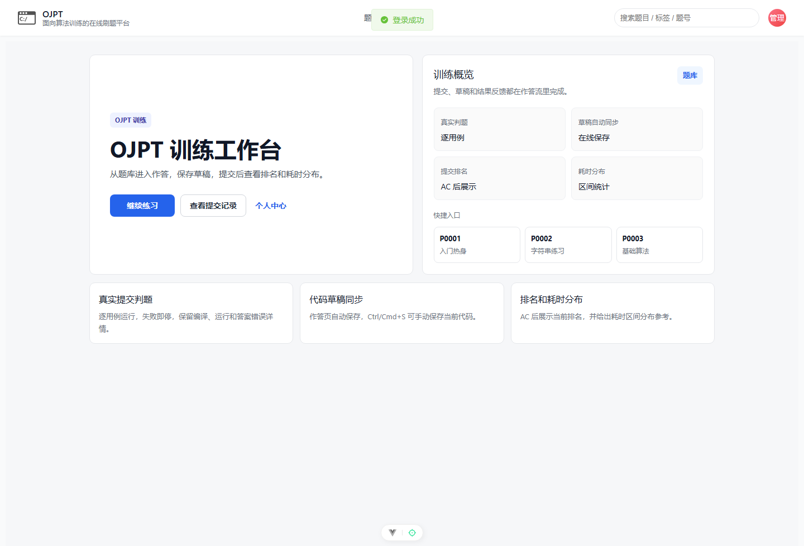
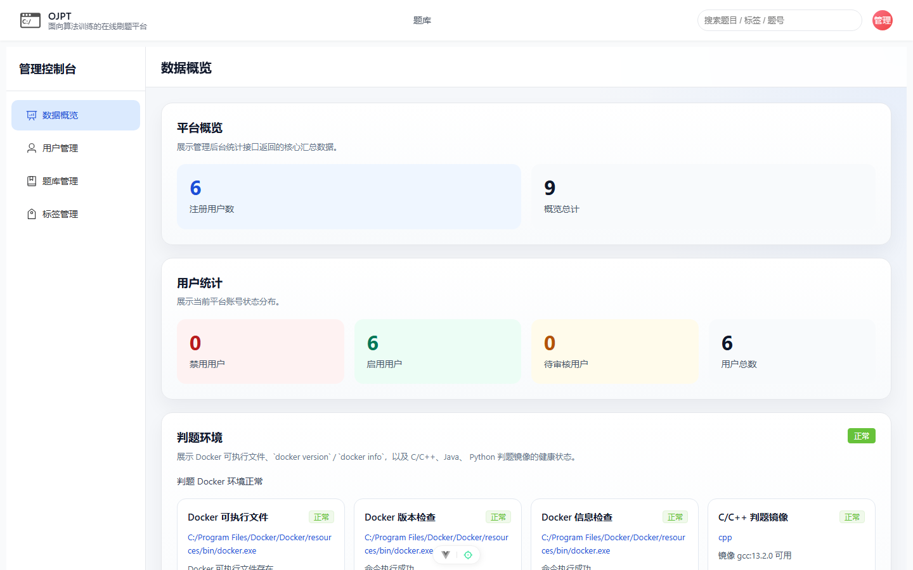

# OJPT 项目功能总览

## 1. 文档目的

本文档汇总 OJPT 当前代码库已经实现并正在使用的核心功能，作为项目功能说明书的入口文档。说明范围以当前前端路由、后端接口、服务实现、数据库迁移和测试用例为准。

OJPT 当前定位为面向个人算法训练的在线刷题平台，不再按完整教学平台、学校班级平台或多角色权限平台进行功能说明。

## 2. 项目定位

OJPT 主要服务个人算法训练场景，核心体验包括：

- 浏览题库并按题号进入题目。
- 阅读 Markdown 题面、查看样例、编写代码。
- 使用 C/C++、Java、Python3 运行样例或自定义用例。
- 提交代码并通过 Docker 判题环境获得结果。
- 查看个人训练数据、提交记录和账号资料。
- 管理员维护用户、题目、测试用例、标签和判题环境。

## 3. 当前角色模型

当前文档只按两个角色说明功能：

| 角色 | 说明 |
| --- | --- |
| `USER` | 普通训练用户，可浏览题库、做题、提交代码、查看个人中心。 |
| `ADMIN` | 管理员，可进入后台维护用户、题库、标签、测试用例、统计和判题环境。 |

代码库中仍保留部分历史角色权限、学校、院系、班级相关实体和服务，但这些能力不属于当前主线功能说明范围。

管理员角色登录后可看到管理端入口，普通用户则进入个人训练和题库流程：

## 4. 核心业务闭环

核心闭环从首页和题库入口开始，经过做题、提交和管理端维护完成：

1. 用户注册或登录。
2. 用户进入题库，按关键词、难度、标签、进度状态筛选题目。
3. 用户进入做题页，选择语言，编辑代码。
4. 用户加载样例或自定义测试用例进行试运行。
5. 用户正式提交代码，后端创建提交记录并异步判题。
6. 判题完成后，用户查看提交结果、逐用例结果和训练数据。
7. 管理员维护题库、测试用例、标签和用户状态，保障训练内容可持续更新。

## 5. 页面截图验证

首页展示了平台入口、题库入口和登录入口，是普通用户进入训练流程的起点。

题库页展示了题目列表、筛选和搜索入口，是从平台入口进入训练内容的主要页面。

管理员登录后进入后台数据概览页，可以看到平台统计、用户统计和判题环境检查。

## 6. 功能模块总览

功能模块的代表页面包括题库、做题页、个人中心和管理端：

| 模块 | 主要功能 | 主要角色 |
| --- | --- | --- |
| 认证与账号 | 登录、注册、刷新 Token、退出登录、当前用户、忘记密码申请。 | 匿名用户、`USER`、`ADMIN` |
| 普通用户中心 | 资料查看与编辑、头像上传、账号安全、注销账号。 | `USER`、`ADMIN` |
| 题库浏览 | 题目列表、题号详情、关键词搜索、筛选、分页、样例查看。 | 匿名用户、登录用户 |
| 做题与判题 | 代码编辑、草稿保存、样例运行、正式提交、异步判题、提交结果。 | 登录用户 |
| 训练数据 | 训练看板、提交记录、提交源码查看。 | 登录用户 |
| 管理端用户管理 | 用户列表、筛选、详情、资料编辑、状态修改、删除。 | `ADMIN` |
| 管理端题库管理 | 新建题目、编辑题目、发布、归档、测试用例维护。 | `ADMIN` |
| 管理端标签管理 | 标签新增、编辑、删除、题目绑定和解绑标签。 | `ADMIN` |
| 管理端统计 | 平台数据概览、用户状态统计、判题环境健康检查。 | `ADMIN` |
| 部署与运行 | 前后端启动、MySQL、Redis、Docker 判题镜像、Flyway 初始化。 | 运维/开发者 |

## 7. 默认账号

首次空库启动时，Flyway 会导入默认账号。初始密码均为 `123456`。

默认账号可通过登录弹窗进入系统，并按角色展示不同入口：

| 账号 | 角色 |
| --- | --- |
| `admin` | `ADMIN` |
| `admin1` | `ADMIN` |
| `user` | `USER` |
| `user1` | `USER` |

## 8. 文档目录

| 文档 | 内容 |
| --- | --- |
| `00-项目功能总览.md` | 项目定位、角色、业务闭环和模块总览。 |
| `01-认证与账号功能.md` | 登录注册、Token、账号状态、密码重置。 |
| `02-普通用户功能.md` | 首页、题库、个人中心、训练看板、提交记录。 |
| `03-做题与判题功能.md` | 代码编辑器、草稿、运行、提交、Docker 判题。 |
| `04-管理员功能.md` | 管理后台、用户、题目、测试用例、标签、统计。 |
| `05-接口功能清单.md` | 后端接口按模块分组说明。 |
| `06-前端页面与路由说明.md` | 前端路由、页面组件和访问控制。 |
| `07-数据模型与业务状态.md` | 核心数据对象和状态枚举。 |
| `08-部署与运行依赖.md` | 本地开发、Docker Compose、判题依赖、初始化数据。 |

## 9. 支撑文档覆盖性审查结论

本次对照 `OJPT-frontend/src/router/index.ts`、`OJPT-backend/src/main/java/com/example/ojpt/controller`、`OJPT-backend/src/main/resources/application.properties`、`docker-compose.yml` 和 Flyway migration 复核后，确认总览文档覆盖当前主线功能：认证与账号、题库、做题与判题、个人中心、训练数据、管理员用户、题目、标签、统计、判题环境、部署运行依赖。

现有证据图已覆盖首页、题库入口、管理端概览、Actuator 健康检查和 Swagger UI：

代码中仍保留学校、院系、班级、权限表等历史模型，但当前前端路由和接口主线未展开为独立教学平台能力，因此总览仅作为历史保留模型说明，不作为当前主线功能展开。
