# 做题与判题功能

## 1. 功能概述

做题与判题模块是 OJPT 的核心业务模块。用户进入题目后，可以阅读题面、编写代码、运行测试用例、保存代码草稿并正式提交判题。

题库筛选/搜索入口如下：

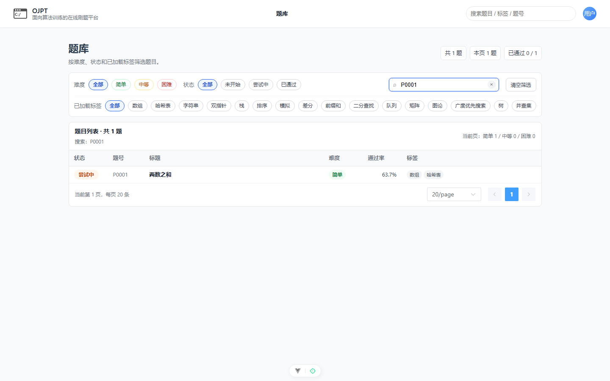
*图示：题库筛选与搜索。*

从题库搜索结果点击题目后，会进入对应做题页：

*图示：题库题目点击前。*

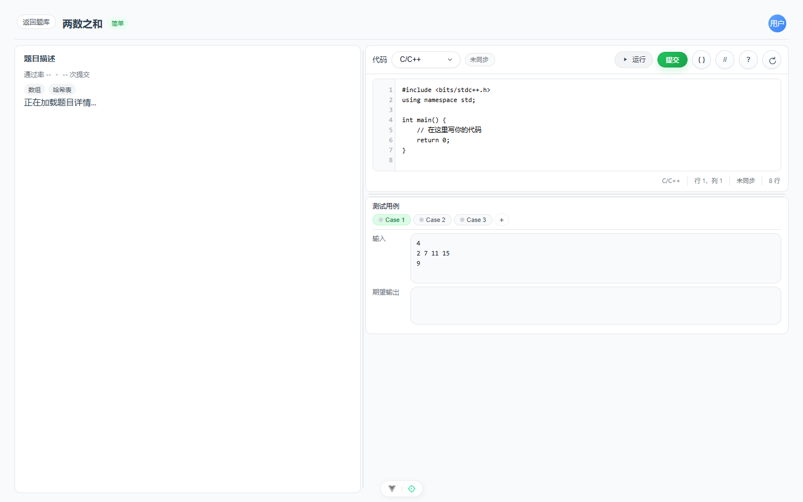
*图示：从题库进入做题页。*

当前支持语言：

| 语言 | 判题镜像 |
| --- | --- |
| C/C++ | `gcc:13.2.0` |
| Java | `eclipse-temurin:17-jdk` |
| Python3 | `python:3.11` |

## 2. 做题页

做题页路径为 `/problems/:problemNo`。

页面主要区域：

- 题目信息区。
- Markdown 题面区。
- 代码编辑区。
- 测试用例区。
- 运行结果区。
- 提交结果弹窗。

做题页隐藏全局顶部导航，并提供独立的返回、登录和用户菜单入口。

题目详情和题面区域如下：

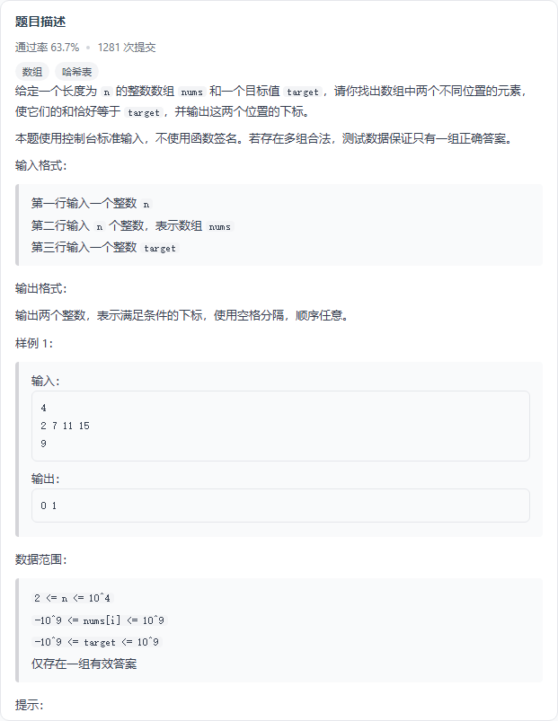
*图示：题目详情与题面。*

## 3. 代码编辑器能力

代码编辑器提供接近 IDE 的基础编辑体验：

- 语言切换。
- 默认代码模板。
- 重置为默认模板。
- 行号展示。
- 光标位置展示。
- 行数统计。
- 滚动同步。
- 缩进和反缩进。
- 行注释和取消注释。
- 代码格式化。
- 当前行或选区复制。
- 当前行或选区删除。
- 撤销和重做。
- 快捷键提示弹窗。

典型快捷键能力：

| 快捷键 | 功能 |
| --- | --- |
| `Tab` | 插入缩进或缩进选中行。 |
| `Shift + Tab` | 反缩进。 |
| `Ctrl/Cmd + S` | 手动保存代码草稿。 |
| `Ctrl + /` | 注释或取消注释。 |
| `Ctrl + D` | 复制当前行或选区。 |
| `Ctrl + Shift + K` | 删除当前行或选中行。 |
| `Ctrl + Z` | 撤销。 |
| `Ctrl + Y` / `Ctrl + Shift + Z` | 重做。 |
| `Ctrl + Alt + L` / `Cmd + Option + L` | 格式化代码。 |

切换语言时，如果当前代码存在未同步修改，前端会提示确认，避免误丢草稿。

代码编辑器区域如下：

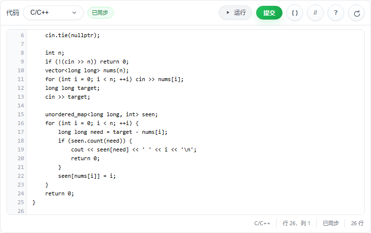
*图示：代码编辑器。*

语言切换会分别加载 C/C++、Java、Python3 的模板或草稿；当当前编辑区存在未同步修改时，切换语言前会弹出确认框：

*图示：C++ 编辑器草稿。*

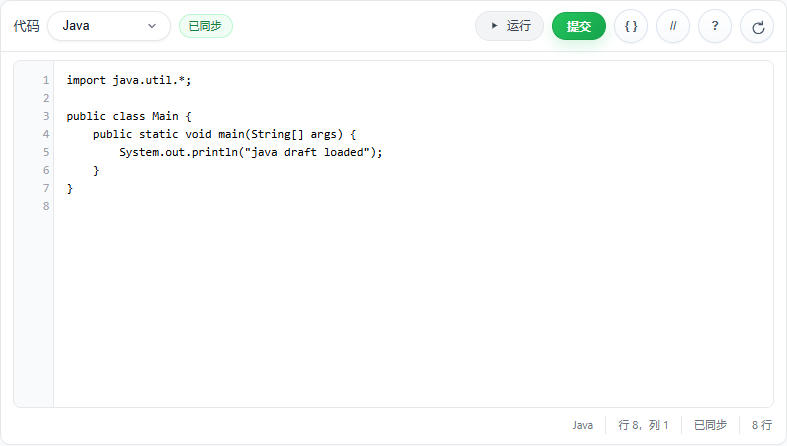
*图示：Java 编辑器草稿。*

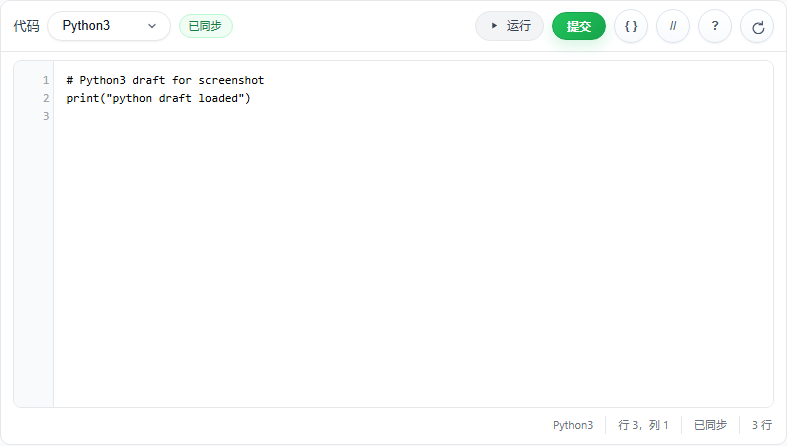
*图示：Python3 编辑器草稿。*

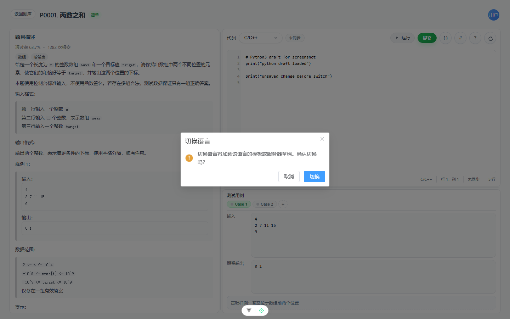
*图示：切换语言前未保存确认。*

重置、格式化、注释、缩进和快捷键帮助的典型操作过程如下：

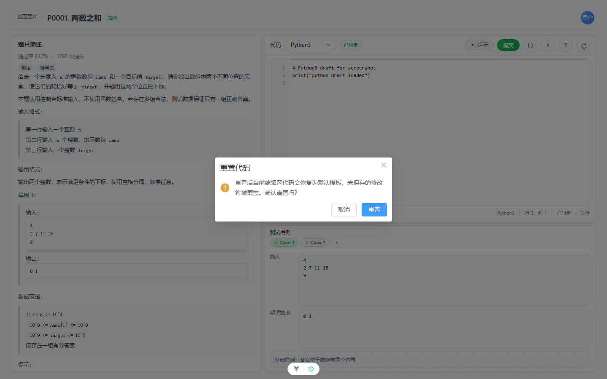
*图示：重置代码确认。*

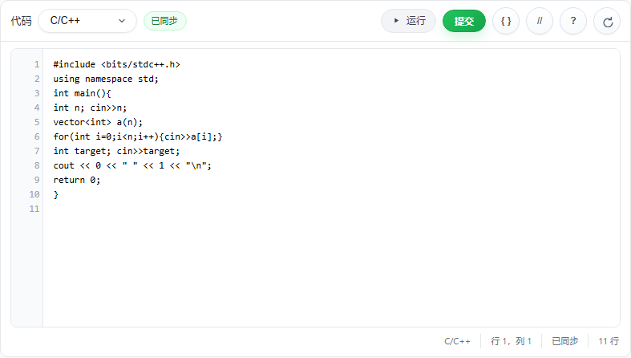
*图示：格式化前。*

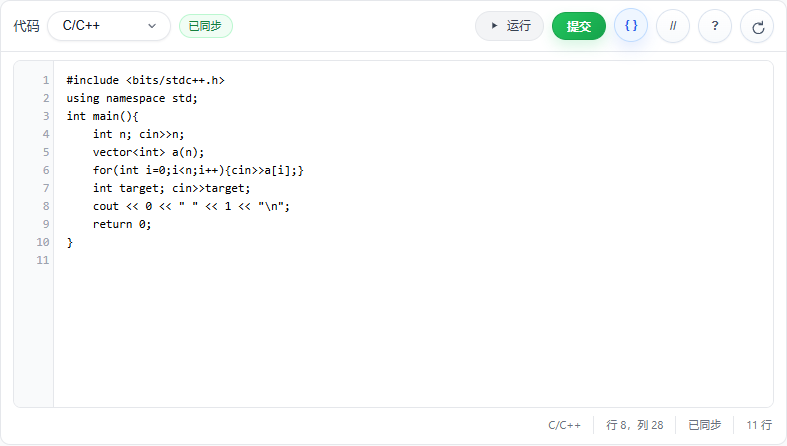
*图示：格式化后。*

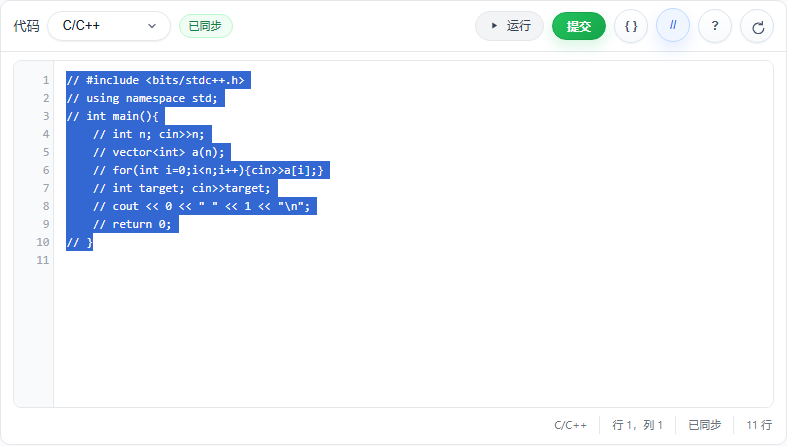
*图示：注释代码。*

*图示：取消注释代码。*

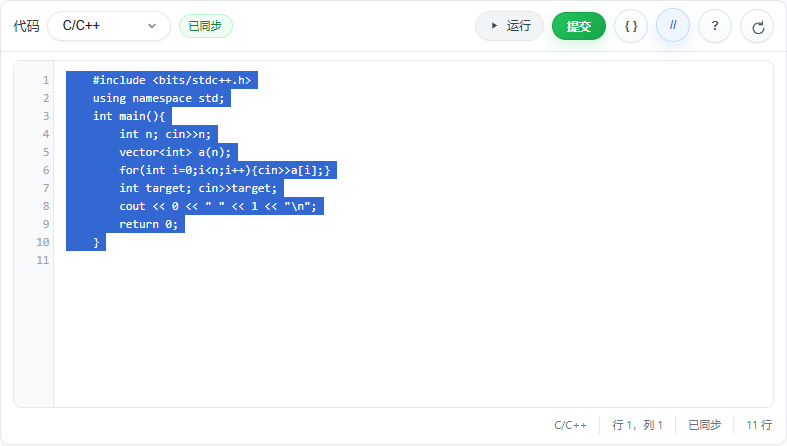
*图示：代码缩进。*

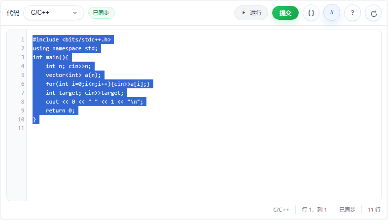
*图示：代码反缩进。*

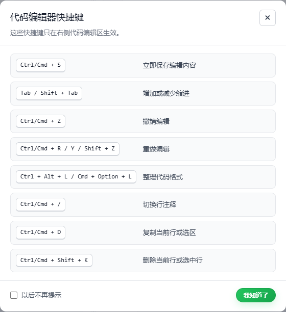
*图示：快捷键帮助弹窗。*

## 4. 代码草稿

登录用户可使用服务端代码草稿能力。

草稿维度：

- 当前用户。
- 当前题目。
- 当前语言。

主要行为：

- 打开做题页时按题号和语言读取草稿。
- 编辑代码后防抖自动保存。
- 使用 `Ctrl/Cmd + S` 立即保存。
- 切换语言时读取对应语言草稿。

相关接口：

- `GET /api/problems/no/{problemNo}/draft?language=...`
- `PUT /api/problems/no/{problemNo}/draft`

代码草稿保存后的同步状态如下：

*图示：代码草稿保存状态。*

草稿会在打开题目时自动读取；用户也可以通过 `Ctrl/Cmd + S` 手动保存。不同语言维护各自的草稿内容，切换语言后会读取对应语言草稿：

*图示：打开题目自动加载 C++ 草稿。*

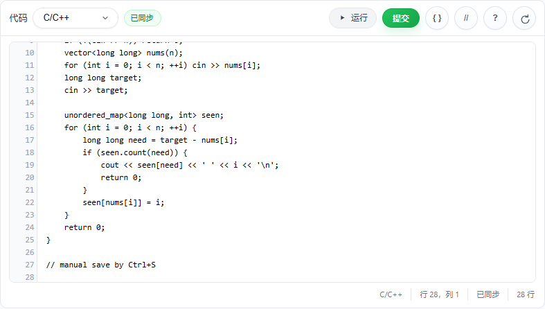
*图示：Ctrl/Cmd+S 手动保存草稿。*

*图示：切换到 Python3 读取对应草稿。*

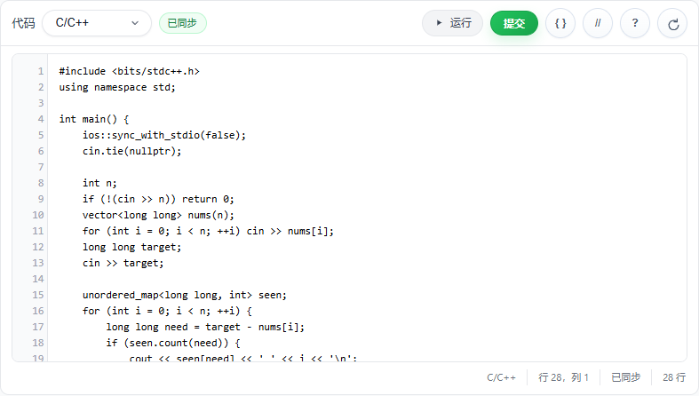
*图示：切回 C++ 读取对应草稿。*

## 5. 测试用例

做题页会加载题目的公开样例用例。用户可在页面中编辑、复制、删除测试用例，也可添加自定义测试用例。

用例字段包括：

- 输入。
- 期望输出。
- 说明。
- 运行状态。
- 实际输出。
- 错误输出。
- 运行耗时。

管理员维护的测试用例分为：

| 类型 | 说明 |
| --- | --- |
| `SAMPLE` | 公开样例，用于题面展示和用户试运行。 |
| `HIDDEN` | 隐藏用例，用于正式提交判题，不向用户暴露输入输出。 |

样例测试用例编辑区域如下：

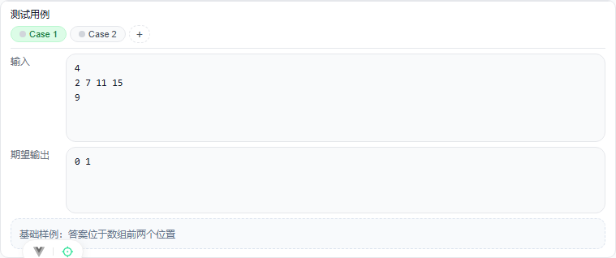
*图示：样例测试用例。*

页面支持多个 case 标签切换、添加自定义用例、编辑输入和期望输出、基于当前 case 复制新增，以及删除多余用例：

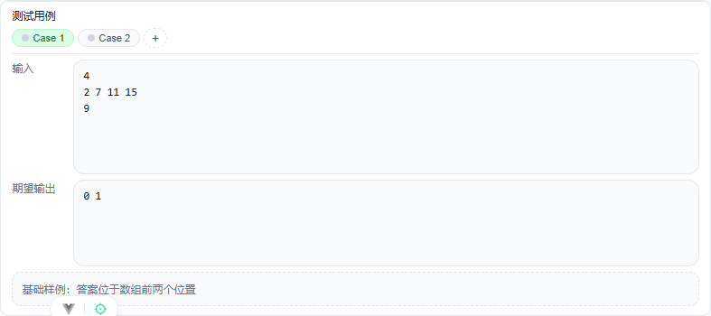
*图示：多个 Case 标签。*

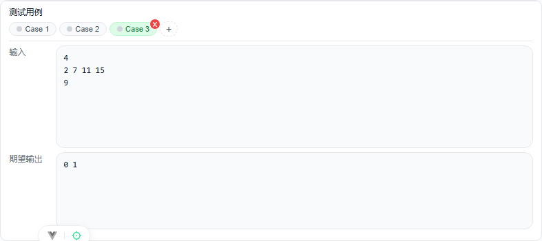
*图示：新增自定义用例。*

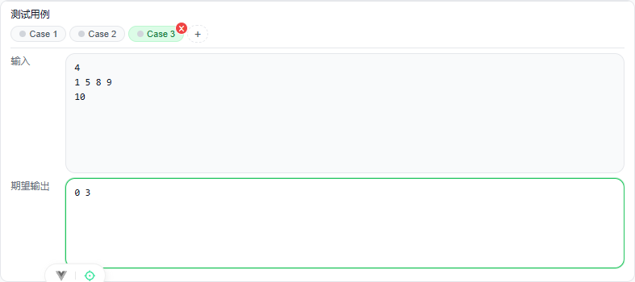
*图示：编辑输入与期望输出。*

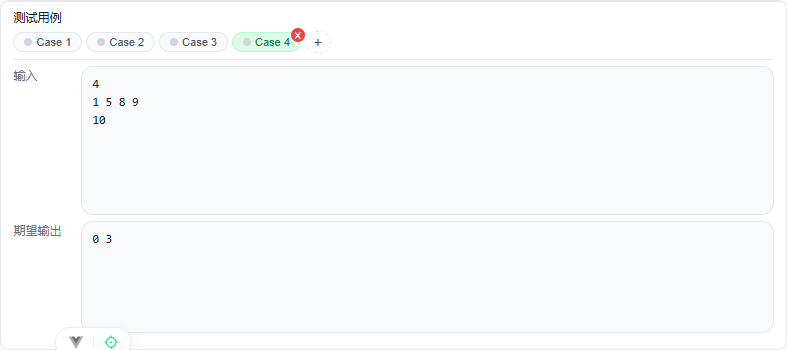
*图示：复制当前用例新增。*

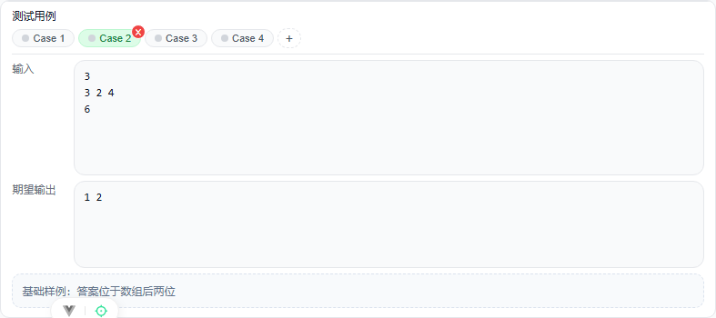
*图示：切换 Case 标签。*

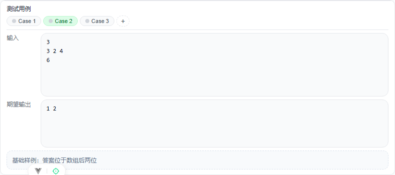
*图示：删除测试用例。*

## 6. 代码试运行

用户点击运行时，前端会把当前代码、语言和页面测试用例发送到后端运行接口。

运行特点：

- 面向样例或自定义用例。
- 同步返回运行结果。
- 不创建正式提交记录。
- 返回逐用例结果。
- 展示实际输出、错误输出、耗时和状态。

相关接口：

- `POST /api/problems/run`

试运行中的弹窗和运行完成结果如下：

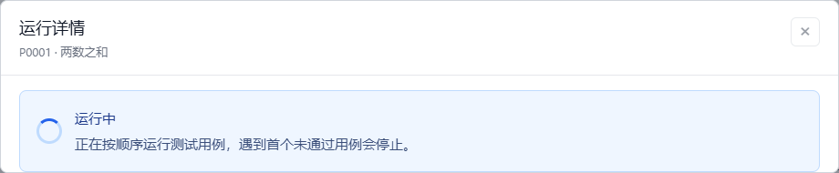
*图示：运行中。*

*图示：运行结果。*

试运行结果会区分通过、答案错误、编译失败和运行错误，并展示实际输出或标准错误：

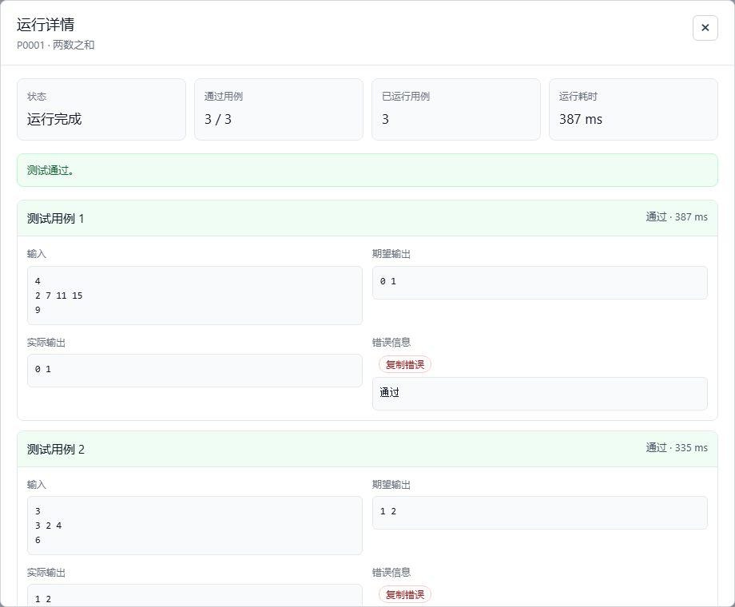
*图示：运行通过。*

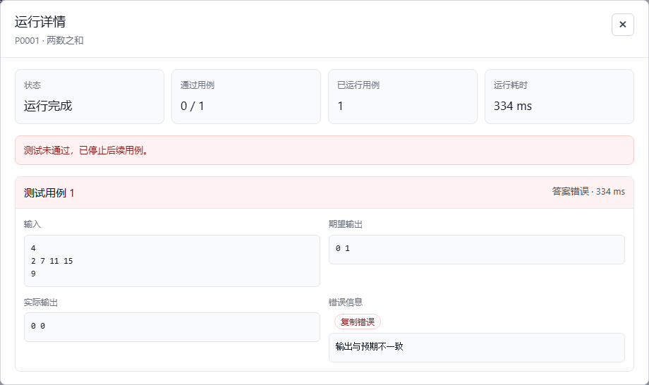
*图示：运行失败答案错误。*

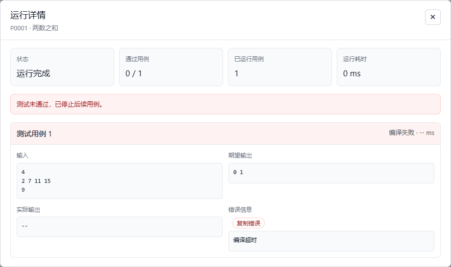
*图示：编译错误。*

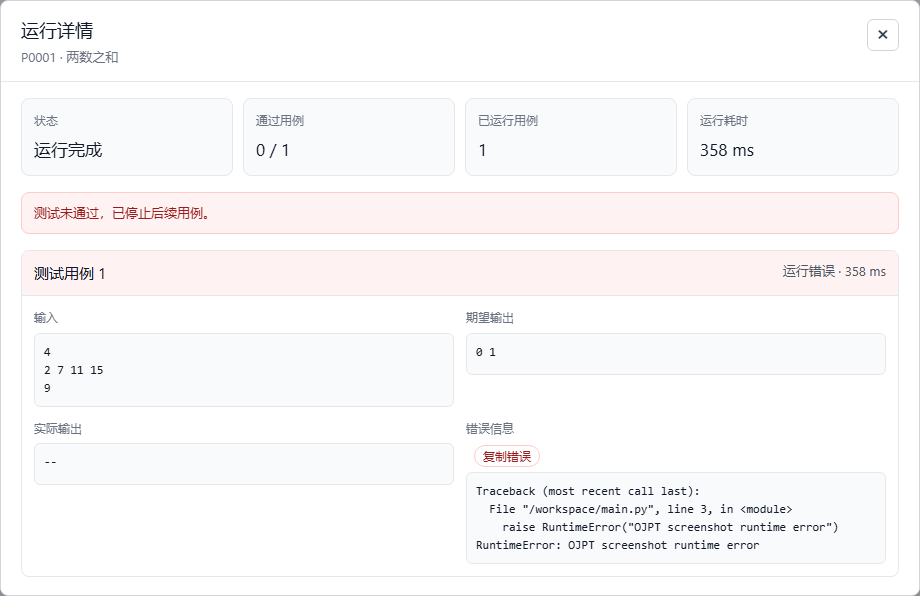
*图示：运行错误 stderr。*

## 7. 正式提交判题

用户点击提交时，前端按题号提交当前语言和源码。

提交流程：

1. 后端创建提交记录。
2. 提交初始状态为 `QUEUED`。
3. 数据库事务提交后，后端将判题任务交给有固定上限的 `ThreadPoolTaskExecutor` 执行 Docker 判题，当前配置为 `core/max=2`、队列容量 `20`。
4. 前端打开提交详情弹窗。
5. 前端轮询提交结果接口。
6. 判题结束后展示最终状态、耗时、内存、编译信息、判题信息和用例结果。

相关接口：

- `POST /api/problems/no/{problemNo}/submissions`
- `GET /api/problems/submissions/{submissionId}`

正式提交后，前端会立即打开提交详情弹窗。新提交通常先显示 `QUEUED` 或 `RUNNING`，随后由轮询接口更新为 AC、WA、CE、RE、TLE 或 SYSTEM_ERROR 等最终状态。

*图示：正式提交判题中。*

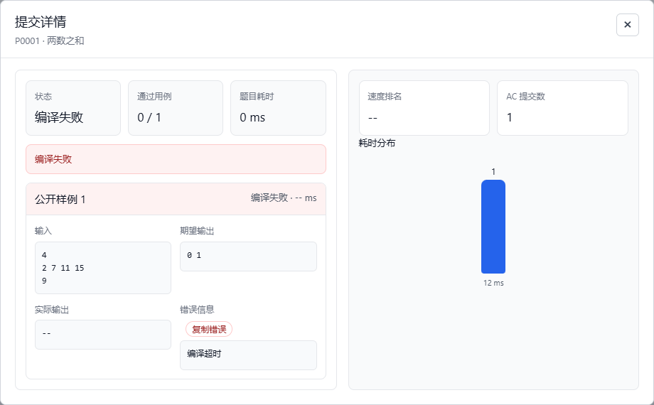
*图示：提交完成结果。*

补充采集时，`judge-38` 为当前环境真实点击提交后的轮询弹窗；`judge-39` 和 `judge-40` 使用真实做题页前端对提交结果接口进行回放采集，用于稳定展示轮询完成后的 AC 详情、失败详情和隐藏用例脱敏效果。

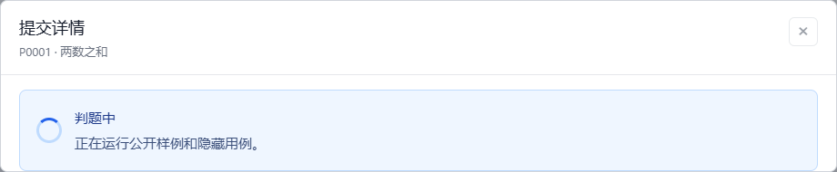
*图示：点击提交后轮询中。*

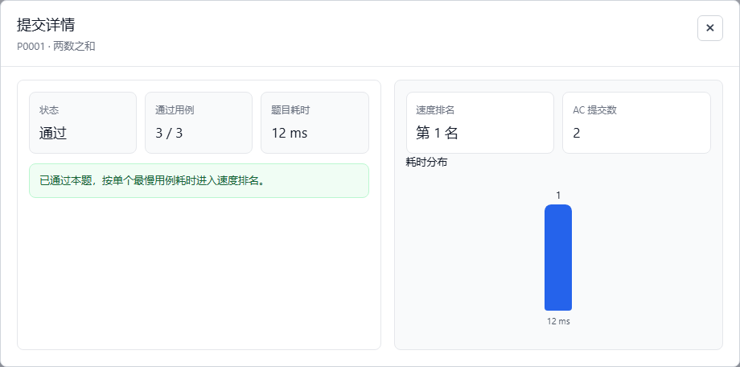
*图示：提交 AC 结果详情。*

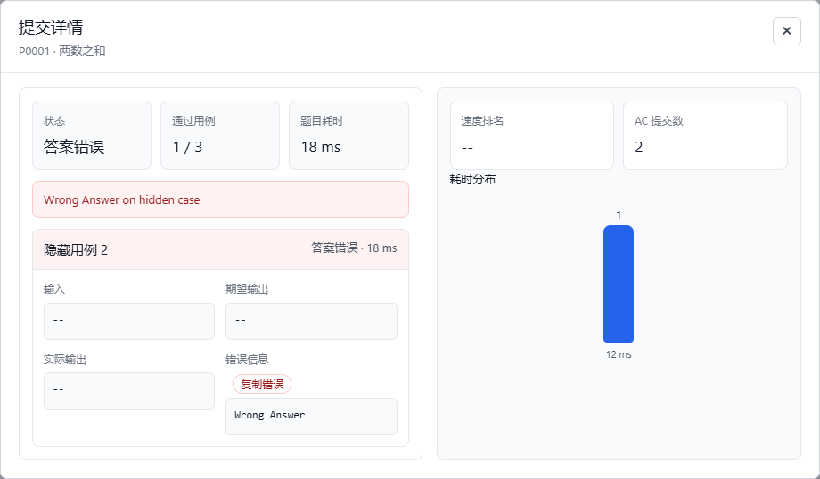
*图示：失败状态与隐藏用例脱敏。*

## 8. 判题结果状态

系统会记录整体提交状态和逐用例状态。常见状态包括：

| 状态 | 含义 |
| --- | --- |
| `AC` | Accepted，通过。 |
| `WA` | Wrong Answer，答案错误。 |
| `TLE` | Time Limit Exceeded，超时。 |
| `MLE` | Memory Limit Exceeded，内存超限。 |
| `RE` | Runtime Error，运行错误。 |
| `CE` | Compilation Error，编译错误。 |
| `SYSTEM_ERROR` | 系统错误或判题环境异常。 |

隐藏用例返回给用户时会脱敏，不展示隐藏输入、期望输出、实际输出和错误输出，只保留状态、耗时、内存和摘要信息。

隐藏用例脱敏展示见提交失败详情截图：

*图示：隐藏用例脱敏展示。*

## 9. Docker 判题环境

后端通过 Docker 执行代码：

- Docker 可执行文件路径来自配置 `ojpt.judge.docker.executable`。
- C/C++ 和 Java 先编译再运行。
- Python3 直接运行。
- 容器运行时关闭网络。
- 设置 CPU 和内存限制。
- 使用临时工作目录。
- 判题后清理临时容器和文件。

管理员可在管理端数据概览页检查判题环境健康状态。

*图示：判题环境健康状态。*

健康检查项包括：

- Docker 可执行文件是否存在。
- `docker version` 是否可执行。
- `docker info` 是否可执行。
- C/C++ 判题镜像是否存在。
- Java 判题镜像是否存在。
- Python 判题镜像是否存在。
