# 接口功能清单

## 1. 通用返回结构

后端接口统一返回 `Result<T>` 结构，前端请求层会自动解包 `data`，并在需要鉴权的请求中自动附加 Bearer Token。

通用响应结构可从登录接口截图中验证，响应包含业务码、消息、数据和时间戳字段：


```json
{
  "code": 200,
  "message": "success",
  "data": {},
  "timestamp": 1714200000000
}
```

本节截图均来自 `http://127.0.0.1:8111` 的真实接口调用。登录、注册等响应中的 Token 已在截图页中截断显示，避免把临时凭证写入文档。

## 2. 认证接口

| 方法 | 路径 | 功能 | 访问控制 |
| --- | --- | --- | --- |
| `POST` | `/api/auth/login` | 登录并返回访问令牌、刷新令牌和用户身份。 | 匿名 |
| `POST` | `/api/auth/register` | 注册用户并返回登录态。 | 匿名 |
| `POST` | `/api/auth/password-reset-requests` | 提交忘记密码申请。 | 匿名 |
| `POST` | `/api/auth/refresh` | 使用刷新令牌换取新令牌。 | 匿名 |
| `GET` | `/api/auth/me` | 获取当前登录用户。 | 登录用户 |
| `POST` | `/api/auth/logout` | 退出登录。 | 登录用户 |

登录接口响应：


注册接口响应：

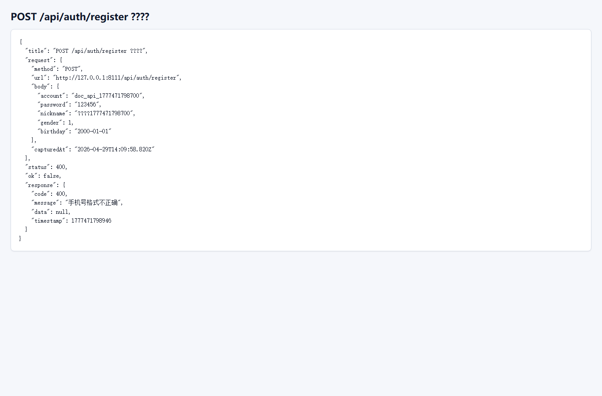

当前用户接口响应：


## 3. 当前用户接口

当前用户接口用于支撑个人资料、训练看板、提交记录和账号安全页面：


| 方法 | 路径 | 功能 | 访问控制 |
| --- | --- | --- | --- |
| `GET` | `/api/users/me` | 当前用户基础信息。 | 登录用户 |
| `GET` | `/api/users/me/detail` | 当前用户详细资料。 | 登录用户 |
| `GET` | `/api/users/me/submissions` | 当前用户提交记录。 | 登录用户 |
| `GET` | `/api/users/me/training-dashboard` | 当前用户训练看板。 | 登录用户 |
| `POST` | `/api/users/me/avatar` | 上传或删除头像。 | 登录用户 |
| `PUT` | `/api/users/me` | 更新个人资料。 | 登录用户 |
| `PUT` | `/api/users/me/username` | 修改用户名。 | 登录用户 |
| `PUT` | `/api/users/me/email` | 修改邮箱。 | 登录用户 |
| `PUT` | `/api/users/me/phone` | 修改手机号。 | 登录用户 |
| `PUT` | `/api/users/me/password` | 修改密码。 | 登录用户 |
| `DELETE` | `/api/users/me` | 注销账号。 | 登录用户 |

## 4. 题库接口

| 方法 | 路径 | 功能 | 访问控制 |
| --- | --- | --- | --- |
| `GET` | `/api/problems` | 分页查询题目列表。 | 匿名可访问 |
| `GET` | `/api/problems/{id}` | 按 ID 查询题目详情。 | 匿名可访问 |
| `GET` | `/api/problems/no/{problemNo}` | 按题号查询题目详情。 | 匿名可访问 |
| `GET` | `/api/problems/no/{problemNo}/test-cases/sample` | 查询公开样例用例。 | 匿名可访问 |

题目列表支持 `page`、`size`、`keyword`、`difficulty`、`tagId`、`status`、`orderBy` 等查询参数。

题库列表接口响应：


题目详情接口响应：

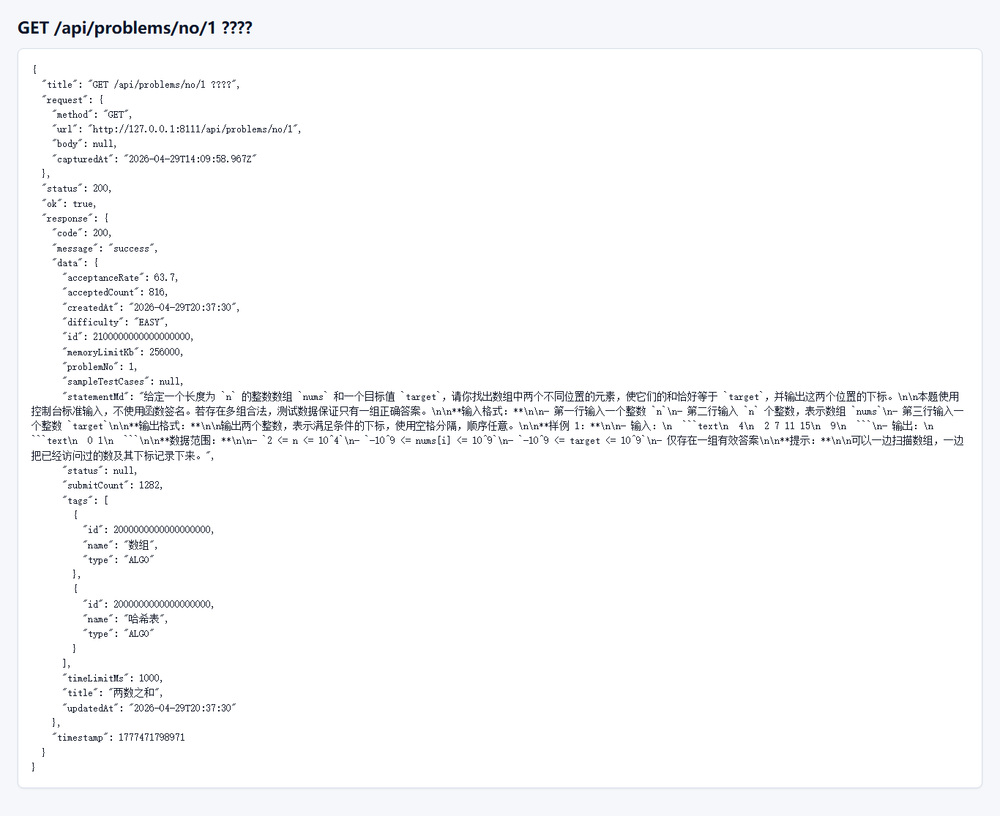

## 5. 做题与提交接口

| 方法 | 路径 | 功能 | 访问控制 |
| --- | --- | --- | --- |
| `GET` | `/api/problems/no/{problemNo}/draft?language=...` | 读取代码草稿。 | 登录用户 |
| `PUT` | `/api/problems/no/{problemNo}/draft` | 保存代码草稿。 | 登录用户 |
| `POST` | `/api/problems/run` | 运行代码和测试用例。 | 登录用户 |
| `POST` | `/api/problems/no/{problemNo}/submissions` | 正式提交代码。 | 登录用户 |
| `GET` | `/api/problems/submissions/{submissionId}` | 查询提交判题结果。 | 登录用户 |

运行代码接口响应：


提交代码接口响应：


## 6. 管理员用户接口

| 方法 | 路径 | 功能 | 访问控制 |
| --- | --- | --- | --- |
| `GET` | `/api/admin/users` | 用户列表。 | `ADMIN` |
| `GET` | `/api/admin/users/{userId}` | 用户详情。 | `ADMIN` |
| `PUT` | `/api/admin/users/{userId}` | 更新用户资料。 | `ADMIN` |
| `DELETE` | `/api/admin/users/{userId}` | 删除用户。 | `ADMIN` |
| `PUT` | `/api/admin/users/{userId}/status` | 修改用户状态。 | `ADMIN` |

管理员用户列表接口响应：

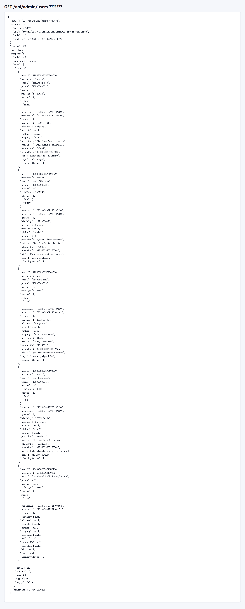

## 7. 管理员密码重置接口

密码重置接口的页面流程见管理员审批截图：

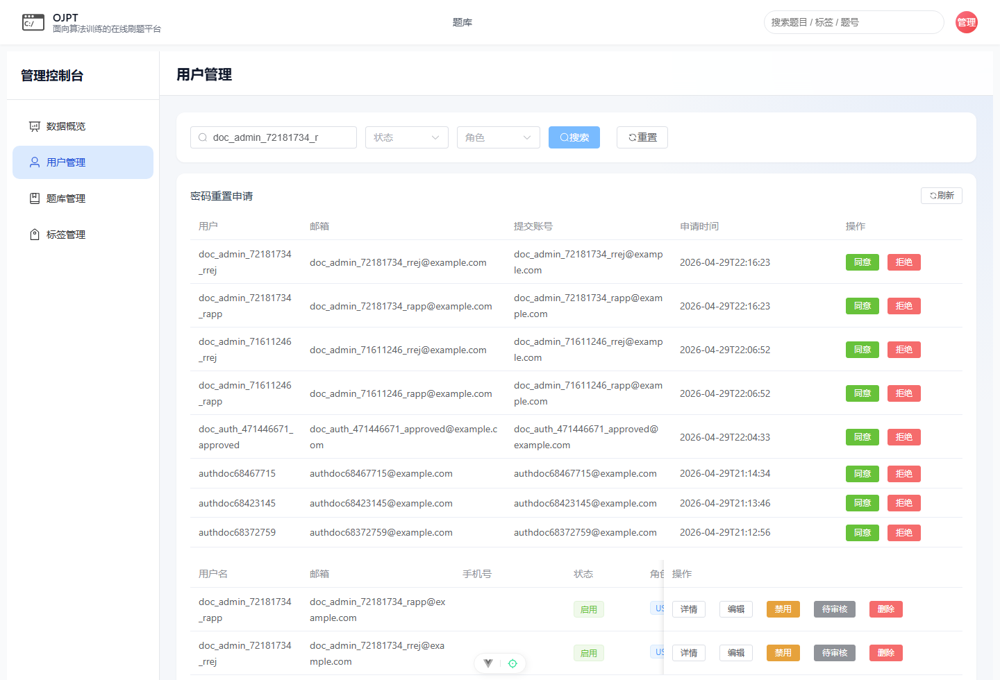

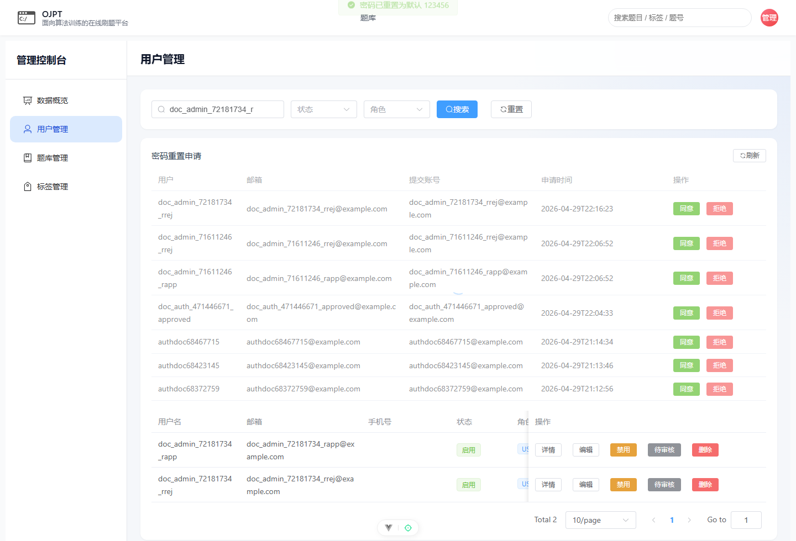

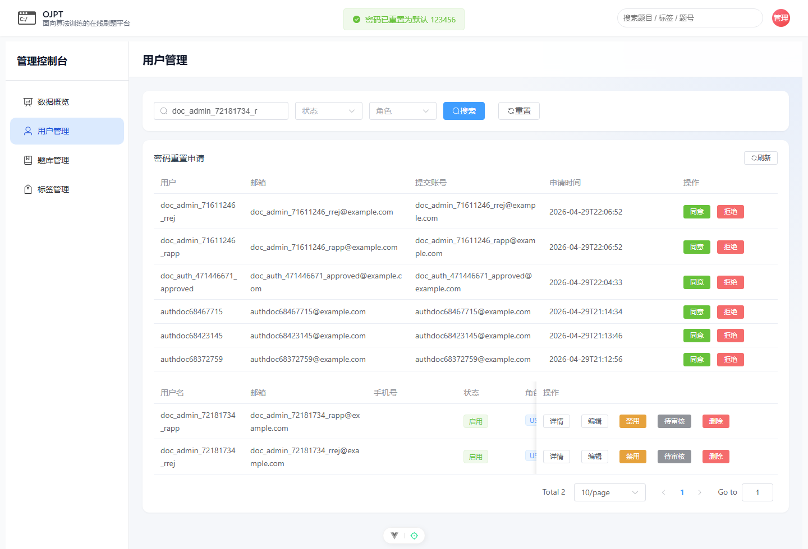

| 方法 | 路径 | 功能 | 访问控制 |
| --- | --- | --- | --- |
| `GET` | `/api/admin/password-reset-requests` | 查询密码重置申请。 | `ADMIN` |
| `POST` | `/api/admin/password-reset-requests/{requestId}:approve` | 批准密码重置。 | `ADMIN` |
| `POST` | `/api/admin/password-reset-requests/{requestId}:reject` | 拒绝密码重置。 | `ADMIN` |

## 8. 管理员题目接口

| 方法 | 路径 | 功能 | 访问控制 |
| --- | --- | --- | --- |
| `GET` | `/api/admin/problems` | 管理端题目列表。 | `ADMIN` |
| `POST` | `/api/admin/problems` | 新建题目草稿。 | `ADMIN` |
| `GET` | `/api/admin/problems/{problemId}` | 管理端题目详情。 | `ADMIN` |
| `PUT` | `/api/admin/problems/{problemId}` | 更新题目。 | `ADMIN` |
| `GET` | `/api/admin/problems/{problemId}/test-cases` | 查询题目测试用例。 | `ADMIN` |
| `PUT` | `/api/admin/problems/{problemId}/test-cases` | 替换题目测试用例。 | `ADMIN` |
| `POST` | `/api/admin/problems/{problemId}:publish` | 发布题目。 | `ADMIN` |
| `POST` | `/api/admin/problems/{problemId}:archive` | 归档题目。 | `ADMIN` |

管理员题目列表接口响应：

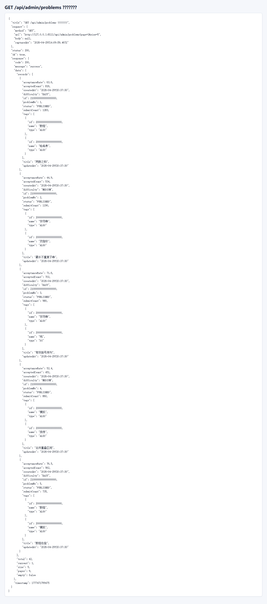

## 9. 管理员标签接口

标签接口的页面流程见标签管理截图：

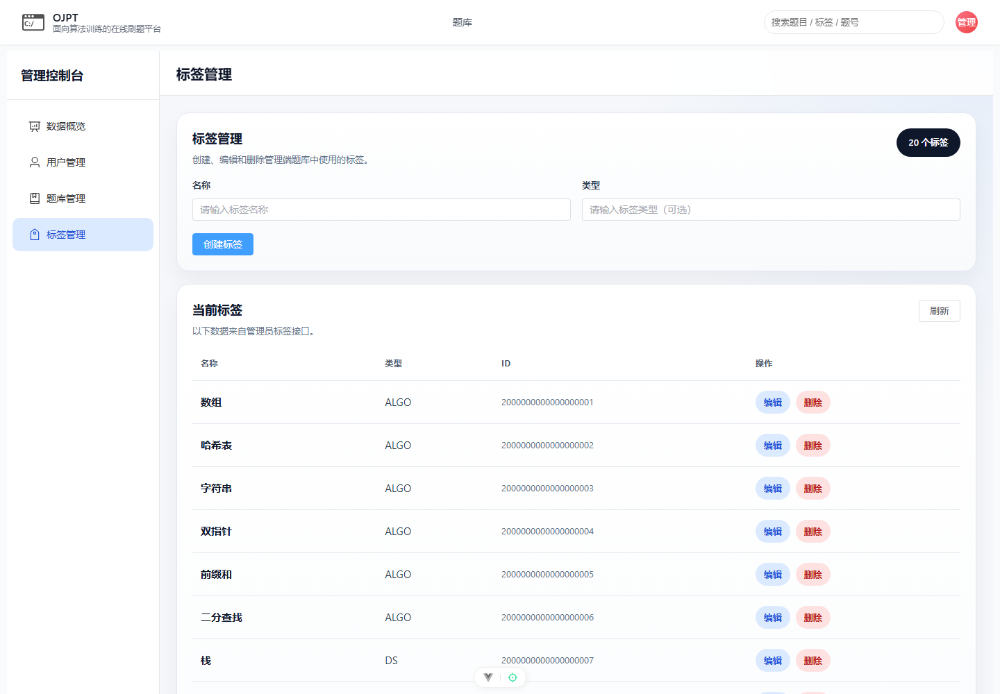

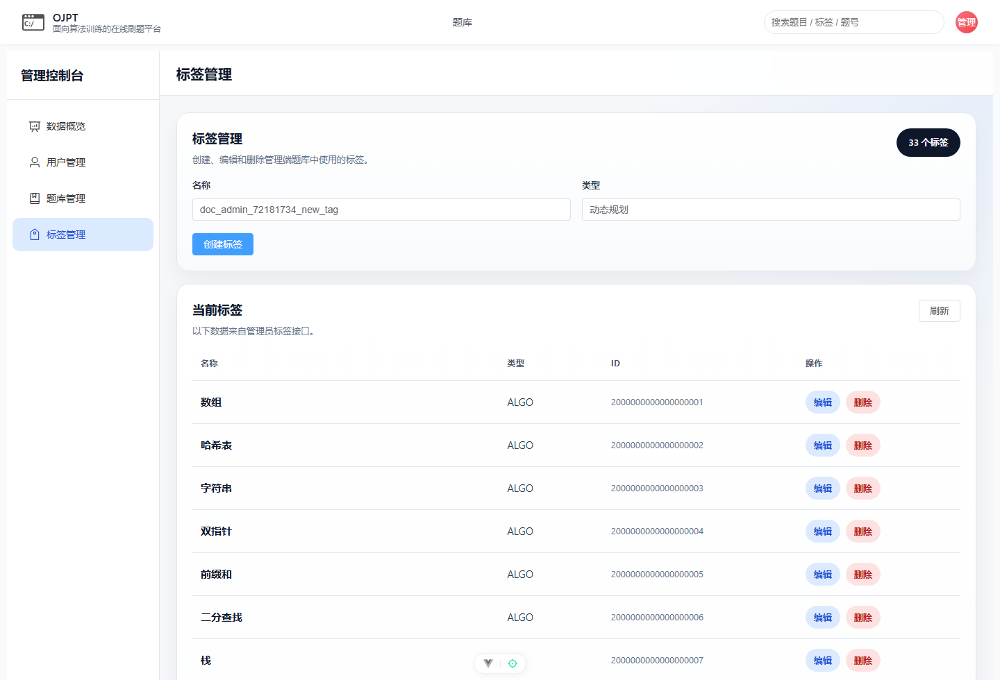

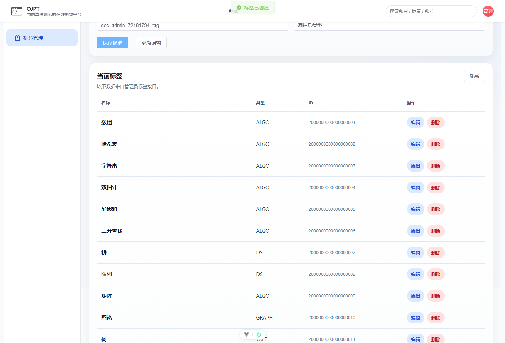

| 方法 | 路径 | 功能 | 访问控制 |
| --- | --- | --- | --- |
| `GET` | `/api/admin/tags` | 标签列表。 | `ADMIN` |
| `POST` | `/api/admin/tags` | 新建标签。 | `ADMIN` |
| `PUT` | `/api/admin/tags/{tagId}` | 更新标签。 | `ADMIN` |
| `DELETE` | `/api/admin/tags/{tagId}` | 删除标签。 | `ADMIN` |
| `POST` | `/api/admin/problems/{problemId}/tags?tagId=...` | 为题目绑定标签。 | `ADMIN` |
| `DELETE` | `/api/admin/problems/{problemId}/tags?tagId=...` | 解绑题目标签。 | `ADMIN` |

## 10. 管理员统计与判题环境接口

| 方法 | 路径 | 功能 | 访问控制 |
| --- | --- | --- | --- |
| `GET` | `/api/admin/statistics/overview` | 平台概览统计。 | `ADMIN` |
| `GET` | `/api/admin/statistics/users` | 用户状态统计。 | `ADMIN` |
| `GET` | `/api/admin/judge-environment/health` | 判题 Docker 环境健康检查。 | `ADMIN` |

判题环境健康接口响应：

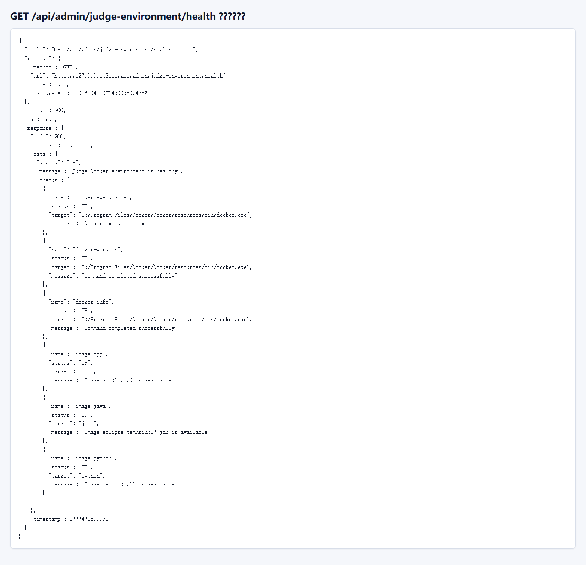

## 11. 支撑文档覆盖性审查结论

本清单已按 Controller 实际映射复核，并使用 Swagger UI 作为接口发现入口证据：


覆盖范围包括认证、当前用户、题库、做题/判题、管理员用户、密码重置、管理员题目、标签、统计与判题环境：

- 认证：登录、注册、忘记密码申请、刷新 Token、当前用户、退出登录。
- 当前用户：基础信息、详细资料、提交记录、训练看板、头像上传、资料/用户名/邮箱/手机号/密码修改、注销账号。
- 题库：列表、按 ID 详情、按题号详情、公开样例。
- 做题/判题：代码草稿读取与保存、运行代码、正式提交、提交结果查询。
- 管理员用户：用户列表、详情、资料更新、删除、状态修改。
- 密码重置：申请列表、批准、拒绝。
- 管理员题目：列表、新建、详情、更新、测试用例维护、发布、归档。
- 标签：标签列表、新建、更新、删除、题目绑定与解绑标签。
- 统计/判题环境：概览统计、用户状态统计、Docker 判题环境健康检查。

未发现 Controller 中存在未纳入本清单的当前主线接口。
