# 前端页面与路由说明

## 1. 路由总览

前端基于 Vue Router，入口文件为 `OJPT-frontend/src/router/index.ts`。本节截图均来自运行中的前端服务 `http://127.0.0.1:8110`。

核心公开入口包括首页和题库页：

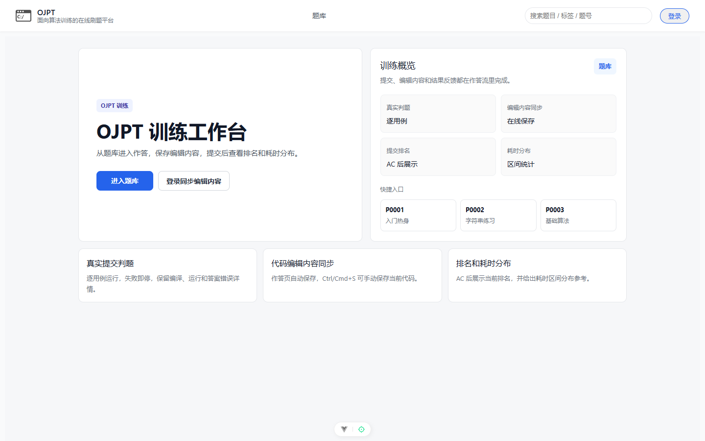
*图示：首页入口。*

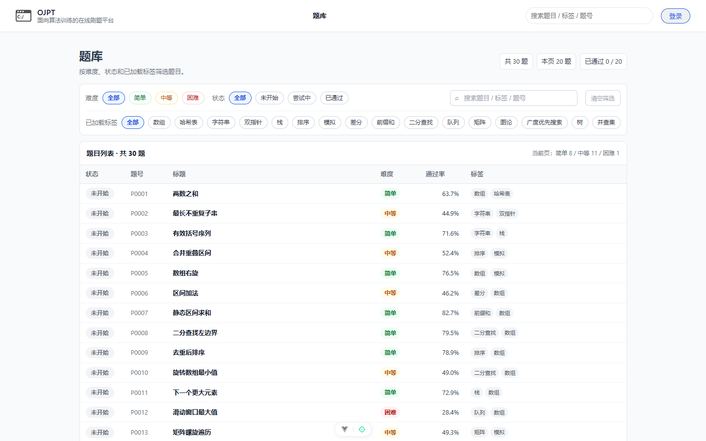
*图示：题库入口。*

| 路由 | 页面组件 | 访问控制 | 功能 |
| --- | --- | --- | --- |
| `/` | `HomeView.vue` | 公开 | 首页和训练入口。 |
| `/problemset` | `ProblemSetView.vue` | 公开 | 题库列表、搜索、筛选、分页。 |
| `/problems/:problemNo` | `ProblemSolveView.vue` | 公开页面，运行、提交、草稿等操作依赖登录 | 做题页、代码编辑器、样例、运行和提交。 |
| `/profile` | `UserCenterLayout.vue` + `ProfileView.vue` | 登录用户 | 个人资料。 |
| `/profile/training` | `UserCenterLayout.vue` + `TrainingDashboardView.vue` | 登录用户 | 训练看板。 |
| `/profile/security` | `UserCenterLayout.vue` + `SecurityView.vue` | 登录用户 | 账号安全。 |
| `/profile/submissions` | `UserCenterLayout.vue` + `SubmissionRecordsView.vue` | 登录用户 | 提交记录。 |
| `/admin` | `AdminLayout.vue` + `OverviewTab.vue` | `ADMIN` | 管理端数据概览。 |
| `/admin/users` | `AdminLayout.vue` + `UserManagement.vue` | `ADMIN` | 用户管理。 |
| `/admin/problems` | `AdminLayout.vue` + `ProblemManagement.vue` | `ADMIN` | 题库管理。 |
| `/admin/problems/:problemId` | `AdminLayout.vue` + `ProblemEdit.vue` | `ADMIN` | 题目编辑。 |
| `/admin/tags` | `AdminLayout.vue` + `TagManagement.vue` | `ADMIN` | 标签管理。 |
| `/:pathMatch(.*)*` | `NotFoundView.vue` | 公开 | 404 页面。 |

## 2. 路由页面截图

做题页 `/problems/:problemNo`：

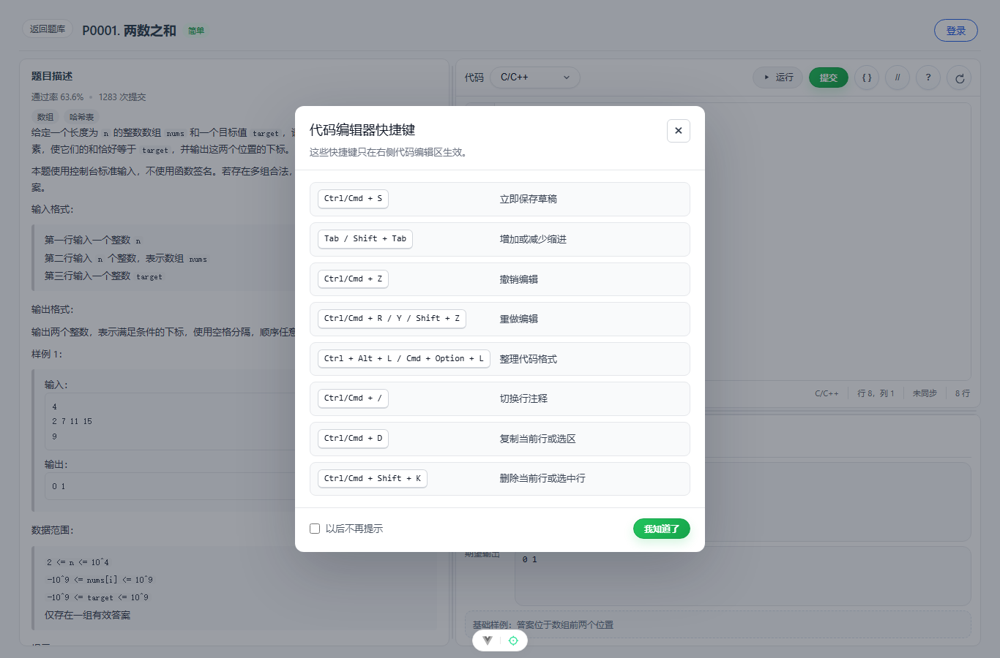
*图示：做题页路由截图。*

个人资料 `/profile`：

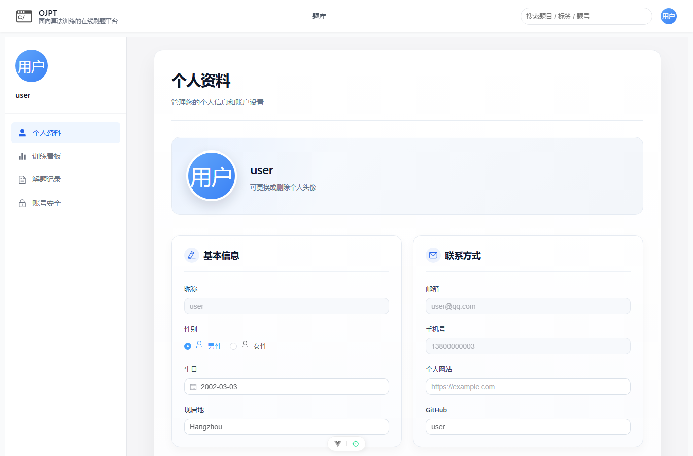
*图示：个人资料路由截图。*

训练看板 `/profile/training`：

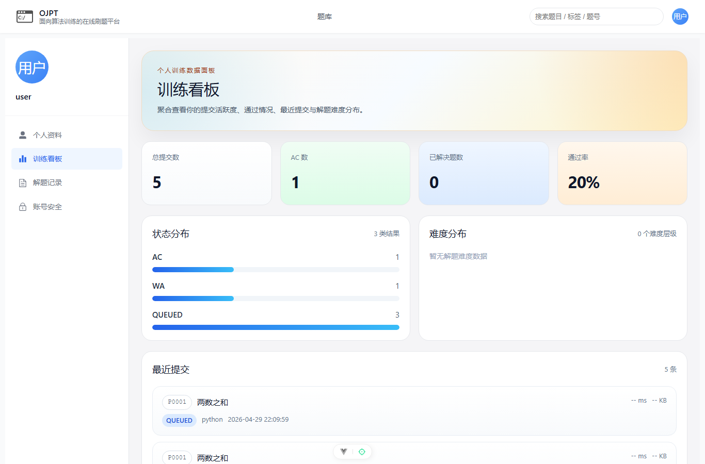
*图示：训练看板路由截图。*

账号安全 `/profile/security`：

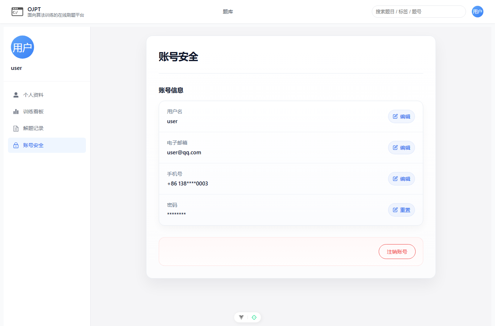
*图示：账号安全路由截图。*

提交记录 `/profile/submissions`：

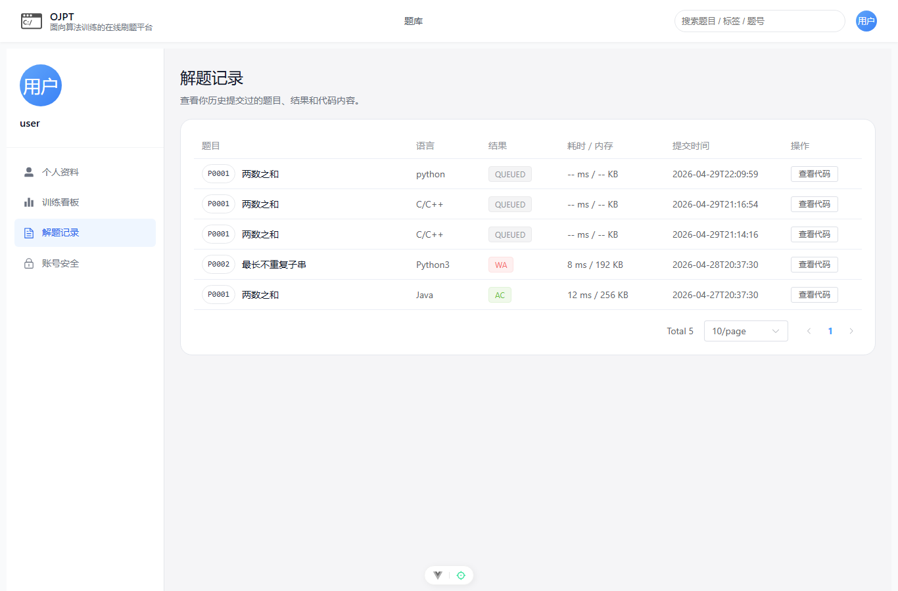
*图示：提交记录路由截图。*

管理员用户管理 `/admin/users`：

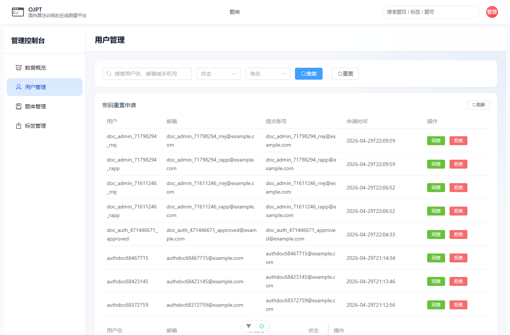
*图示：管理员用户管理路由截图。*

管理员题库管理 `/admin/problems`：

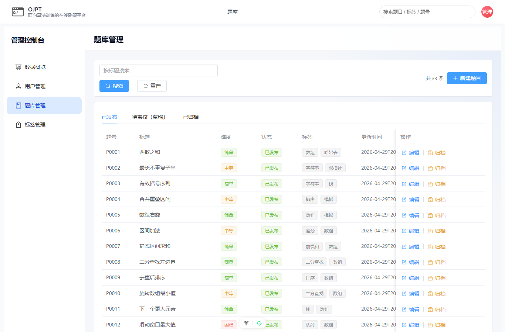
*图示：管理员题库管理路由截图。*

管理员题目编辑 `/admin/problems/:problemId`：

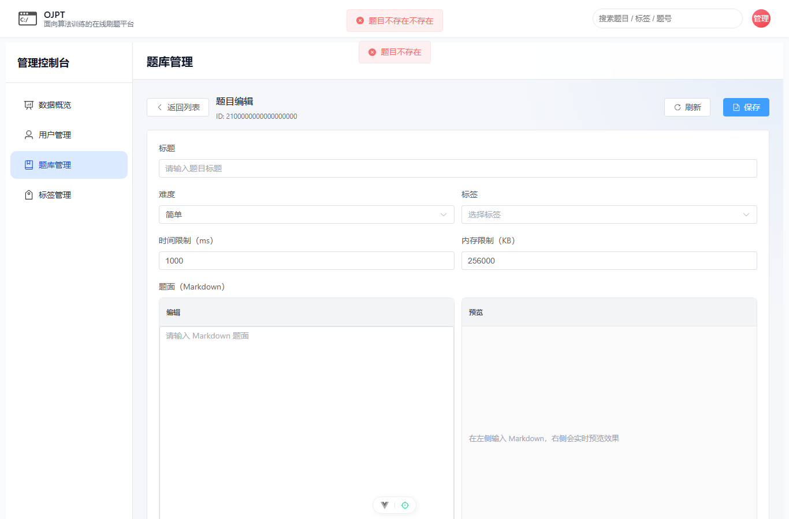
*图示：管理员题目编辑路由截图。*

管理员标签管理 `/admin/tags`：

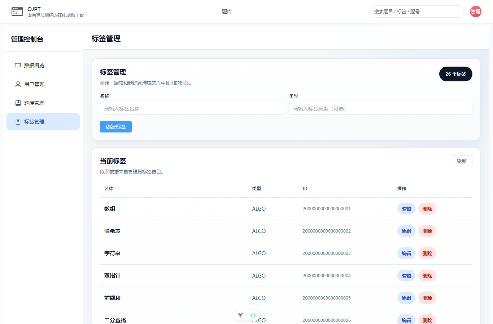
*图示：管理员标签管理路由截图。*

404 页面：

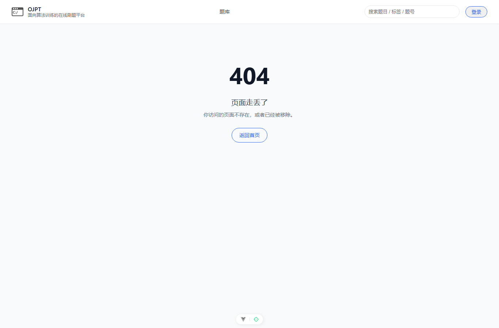
*图示：404 路由截图。*

## 3. 路由守卫

管理端路由在 `meta` 中配置 `requiresAuth: true` 和 `requiredRole: 'ADMIN'`。路由守卫处理流程如下：

- 访问 `/admin/**` 需要登录。
- 如果本地有 Token 但没有用户信息，会先调用 `/api/auth/me` 补齐身份。
- 未登录用户访问管理端时，提示“请先登录”并跳转首页。
- 普通用户访问管理端时，提示“您没有权限访问此页面”并跳转首页。
- 管理员访问管理端时，进入对应管理页面。

未登录访问 `/admin/users` 被拦截：

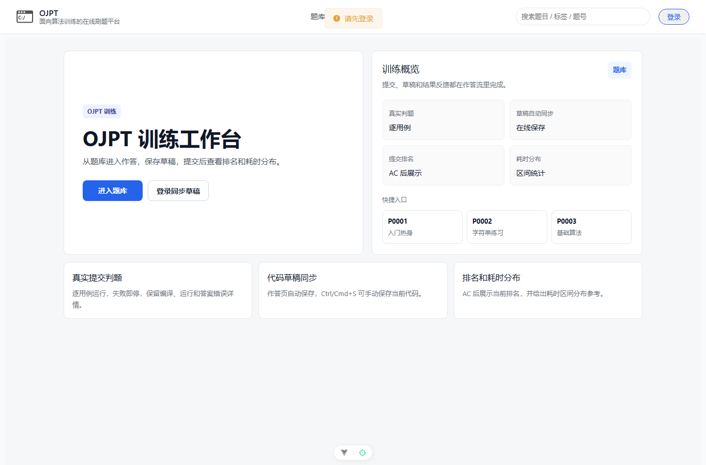
*图示：未登录访问管理端被拦截。*

普通用户访问 `/admin/users` 被拒绝：

*图示：普通用户访问管理端被拒绝。*

管理员访问 `/admin/users` 成功：

*图示：管理员访问管理端成功。*

## 4. 顶部导航

组件：`TopNav.vue`

顶部导航在登录前后提供不同入口：

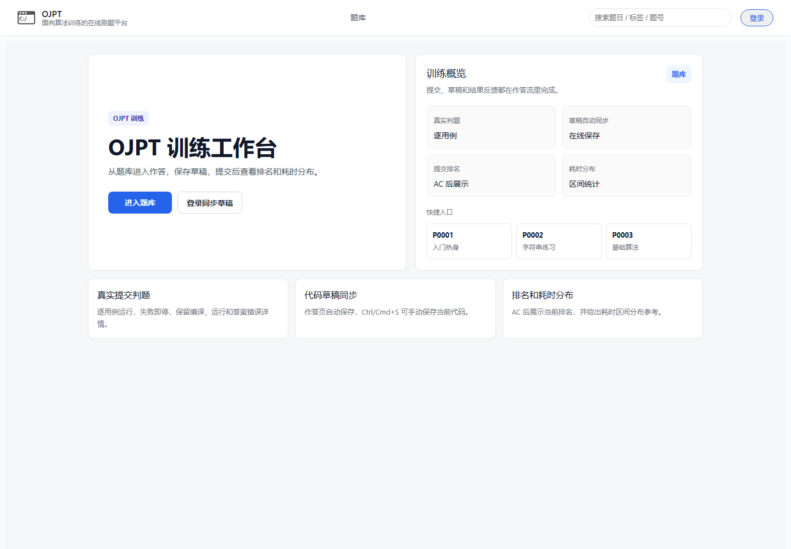
*图示：登录前首页。*

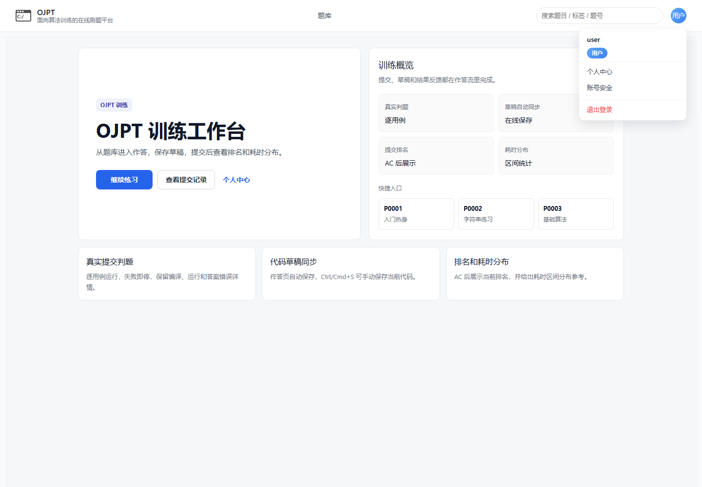
*图示：用户菜单展开并提供个人中心与账号安全入口。*

主要能力：

- 显示 Logo 和站点名称。
- 跳转题库。
- 全局搜索题目。
- 打开登录弹窗。
- 登录后显示用户菜单。
- 管理员显示管理入口。

全局搜索会跳转到 `/problemset?keyword=...`，由题库页面读取查询参数并请求题目列表。

## 5. 登录弹窗

组件：`LoginDialog.vue`

登录弹窗承载登录、注册和忘记密码入口：

*图示：登录弹窗。*

*图示：注册表单。*

*图示：忘记密码申请。*

主要能力：

- 邮箱登录、手机号登录。
- 邮箱注册、手机号注册。
- 忘记密码申请。
- 邮箱域名联想。
- 登录成功后写入登录状态。
- 处理禁用账号、错误密码、网络错误等提示。

## 6. 页面与接口关系

页面与接口关系可通过题库、做题页、个人中心和管理端页面截图交叉验证：

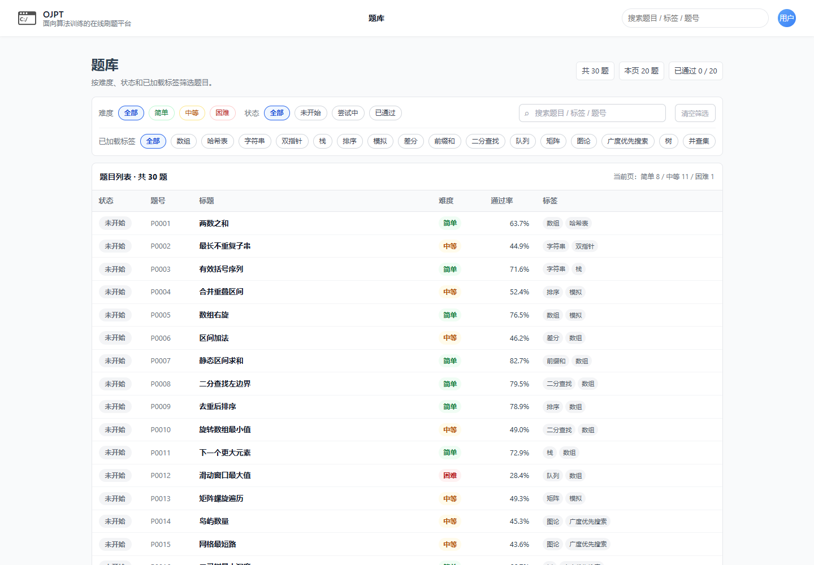
*图示：题库列表。*

*图示：做题页路由截图。*

*图示：管理员用户管理路由截图。*

| 页面 | 主要接口 |
| --- | --- |
| 题库页 | `GET /api/problems` |
| 做题页 | `GET /api/problems/no/{problemNo}`、样例、草稿、运行、提交、提交结果接口 |
| 个人资料 | `GET /api/users/me/detail`、`PUT /api/users/me`、`POST /api/users/me/avatar` |
| 训练看板 | `GET /api/users/me/training-dashboard` |
| 提交记录 | `GET /api/users/me/submissions` |
| 账号安全 | 用户名、邮箱、手机号、密码修改和注销接口 |
| 管理端概览 | 统计接口、判题环境健康接口 |
| 用户管理 | 管理员用户接口、密码重置审批接口 |
| 题库管理 | 管理员题目接口 |
| 题目编辑 | 题目详情、测试用例、标签绑定接口 |
| 标签管理 | 管理员标签接口 |

## 7. 支撑文档覆盖性审查结论

本章已对照 `OJPT-frontend/src/router/index.ts` 复核，覆盖公开路由 `/`、`/problemset`、`/problems/:problemNo`，受登录保护的个人中心 `/profile` 及 `training`、`security`、`submissions` 子路由，管理端 `/admin` 及 `users`、`problems`、`problems/:problemId`、`tags` 子路由，404 捕获路由，以及未登录访问个人中心、未登录或非管理员访问管理端时的权限跳转。当前代码没有其他已注册前端路由。

`/` 与 `/problemset` 的页面证据复用总览截图：

*图示：首页路由截图。*

*图示：题库路由截图。*
