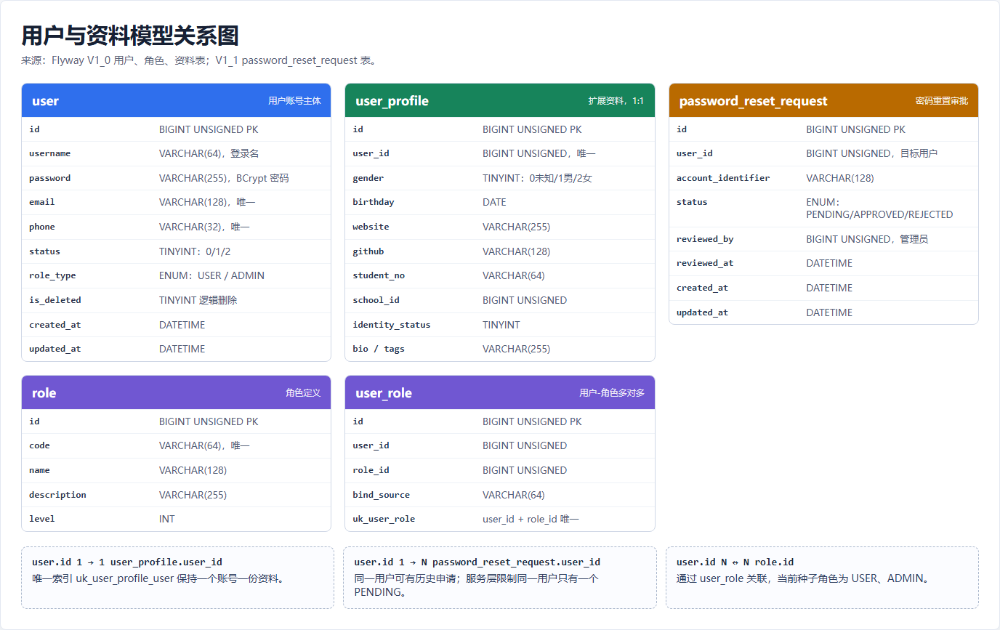
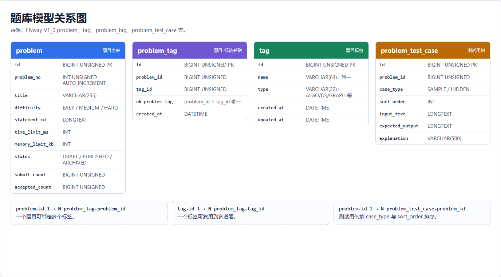
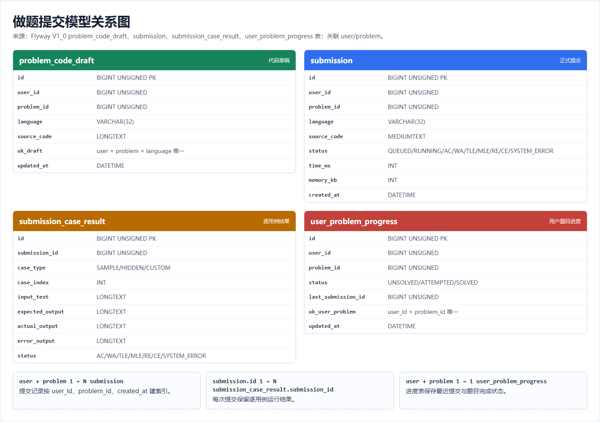
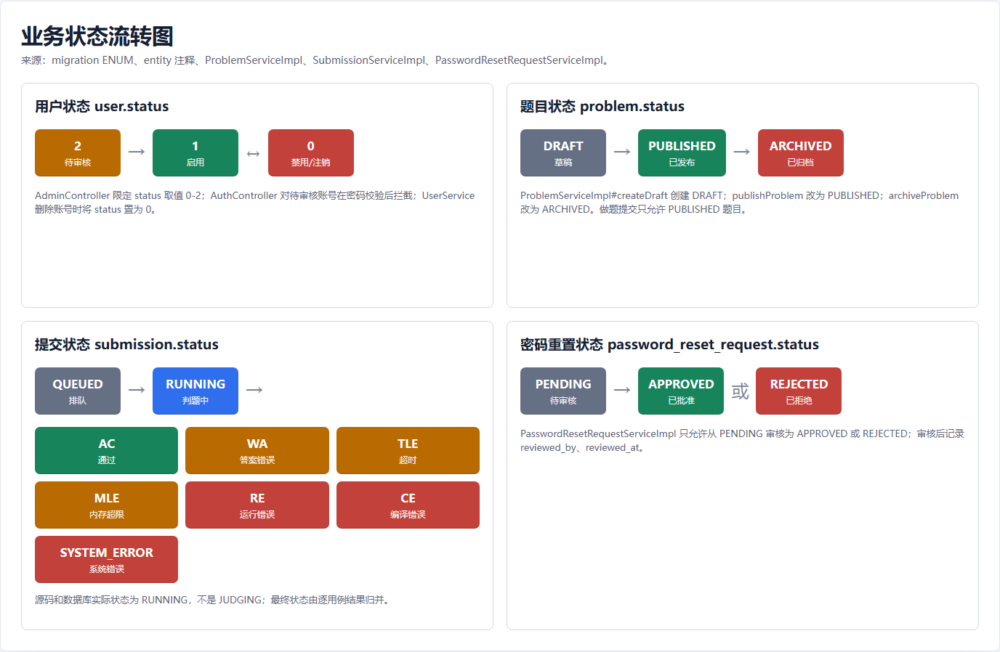

# 数据模型与业务状态

本章依据后端 Flyway migration、entity 与 service 实现整理。关系图由真实表结构和源码状态常量生成，图片源文件保留在 `assets/screenshots/data/data-model-diagrams.html`，可用同目录的 `capture-data-diagrams.js` 重新截图。

## 1. 用户与账号模型

### `user`

用户账号主体。

主要字段：

- `id`
- `username`
- `password`
- `email`
- `phone`
- `avatar`
- `status`
- `role_type`
- `is_deleted`
- `created_at`
- `updated_at`

用户状态：

| 状态 | 含义 |
| --- | --- |
| `0` | 禁用或注销。 |
| `1` | 启用。 |
| `2` | 待审核。 |

状态约束来自 `user.status` 字段注释与管理员更新接口校验。登录时，禁用账号会被安全层拦截，待审核账号会在密码校验通过后返回待审核提示。

### `user_profile`

用户扩展资料，与 `user` 通过 `user_profile.user_id` 建立一对一关系，唯一约束为 `uk_user_profile_user`。

主要字段包括：

- 性别。
- 生日。
- 地址。
- 网站。
- GitHub。
- 公司。
- 职位。
- 技能。
- 学号或工号。
- 学校 ID。
- 标签。
- 简介。
- 实名或资质状态。

### `password_reset_request`

密码重置申请，与 `user` 通过 `password_reset_request.user_id` 关联。服务层会对同一用户的待处理申请加锁检查，避免重复创建多个 `PENDING` 申请。

主要字段：

- 申请 ID。
- 用户 ID。
- 申请账号标识。
- 状态。
- 审核人。
- 审核时间。
- 创建时间。
- 更新时间。

申请状态：

| 状态 | 含义 |
| --- | --- |
| `PENDING` | 待处理。 |
| `APPROVED` | 已批准。 |
| `REJECTED` | 已拒绝。 |

### `role` / `user_role`

代码库仍保留角色表和用户角色关联表，当前种子角色为 `USER` 与 `ADMIN`。现行账号也在 `user.role_type` 中保留 `USER` / `ADMIN` 枚举，用于当前前后端主线角色判断。

## 2. 题库模型

### `problem`

题目主表。

主要字段：

- `id`
- `problem_no`
- `title`
- `difficulty`
- `statement_md`
- `time_limit_ms`
- `memory_limit_kb`
- `status`
- `submit_count`
- `accepted_count`
- `created_at`
- `updated_at`

题目状态：

| 状态 | 含义 |
| --- | --- |
| `DRAFT` | 草稿。 |
| `PUBLISHED` | 已发布。 |
| `ARCHIVED` | 已归档。 |

`ProblemServiceImpl#createDraft` 创建草稿，`publishProblem` 将状态改为 `PUBLISHED`，`archiveProblem` 将状态改为 `ARCHIVED`。做题提交服务只允许提交 `PUBLISHED` 状态的题目。

### `tag`

题目标签。

主要字段：

- `id`
- `name`
- `type`
- `created_at`
- `updated_at`

### `problem_tag`

题目与标签的关联表。`problem_id` 与 `tag_id` 组成唯一约束，表达题目和标签的多对多关系。

主要字段：

- `id`
- `problem_id`
- `tag_id`
- `created_at`

### `problem_test_case`

题目测试用例。

主要字段：

- `id`
- `problem_id`
- `case_type`
- `input_text`
- `expected_output`
- `explanation`
- `sort_order`

用例类型：

| 类型 | 含义 |
| --- | --- |
| `SAMPLE` | 公开样例。 |
| `HIDDEN` | 隐藏判题用例。 |

## 3. 做题与提交模型

### `problem_code_draft`

用户代码草稿。

唯一维度：

- 用户。
- 题目。
- 编程语言。

主要字段：

- `user_id`
- `problem_id`
- `language`
- `source_code`
- `created_at`
- `updated_at`

### `submission`

正式提交记录。

主要字段：

- `id`
- `user_id`
- `problem_id`
- `language`
- `source_code`
- `status`
- `time_ms`
- `memory_kb`
- `compile_message`
- `judge_message`
- `created_at`

提交状态：

| 状态 | 含义 |
| --- | --- |
| `QUEUED` | 已排队。 |
| `RUNNING` | 判题中。 |
| `AC` | 通过。 |
| `WA` | 答案错误。 |
| `TLE` | 超时。 |
| `MLE` | 内存超限。 |
| `RE` | 运行错误。 |
| `CE` | 编译错误。 |
| `SYSTEM_ERROR` | 系统错误。 |

说明：数据库 ENUM、`Submission` entity、`SubmissionServiceImpl` 与前端展示均使用 `RUNNING` 表示判题中；文档不使用未在源码中出现的 `JUDGING`。

### `submission_case_result`

逐用例判题结果。

主要字段：

- `submission_id`
- `case_type`
- `case_index`
- `status`
- `input_text`
- `expected_output`
- `actual_output`
- `error_output`
- `time_ms`
- `memory_kb`
- `message`

隐藏用例返回给用户时会隐藏输入、期望输出、实际输出和错误输出。

### `user_problem_progress`

用户题目进度。

主要字段：

- `user_id`
- `problem_id`
- `status`
- `last_submission_id`
- `updated_at`

进度状态：

| 状态 | 含义 |
| --- | --- |
| `UNSOLVED` | 未解决。 |
| `ATTEMPTED` | 已尝试但未通过。 |
| `SOLVED` | 已解决。 |

提交服务根据最终判题状态维护进度：通过时写入 `SOLVED`，未通过时写入 `ATTEMPTED`，同时记录最近一次提交 ID。

## 4. 业务状态流转

状态流转来源：

- 用户状态来自 `user.status`、管理员状态更新接口和登录拦截逻辑。
- 题目状态来自 `problem.status` 与 `ProblemServiceImpl` 的创建、发布、归档方法。
- 提交状态来自 `submission.status` ENUM、`Submission` entity 与 `SubmissionServiceImpl`。
- 密码重置状态来自 `password_reset_request.status` ENUM 与 `PasswordResetRequestServiceImpl`。

## 5. 核心表结构清单

本地环境未提供 `mysql` 命令行客户端，因此本章未补充真实 MySQL 终端查询截图。上图表清单仍来自已执行的 Flyway migration 源文件，可复现当前数据库结构。

## 6. 角色权限历史模型

角色相关历史表与当前账号主线的关系见用户与资料模型图：

代码库中仍保留以下表和实体：

- `role`
- `user_role`
- `permission`
- `role_permission`

当前文档仅在用户模型图中展示 `role` 与 `user_role`，不将权限表作为主线功能展开。现行前端和 README/API 均将角色收敛为 `USER` 和 `ADMIN`。

## 7. 学校班级历史模型

学校班级相关对象属于历史模型，当前主线表结构清单中仍可追溯其迁移来源：

代码库中仍保留以下历史对象：

- `school`
- `department`
- `class`
- `class_user`
- `class_teacher`

这些对象属于历史教学平台规划遗留内容，不作为当前个人算法训练平台的主功能说明。

## 8. 支撑文档覆盖性审查结论

本章已对照 Flyway migration、entity 与 service 状态流转复核，覆盖当前主线数据对象：`user`、`user_profile`、`password_reset_request`、`role`、`user_role`、`problem`、`tag`、`problem_tag`、`problem_test_case`、`problem_code_draft`、`submission`、`submission_case_result`、`user_problem_progress`。

状态枚举覆盖用户状态、密码重置状态、题目状态、测试用例类型、提交状态、逐用例结果状态和用户做题进度状态。学校、院系、班级、权限相关表已作为历史模型单独说明，未混入当前主线功能。

