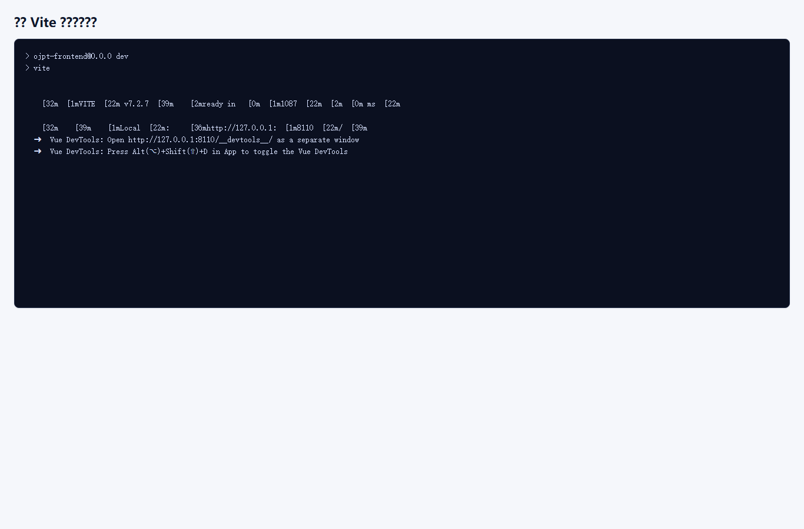
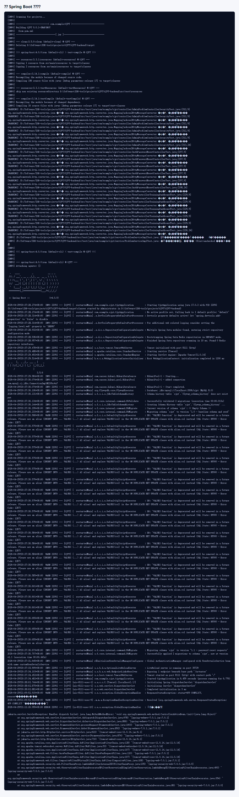
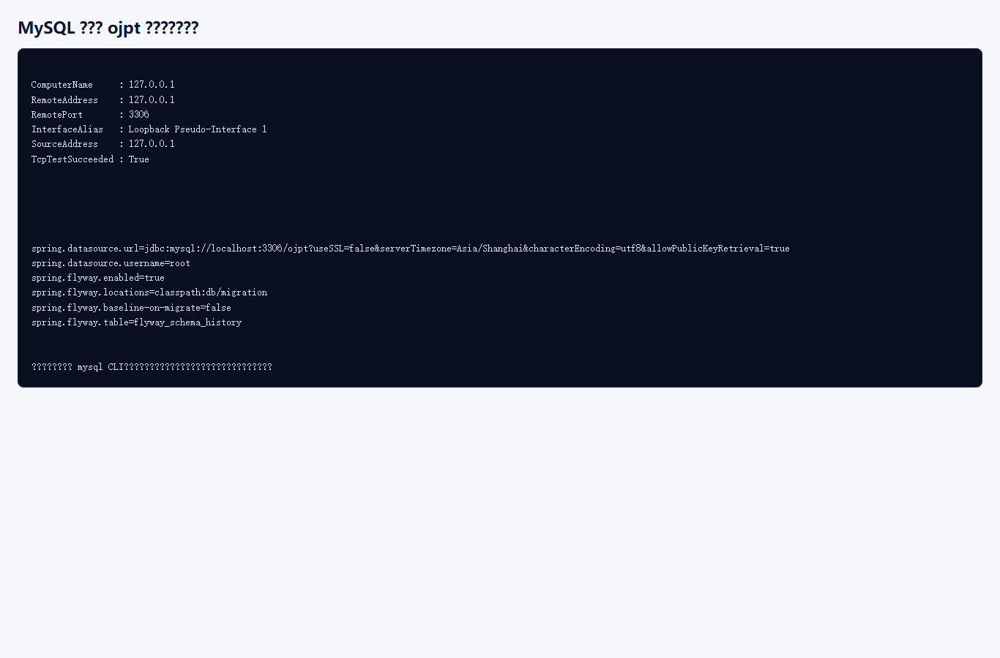
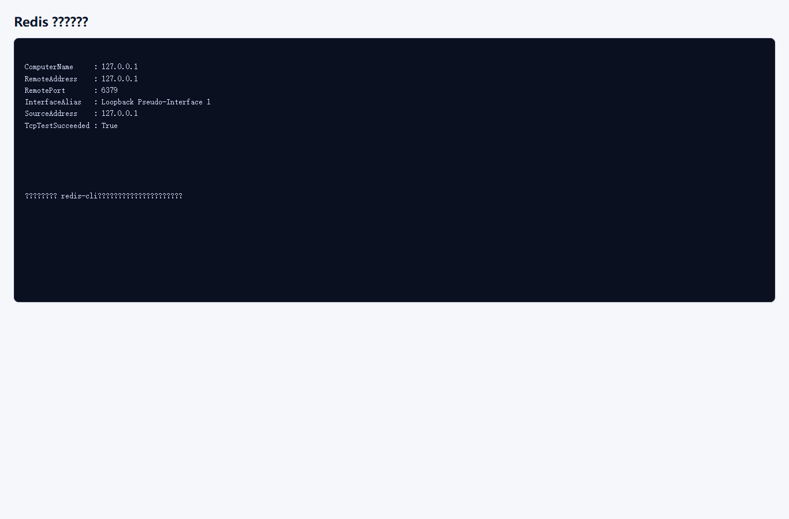
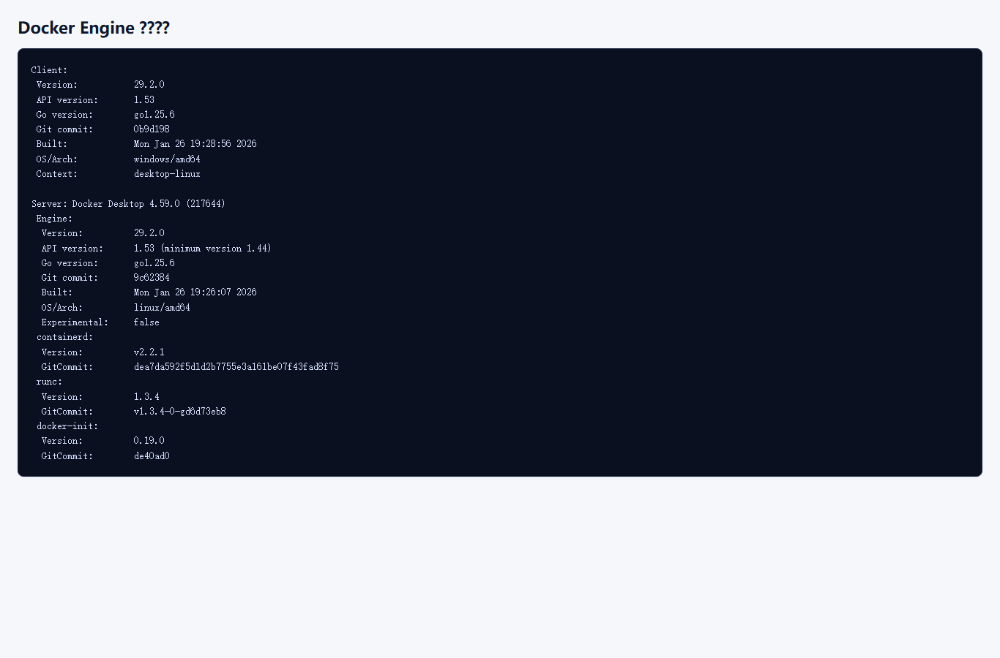
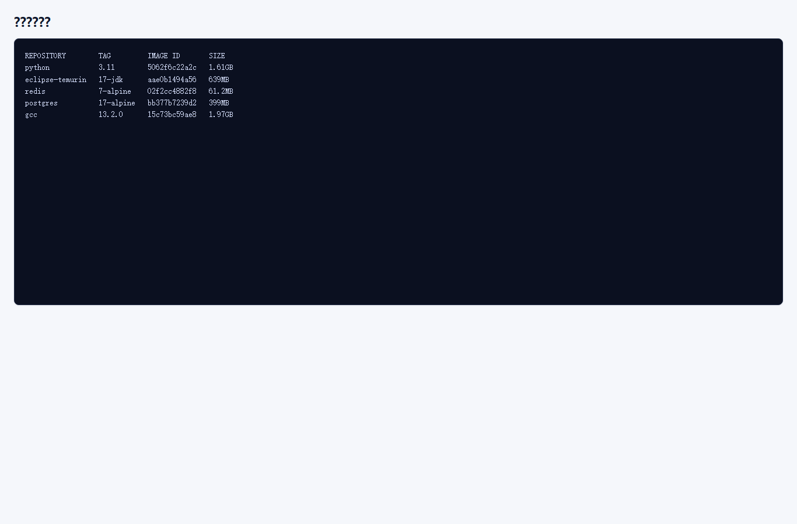
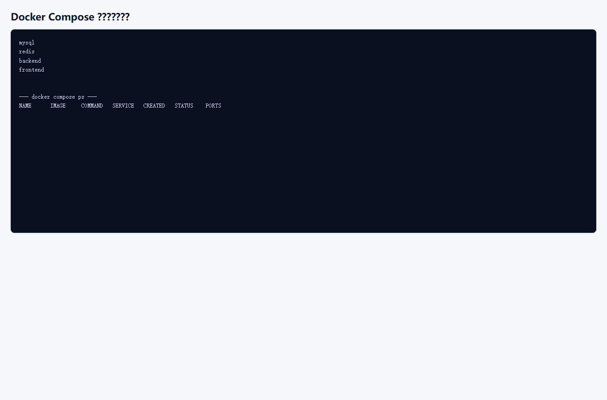
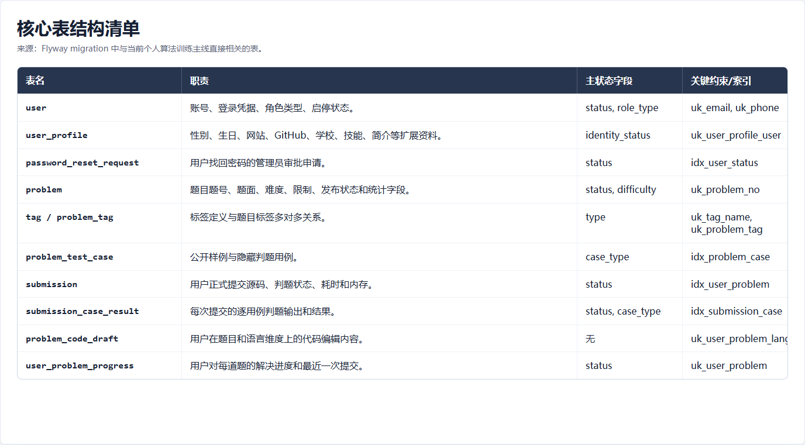
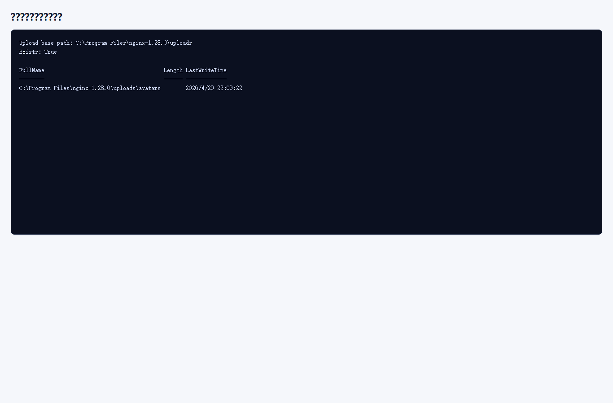

# 部署与运行依赖

## 1. 本地开发端口

| 服务 | 默认地址 |
| --- | --- |
| 前端 Vite | `http://127.0.0.1:8110` |
| 后端 Spring Boot | `http://127.0.0.1:8111` |
| MySQL | `localhost:3306` |
| Redis | `localhost:6379` |
| Swagger UI | `http://localhost:8111/swagger-ui/index.html` |
| 健康检查 | `http://localhost:8111/actuator/health` |

前端开发服务器会将 `/api` 代理到 `http://127.0.0.1:8111`。

前端 Vite 服务运行日志：


*图示：前端 Vite 服务运行日志。*

后端 Spring Boot 运行日志：


*图示：后端 Spring Boot 启动日志。*

## 2. 本地启动方式

本地启动验证截图如下，分别对应前端 Vite 和后端 Spring Boot：


*图示：前端 Vite 服务运行日志。*


*图示：后端 Spring Boot 启动日志。*

后端：

```bash
cd OJPT-backend
mvn spring-boot:run
```

前端：

```bash
cd OJPT-frontend
npm install
npm run dev
```

生产构建输出到前端项目内的 `dist` 目录：

```bash
cd OJPT-frontend
npm run build
```

本地后端默认读取：

```text
OJPT-backend/src/main/resources/application.properties
```

默认数据库配置：

- 数据库：`ojpt`
- 用户名：`root`
- 密码：`123456`

## 3. MySQL 与 Redis

MySQL 用于存储用户、角色、题目、测试用例、提交记录等业务数据。当前采集环境未安装 `mysql` 命令行客户端，因此使用 `Test-NetConnection` 端口连通性和后端数据源配置作为真实可获取检查输出。


*图示：MySQL 连接与数据库配置检查。*

Redis 用于 Refresh Token、Token 黑名单，以及权限变化或密码重置后的强制重新登录。当前采集环境未安装 `redis-cli`，因此使用 `Test-NetConnection` 端口连通性作为真实可获取检查输出。


*图示：Redis 连接状态检查。*

## 4. Docker Engine 与判题镜像

后端判题依赖 Docker Engine。Windows 本地开发时通常需要启动 Docker Desktop。

配置项：

```properties
ojpt.judge.docker.executable=C:/Program Files/Docker/Docker/resources/bin/docker.exe
ojpt.judge.cpp.image=gcc:13.2.0
ojpt.judge.java.image=eclipse-temurin:17-jdk
ojpt.judge.python.image=python:3.11
ojpt.judge.cpu=1
ojpt.judge.memory-mb=256
ojpt.judge.health.timeout-ms=3000
```

Docker Engine 运行状态：


*图示：Docker Engine 运行状态。*

判题镜像列表：


*图示：判题镜像列表。*

需要准备的镜像：

```bash
docker pull gcc:13.2.0
docker pull eclipse-temurin:17-jdk
docker pull python:3.11
```

管理端会检查 Docker 可执行文件、Docker Engine 连接、`docker version`、`docker info` 和三类语言镜像是否可用。

## 5. Docker Compose 部署

仓库根目录提供 `docker-compose.yml`，可用于启动 MySQL、Redis、Backend、Frontend。

推荐部署命令：

```bash
docker compose up --build -d
```

生产或部署环境应通过 `.env` 配置真实密码和 JWT Secret。当前采集环境中 `docker compose config --services` 可解析服务配置，但 `docker compose ps` 未显示运行中的 compose 服务，并提示部分环境变量未设置。


*图示：Docker Compose 配置与运行状态。*

## 6. 数据库初始化

项目使用 Flyway 自动初始化数据库。

当前核心表结构与迁移结果关系如下：


*图示：核心表结构清单。*

| 迁移 | 说明 |
| --- | --- |
| `V1_0__baseline_schema_and_seed.sql` | 初始化表结构、角色、默认账号、题库和测试用例。 |
| `V1_1__password_reset_requests.sql` | 增加密码重置申请表。 |

首次空库启动时，后端会自动执行迁移。默认账号：

| 账号 | 初始密码 |
| --- | --- |
| `admin` | `123456` |
| `admin1` | `123456` |
| `user` | `123456` |
| `user1` | `123456` |

如果数据库已经执行过迁移，Flyway 不会重复导入 seed 数据。需要重置本地数据时，应清空数据库或删除 Docker volume 后重新启动。

## 7. 上传文件依赖

后端配置头像上传目录：

```properties
ojpt.upload.base-path=C:/Program Files/nginx-1.28.0/uploads
ojpt.upload.avatar-path=avatars
ojpt.upload.avatar-url-prefix=/uploads/avatars
```

当前采集环境中上传根目录检查结果如下。若目录不存在或无写入权限，头像上传可能失败；部署环境中的前端静态服务也需要能访问 `/uploads/avatars`。

前端展示头像时直接使用后端返回的相对路径，例如 `/uploads/avatars/xxx.webp`，不再拼接固定的 `localhost` 域名。部署到 Nginx 或其他静态服务时，应保证同源访问 `/uploads/avatars` 能映射到上述上传目录。


*图示：上传目录与头像路径检查。*

## 8. 支撑文档覆盖性审查结论

本章已对照 `application.properties`、`vite.config.ts`、`docker-compose.yml` 和部署 Dockerfile/README 复核，覆盖前端 Vite 启动、前端 `dist` 构建输出、后端 Spring Boot 启动、MySQL、Redis、Docker Engine、C/C++/Java/Python 判题镜像、Docker Compose 服务编排、Flyway 初始化数据、默认账号、上传目录与头像 URL 前缀。

现有证据截图已覆盖本地启动日志、MySQL/Redis 端口与配置、Docker 状态、判题镜像、Compose 配置解析与上传目录检查，无需额外补图。
