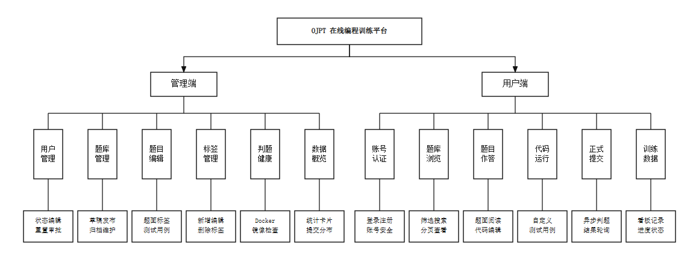
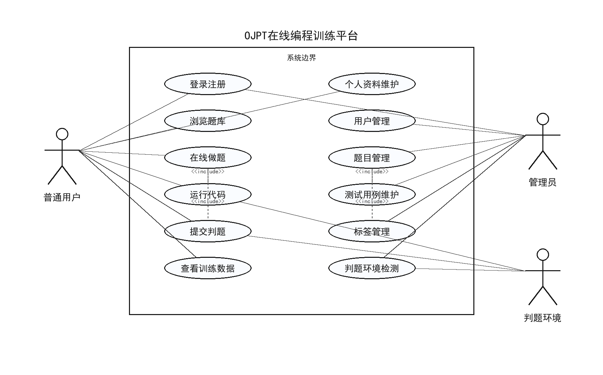
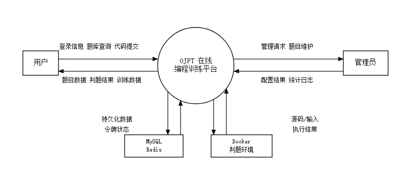
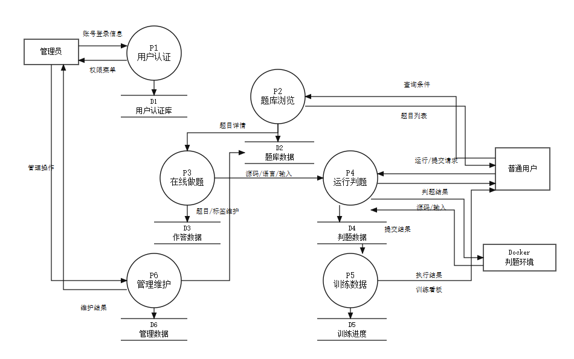
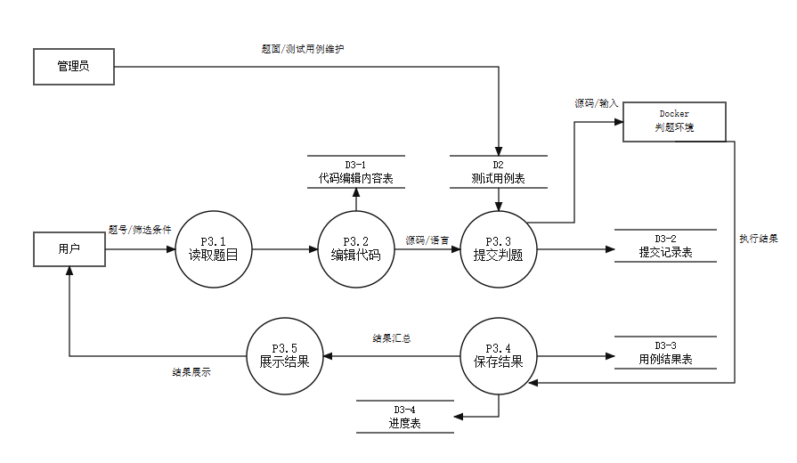

# 3系统需求分析

## 3.1系统功能需求分析

OJPT在线编程训练平台面向个人算法训练和题库维护场景，系统功能围绕“选择题目、编辑代码、运行调试、提交判题、查看训练数据、维护题库资源”展开。普通用户侧重点在训练闭环，管理员侧重点在基础数据和运行环境维护。需求分析不再按用户角色单独铺开，而是直接按照系统功能组织说明，使需求描述与后续系统实现章节保持一致。

### 3.1.1系统主要功能介绍

系统的账号认证功能负责登录、注册、令牌刷新、退出登录、当前用户信息查询和密码重置申请。用户可以使用用户名、邮箱或手机号登录，注册成功后系统返回登录态；访问个人中心、代码草稿、运行代码、正式提交和后台管理等受保护功能时，系统根据JWT和角色权限进行校验。

题库与在线做题功能负责题目列表展示、题目筛选、题目详情加载、Markdown题面展示、公开样例加载、代码编辑和语言切换。用户可以按题号、关键词、难度、标签和完成状态查找题目，进入做题页后可以阅读题面、查看限制条件和样例数据，并在代码编辑区完成作答。

代码运行与提交判题功能负责保存代码草稿、运行样例或自定义测试用例、正式提交代码、查询提交结果和更新训练进度。代码运行主要服务于提交前调试，不创建正式提交记录；提交判题会创建提交记录，调用Docker判题环境执行测试用例，保存逐用例结果，并更新用户题目进度。

个人中心与训练数据功能负责个人资料维护、头像上传与删除、账号安全设置、提交记录查看和训练看板展示。训练看板需要展示提交次数、通过次数、已解决题数、通过率、难度分布、状态分布和近期提交记录，使用户能够了解自己的训练情况。

后台管理功能负责用户管理、题目管理、测试用例维护、标签管理、密码重置审核、统计概览和判题环境检测。管理员可以维护用户状态和资料，创建题目草稿，编辑题面和限制条件，维护公开样例和隐藏用例，绑定题目标签，并检查Docker可执行文件、版本和语言镜像状态。

### 3.1.2系统功能模块分析

根据系统功能范围，OJPT可以划分为认证与账号、题库浏览、在线做题、代码运行、提交判题、训练数据、后台用户管理、后台题目管理、后台标签管理和判题环境检测等模块。各模块之间以题库和判题为核心形成联系：题库模块提供题目数据，在线做题模块组织题面和代码编辑，代码运行与提交判题模块产生运行结果和提交记录，训练数据模块读取提交记录与题目进度，后台管理模块维护题目、测试用例、标签和用户状态。系统功能模块如图3-1所示。

图3-1系统功能模块图

### 3.1.3系统用例分析

系统用例主要包括普通用户训练用例、管理员维护用例和判题环境交互用例。普通用户可以完成登录注册、浏览题库、在线做题、运行代码、提交判题和查看训练数据；管理员在具备普通用户能力的基础上，可以完成用户管理、题目管理、测试用例维护、标签管理、统计概览和判题环境检测；判题环境作为外部执行环境，参与代码运行、正式判题和环境检测。系统用例图如图3-2所示。

图3-2系统用例图

## 3.2系统功能流程介绍

OJPT在线编程训练平台的功能流程可以通过数据流图进行描述。普通用户、管理员、Docker判题环境和数据库是系统数据交换的主要参与方，题库浏览、在线做题、代码运行、提交判题、训练统计和后台维护等处理过程共同构成系统的数据处理链路。

### 3.2.1系统数据流分析

顶层数据流图用于描述系统与外部实体之间的主要数据交换关系。普通用户向系统提交登录信息、题库筛选条件、源代码、测试输入和个人资料维护请求，系统向普通用户返回题目列表、题目详情、运行结果、提交结果和训练数据。管理员向系统提交用户、题目、测试用例、标签和判题环境检查等维护请求，系统返回管理结果、统计数据和环境状态。Docker判题环境接收源码、语言、输入数据和资源限制，返回执行结果。系统顶层数据流图如图3-3所示。

图3-3系统顶层数据流图

零层数据流图在顶层数据流图的基础上，将系统内部处理过程拆分为用户认证、题库浏览、在线做题、运行判题、训练数据和后台维护等部分。各处理过程通过用户信息、题目信息、测试用例、代码草稿、提交记录、提交用例结果和用户题目进度等数据存储进行联系，能够反映系统内部主要数据的产生、读取和更新关系。系统零层数据流图如图3-4所示。

图3-4系统零层数据流图

一层数据流图重点展开代码运行和提交判题这一核心业务。用户进入做题页后，系统读取题目详情、公开样例和代码草稿；用户运行代码时，系统将源码、语言和输入数据发送给Docker判题环境，并返回标准输出、错误输出、耗时和状态；用户正式提交时，系统创建提交记录，读取题目测试用例，保存逐用例结果，并更新用户题目进度。一层数据流图如图3-5所示。

图3-5一层数据流图

### 3.2.2数据字典

数据字典中包含数据源、数据流、数据存储和数据加工等内容，通过数据字典可以明确系统与用户、管理员、判题环境和数据库之间的数据走向及处理情况。

数据源

表3-1数据源表

| 序号 | 名称 | 简述 | 输入/输出 |
| --- | --- | --- | --- |
| 1 | 普通用户 | 浏览题库、在线做题、运行代码、提交判题和查看训练数据 | 输入登录信息、筛选条件、源码和测试输入；接收题目、运行结果、提交结果和训练数据 |
| 2 | 管理员 | 维护用户、题目、测试用例、标签和判题环境 | 输入管理操作和维护数据；接收统计数据、维护结果和环境检测结果 |
| 3 | Docker判题环境 | 隔离执行用户代码并返回运行状态 | 接收源码、语言、输入数据和资源限制；输出标准输出、错误输出、耗时和状态 |
| 4 | MySQL/Redis | 保存业务数据和登录状态数据 | 接收持久化数据、令牌状态和缓存数据；输出查询结果和状态校验结果 |

数据流

表3-2数据流表

| 序号 | 名称 | 来源 | 去向 | 组成 |
| --- | --- | --- | --- | --- |
| 1 | 登录信息 | 用户 | 用户认证处理 | 账号、密码、验证码状态 |
| 2 | 用户身份信息 | 用户认证处理 | 前端与权限控制 | 用户ID、用户名、角色、访问令牌、刷新令牌 |
| 3 | 题库查询条件 | 用户 | 题库浏览处理 | 关键词、题号、难度、标签、完成状态、分页参数 |
| 4 | 题目详情数据 | 题库浏览处理 | 在线做题处理 | 题号、标题、题面、限制条件、样例、标签 |
| 5 | 运行请求数据 | 在线做题处理 | 代码运行处理 | 语言、源码、测试输入、期望输出 |
| 6 | 提交请求数据 | 在线做题处理 | 提交判题处理 | 题号、语言、源码、用户信息 |
| 7 | 判题结果数据 | Docker判题环境 | 提交记录与结果展示 | 状态、输出、错误信息、耗时、内存 |
| 8 | 管理维护数据 | 管理员 | 后台管理处理 | 用户信息、题目信息、测试用例、标签和发布状态 |

数据存储

表3-3数据存储表

| 序号 | 名称 | 编号 | 组成 | 相关处理 |
| --- | --- | --- | --- | --- |
| 1 | 用户信息表 | D1 | 用户ID、用户名、密码、邮箱、手机号、角色、状态 | 登录注册、权限判断、用户管理 |
| 2 | 题目信息表 | D2 | 题目ID、题号、标题、难度、题面、限制、状态 | 题库查询、题目详情、题目维护 |
| 3 | 测试用例表 | D3 | 用例ID、题目ID、输入、期望输出、类型、排序 | 代码运行、提交判题、用例维护 |
| 4 | 代码草稿表 | D4 | 用户ID、题目ID、语言、源码、更新时间 | 草稿保存、做题页初始化 |
| 5 | 提交记录表 | D5 | 提交ID、用户ID、题目ID、语言、源码、状态、耗时 | 正式提交、提交记录查询 |
| 6 | 提交用例结果表 | D6 | 提交ID、用例序号、状态、输入、期望输出、实际输出 | 提交详情、结果展示 |
| 7 | 用户题目进度表 | D7 | 用户ID、题目ID、进度状态、最近提交ID | 训练看板、题库完成状态 |
| 8 | 标签与题目标签表 | D8 | 标签ID、标签名、题目ID、标签ID | 题库筛选、题目标签维护 |

数据加工

表3-4数据加工表

| 序号 | 名称 | 输入 | 输出 | 处理逻辑 |
| --- | --- | --- | --- | --- |
| 1 | 用户认证处理 | 登录信息、注册信息 | 用户身份信息、令牌状态 | 校验账号、密码和用户状态，生成或刷新访问令牌 |
| 2 | 题库浏览处理 | 题库查询条件 | 题目列表、分页数据 | 按关键词、题号、难度、标签和完成状态组合查询 |
| 3 | 做题页初始化处理 | 题号、用户、语言 | 题目详情、公开样例、代码草稿 | 查询题面、样例和当前用户草稿 |
| 4 | 代码运行处理 | 源码、语言、测试输入 | 运行输出、错误信息、耗时、状态 | 调用Docker判题环境执行临时测试，不生成正式提交记录 |
| 5 | 提交判题处理 | 题号、源码、语言、用户信息 | 提交记录、逐用例结果、题目进度 | 创建提交记录，执行全部测试用例，保存结果并更新训练进度 |
| 6 | 训练数据处理 | 提交记录、题目进度 | 提交统计、通过率、难度分布 | 汇总用户提交与通过情况，生成训练看板数据 |
| 7 | 后台维护处理 | 管理维护数据 | 维护结果、统计数据、环境状态 | 维护用户、题目、测试用例、标签和判题环境信息 |
