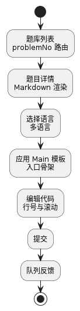
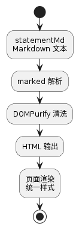
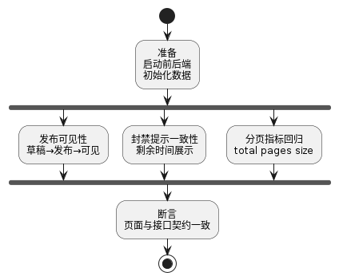

# 5 系统的开发设计与实现

## 5.1 后端服务实现
后端服务基于 Spring Boot 4 实现，采用分层架构组织控制器、服务与数据访问逻辑。系统实现了题库展示接口、管理端题库管理接口以及提交相关接口。

（1）题目公开查询接口  
通过按题号查询接口实现公开题目访问能力，使学员端可以在无需登录的情况下访问已发布题目详情。

（2）管理端题库管理接口  
管理端题库列表接口提供分页能力，并支持状态（`DRAFT/PUBLISHED/ARCHIVED`）过滤、关键字检索、标签过滤与默认排序策略。接口返回结构化分页结果，确保前端分页条能够正确显示 `total/pages/size` 指标。

（3）安全鉴权与权限控制  
系统采用 JWT 认证与角色权限机制，对公开接口进行放行、对管理端敏感接口进行鉴权。登录失败与封禁状态反馈在前端与后端之间保持一致的数据结构映射，从而提升错误提示的可读性。

（4）分页实现一致性  
在工程实现中，通过装配 MyBatis-Plus 分页拦截器解决分页 `total/pages` 返回为 0 的异常问题，保证列表分页结果稳定并可回归验证。

## 5.2 学员端实现
学员端基于 Vue 3、TypeScript 与 Element Plus 构建，主要实现以下功能：

（1）题库列表页与题号路由策略  
列表展示通过 `problemNo` 进行题号呈现与详情路由定位。页面以 `P0001` 等格式显示题号，点击进入题目详情页完成内容展示。

图5-1 以用户操作顺序串联了核心交互：从题库列表进入题目详情后，前端完成题面渲染与安全清洗；用户选择语言后系统应用对应的 Main 入口模板并进入代码编辑；提交后返回结构化状态提示，使用户获得“已进入评测队列”等可读反馈。该链路的稳定性直接决定了学员端的可用体验。

（图5-1 学员端做题与提交链路流程图）

（2）题面 Markdown 渲染与安全清洗  
题面内容使用 Markdown 解析并在前端进行安全清洗，避免潜在脚本注入。渲染样式通过作用域深度选择器对内容进行统一调整，使标题、段落、列表与代码块显示符合教学展示的阅读体验。

（3）代码编辑器与滚动同步  
在做题页中实现代码编辑器行号展示，并通过滚动同步保证行号与代码区域一致，从而提升编程交互体验。

（4）按语言生成的 Main 文件模板  
系统在做题页提供语言选择与模板初始化机制。当前语言集合中 C/C++ 采用共用模板，Java 与 Python3 分别提供入口骨架。模板的入口文件名分别为 `Main.cpp`、`Main.java`、`main.py`，并以此形成沙盒执行入口组织策略。

（5）提交链路与反馈  
提交按钮在登录态校验通过后，将题目标识、语言与源代码发送至后端提交接口。后端返回结构化提交状态信息，前端据此展示可读反馈，例如进入评测队列的占位提示。

## 5.3 管理端实现
管理端实现了题库管理的最小闭环链路，满足草稿池到发布上架的演示需求。

（1）管理端题库管理列表页  
页面通过 Tab 分区管理草稿池、已发布内容与已归档内容，并将默认展示定位为已发布状态。列表支持标题搜索与按状态分页浏览。

（2）题目编辑页  
编辑页提供标题、难度、时间限制、内存限制以及题面 Markdown 的编辑能力。为便于对照效果，题面编辑采用左右分栏布局：左侧为 Markdown 编辑区，右侧为实时预览区，实现了“输入即视图更新”的交互体验。

（3）标签绑定与同步  
编辑页提供标签的选择与绑定/解绑操作。系统对标签绑定执行增删差异同步，使题目标签在发布后可以在列表展示中保持一致。

（4）发布与归档操作  
通过后端发布/归档接口完成题目状态切换，发布后学员端题库与详情页可立即可见。

## 5.4 关键技术与实现细节
为保证系统在演示与验证阶段具备稳定性，本文在关键环节使用了以下工程实现手段：

（1）全局接口返回结构统一  
前后端基于统一返回结构进行字段解析与错误处理，减少前端对后端返回形态的耦合。

（2）Markdown 渲染样式复用与内容清洗  
对渲染内容进行安全清洗并复用学员端的最小样式集合，确保管理端预览与学员端展示的一致性。

图5-2 说明了题面内容从 Markdown 文本到最终页面渲染的处理顺序：先通过解析器将 Markdown 转换为 HTML 结构，再通过清洗器移除潜在风险标签与属性，最后在统一样式约束下渲染到页面。该流程使题面展示在“可读性”与“安全性”之间达到平衡，并为测试提供可断言的处理链路。

（图5-2 Markdown 渲染与安全清洗处理流程图）

（3）页面滚动体验修复  
对主容器与管理端内容区采用 `overflow: auto` 的策略，解决长页面内容超出可视区域时缺乏滚动条的问题，使长题面编辑与列表页面可以顺畅浏览到底部。

## 5.5 测试与结果分析

OJPT 的测试策略以“关键链路正确 + 高影响回归防护”为目标，覆盖单元层面的稳定性校验以及端到端层面的可见性验证。

### 5.5.1 测试环境与工具
测试体系采用前端 TypeScript 为主的单元测试与端到端测试策略：

（1）单元测试  
使用 Vitest 对关键工具与 API 封装进行校验，包括 Markdown 渲染与安全清洗逻辑、题目信息字段组织一致性以及提交相关参数组装行为。

（2）端到端测试  
使用 Playwright 对用户可见链路进行验证，包括管理端草稿创建到发布可见的全流程、封禁账号登录提示信息展示一致性、以及题库列表分页指标回归验证等场景。

（3）运行环境与访问方式  
端到端测试在本地服务环境中完成：后端通过本地 Spring Boot 启动，前端通过本地 Vite 启动，依赖统一的接口封装与路由策略完成端到端调用链路。

### 5.5.2 单元测试结果
单元测试主要覆盖以下方面：

（1）Markdown 渲染稳定性  
对 Markdown 渲染输入进行结构化校验，确保段落、列表与代码块等结构能稳定生成对应 HTML。

（2）安全清洗校验  
对典型脚本注入风险输入进行清洗断言，降低潜在 XSS 风险对页面渲染层面的影响。

（3）题号接口字段一致性  
对基于题号 `problemNo` 的详情查询返回结构进行断言，保证路由策略与详情页面展示字段一致。

（4）提交接口请求参数一致性  
对提交 API 请求 payload 的字段组装进行校验，降低字段缺失导致的接口调用偏差。

图5-3 以“准备—操作—断言”的思路归纳端到端测试的关键回归点：其一为管理端草稿发布后学员端可见性验证，确保状态流转与数据刷新一致；其二为封禁用户登录提示一致性验证，确保错误结构与剩余时间信息的展示符合预期；其三为分页指标回归验证，确保 `total/pages/size` 的返回与前端分页条表现一致。通过聚焦高影响路径，端到端测试为迭代提供稳定的回归基线。

（图5-3 端到端测试关键回归点覆盖图）

### 5.5.3 端到端测试结果
端到端测试围绕“用户可见效果”和“关键回归点”展开，确保系统在迭代过程中仍保持一致体验。

（1）管理端发布到学员端可见链路  
通过测试模拟草稿创建、管理端登录审核发布，并验证学员端题库列表与题目详情页能够读取到新发布题目。

（2）封禁登录体验一致性  
对封禁用户登录错误提示进行断言，确保错误信息中包含与剩余时间相关的展示内容，并保持前端与后端错误结构一致。

（3）题库分页指标回归  
对题库列表接口分页返回结构进行断言，重点验证在记录非空时 `total/pages/size` 指标不会异常为 0，确保分页条显示正确。

### 5.5.4 结果分析与讨论
综合单元测试与端到端测试，本文在一致性与回归防护方面得到如下结论：

（1）一致性与可用性  
关键页面的数据结构与展示策略保持一致，题库发布闭环能够形成用户可见的反馈闭环。

（2）安全与稳健性  
Markdown 渲染清洗策略降低了渲染层面的安全风险；接口封装与统一错误处理机制提升了使用过程中的可读性。

（3）回归防护能力  
针对分页指标异常与封禁提示缺失等历史高影响点，端到端用例提供了稳定的验证基线，便于维护迭代。

## 5.6 本章小结
本章从后端接口实现、前端关键交互实现、以及测试与结果分析三个维度阐述了系统的工程落地过程。通过接口契约一致性与关键回归用例，OJPT 在演示与验证阶段保持了较好的正确性与稳定性。

在开发实现细节方面，本文重点关注了“长内容可用性”“编辑体验可检查性”与“沙盒入口一致性”三个环节。首先，在页面滚动体验层面，系统对主容器与管理端内容区引入 `overflow: auto` 策略，并在根级视图中启用全局可滚动能力，确保在不同分辨率下内容均可浏览到底部。其次，在 Markdown 编辑体验层面，管理端采用左右分栏卡片布局：左侧为编辑区，右侧为实时预览区，并通过自适应宽度与容器高度策略保证两侧卡片在父级空间内稳定排布；预览内容同时复用安全清洗策略，确保用户输入内容在展示层面可控。再次，在代码提交一致性层面，前端引入语言模板体系，并对 C/C++ 采用共用入口模板的规则；当用户切换语言时，通过确认交互避免误切换导致的代码结构丢失，且重置时保持入口文件命名与 Main 文件约束一致，从而为后续评测执行入口组织提供可预测的输入形式。

从验证结果看，测试体系覆盖了分页字段正确性、Markdown 渲染与安全清洗稳定性、封禁用户登录提示展示一致性，以及管理端草稿到发布的可见性闭环等关键场景。通过单元测试与端到端测试的组合，系统能够在功能迭代后仍维持关键链路的稳定性，并为后续评测沙盒更复杂题型的接入提供可复用的接口基础与验证基线。

在前端实现层面，OJPT 重点保证了管理端“题目维护—实时校对—状态发布”的可操作性。管理端题目列表通过状态分区组织，默认将“已发布”作为首要展示，以便在演示时快速定位到可见题目；列表同时按 `problemNo` 升序排列，确保同一题号在不同轮次的浏览体验一致。题目编辑页的 Markdown 编辑区域采用左右分栏布局：左侧为可输入的编辑区，右侧为实时预览区，并以卡片式容器组织，提升视觉层次与可读性。为保证编辑与预览区在不同屏幕宽度下保持良好排版，相关容器均按父级宽度自适应，并通过最小高度约束避免内容过短导致的布局塌陷。

在题面滚动体验上，本文对全局与管理主区域采用 `overflow: auto` 策略，保证当内容超过视口高度时能够自然出现滚动条，从而解决长题面编辑与长列表浏览无法到底部的问题。与之配套，Markdown 渲染容器通过样式作用域控制标题、段落与代码块展示，确保预览与详情页展示风格一致，降低“编辑看见的与发布后看到的不同步”问题。

在语言模板策略层面，学员端提供了按语言选择的代码骨架生成机制。当前系统以 C/C++、Java、Python3 三类语言为主要入口，其中 C/C++ 共用同一套 Main 入口模板，并将入口文件命名统一为 `Main.cpp`、`Main.java` 与 `main.py` 以保证沙盒执行入口的稳定性。为减少误操作风险，前端在语言切换时会弹出确认交互，在确认后对代码编辑器进行对应语言模板的初始化与更新。模板内容保持为最小可执行骨架，避免过多注释降低代码可读性，并使用户能够在提交前快速完成对入口函数的调整。

综合上述实现细节，OJPT 原型系统在“交互可用性、渲染一致性、入口组织一致性与可验证性”方面形成了较为完整的闭环，为后续扩展评测沙盒执行与题型丰富提供了稳定的工程基础。

<!-- pagebreak -->

