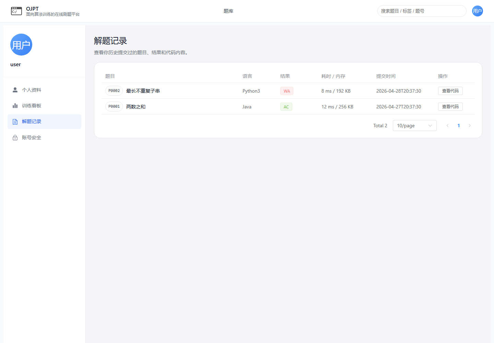

# 5系统的开发设计与实现

## 5.1用户登录功能的设计与实现

### 5.1.1功能设计

用户进入系统后，可以通过登录弹窗输入账号和密码。账号支持用户名、邮箱和手机号三种形式，前端提交登录信息后，由后端认证接口统一处理。后端先根据账号类型定位用户，再交给Spring Security完成密码校验。校验通过后，系统读取用户状态和角色信息，生成访问令牌和刷新令牌，并把令牌、用户基本信息和角色列表返回给前端。

前端收到登录结果后，将访问令牌保存到用户状态中，后续访问个人中心、代码编辑器、提交判题和管理端功能等受保护接口时，在请求头中携带该令牌。若账号不存在、密码错误、账号被禁用或令牌状态异常，系统返回失败提示，用户需要重新输入登录信息。用户登录流程如图5-1所示。


图5-1用户登录流程图

该功能的核心代码：

```java
@PostMapping("/login")
public Result<LoginResponseVO> login(@Valid @RequestBody LoginRequestDTO dto) {
    String principalName = resolvePrincipalName(dto.getAccount());
    Authentication authentication = authenticationManager.authenticate(
            new UsernamePasswordAuthenticationToken(principalName, dto.getPassword()));
    SecurityContextHolder.getContext().setAuthentication(authentication);
    LoginUserDetails principal = (LoginUserDetails) authentication.getPrincipal();
    List<String> roles = principal.getAuthorities().stream()
            .map(a -> a.getAuthority().replace("ROLE_", ""))
            .toList();
    JwtService.TokenPair pair = jwtService.generateTokens(
            principal.getUserId(), principal.getUsername(), roles);
    refreshTokenStore.store(principal.getUserId(), pair.refreshJti(), pair.refreshToken());
    User dbUser = userService.findById(principal.getUserId());
    return Result.ok(authConverter.toLoginResponse("Bearer", pair,
            jwtProperties.getAccessExpSeconds(), jwtProperties.getRefreshExpSeconds(), dbUser, roles));
}
```


### 5.1.2界面设计

登录界面采用弹窗形式展示，用户可以输入用户名、邮箱或手机号以及密码完成身份认证。界面在提交失败时显示错误提示，登录成功后顶部导航切换为用户菜单。


图5-2 用户登录界面

## 5.2用户注册功能的设计与实现

### 5.2.1功能设计

用户未拥有账号时，可以在注册弹窗中填写用户名、密码、邮箱或手机号等信息。前端先进行基础表单校验，校验通过后调用注册接口。后端接收注册请求后，对用户名、邮箱、手机号进行唯一性检查，并对密码进行加密存储，防止明文密码进入数据库。

注册成功后，系统直接为新用户分配普通用户角色，生成访问令牌和刷新令牌，使用户无需再次回到登录页即可进入训练流程。若用户名、邮箱或手机号已被占用，后端返回明确错误信息，前端提示用户重新填写。用户注册流程如图5-3所示。


图5-3用户注册流程图

该功能的核心代码：

```java
@PostMapping("/register")
public Result<LoginResponseVO> register(@Valid @RequestBody RegisterRequestDTO dto) {
    User user = userService.register(dto);
    List<String> roles = List.of("USER");
    JwtService.TokenPair pair = jwtService.generateTokens(user.getId(), user.getUsername(), roles);
    refreshTokenStore.store(user.getId(), pair.refreshJti(), pair.refreshToken());
    LoginResponseVO vo = authConverter.toLoginResponse(
            "Bearer", pair, jwtProperties.getAccessExpSeconds(),
            jwtProperties.getRefreshExpSeconds(), user, roles);
    return Result.ok(vo);
}

public User register(RegisterRequestDTO dto) {
    String account = dto.getAccount().trim();
    String password = dto.getPassword();
    String nickname = dto.getNickname().trim();
    boolean emailAccount = account.contains("@");
    String email = emailAccount ? account.toLowerCase() : null;
    String phone = emailAccount ? null : account;
    if (email != null && findByEmail(email) != null) {
        throw new ResponseStatusException(HttpStatus.CONFLICT, "邮箱已被使用");
    }
    if (phone != null && findByPhone(phone) != null) {
        throw new ResponseStatusException(HttpStatus.CONFLICT, "手机号已被使用");
    }
    User user = new User()
            .setUsername(buildUniqueUsername(nickname, account))
            .setPassword(passwordEncoder.encode(password))
            .setEmail(email)
            .setPhone(phone)
            .setRoleType("USER")
            .setStatus(1);
    userMapper.insert(user);
    return user;
}
```


### 5.2.2界面设计

注册界面与登录入口保持一致，用户填写账号、密码和基础资料后提交注册请求。表单会对必填项和账号格式进行提示，注册成功后系统自动进入登录态。


图5-4 用户注册界面

## 5.3题库浏览功能的设计与实现

### 5.3.1功能设计

题库浏览功能面向匿名用户和已登录用户开放。用户进入题库页面后，可以按页码、关键词、难度、标签、完成状态和排序条件查询题目。前端把筛选条件组织为查询参数，请求后端题库分页接口，后端返回题号、标题、难度、标签、提交次数和用户完成状态等信息。

后端查询题库时，会结合题目发布状态和用户身份进行处理。匿名用户只能看到已发布题目的公开信息；已登录用户还会结合用户题目进度表，返回未开始、已尝试或已解决等训练状态。题库浏览流程如图5-5所示。


图5-5题库浏览流程图

该功能的核心代码：

```java
@GetMapping
public Result<PageResult<ProblemListItemVO>> listProblems(
        @RequestParam(value = "page", defaultValue = "1") Integer page,
        @RequestParam(value = "size", defaultValue = "20") Integer size,
        @RequestParam(value = "keyword", required = false) String keyword,
        @RequestParam(value = "difficulty", required = false) String difficulty,
        @RequestParam(value = "tagId", required = false) Long tagId,
        @RequestParam(value = "status", required = false) String status,
        @RequestParam(value = "orderBy", required = false) String orderBy) {
    PageResult<ProblemListItemVO> pageResult = problemService.queryProblems(
            getCurrentUserId(), page, size, keyword, difficulty, tagId, status, orderBy);
    return Result.ok(pageResult);
}
```


### 5.3.2界面设计

题库浏览界面以列表形式展示题号、标题、难度、标签和完成状态。用户可以通过关键词、题号、难度、标签和状态组合筛选题目，并通过分页查看更多题目。


图5-6 题库浏览界面

## 5.4在线做题功能的设计与实现

### 5.4.1功能设计

用户从题库列表点击题目后进入做题页面。页面初始化时，前端根据题号请求题目详情，加载题面、输入输出说明、时间限制、内存限制、难度、标签和提交统计等内容。题面采用Markdown存储，前端渲染前会进行安全清洗，避免危险HTML影响页面安全。

做题页还会加载公开样例测试用例，并根据当前用户、题目和语言读取代码编辑内容。若用户未登录或没有历史编辑内容，页面使用默认代码模板；若存在已保存的编辑内容，则恢复上次编辑内容。在线做题流程如图5-7所示。


图5-7在线做题流程图

该功能的核心代码：

```java
@GetMapping("/no/{problemNo}")
public Result<ProblemDetailVO> getProblemDetailByNo(@PathVariable("problemNo") Integer problemNo) {
    return Result.ok(problemService.getProblemDetailByNo(problemNo, getCurrentUserId()));
}

@GetMapping("/no/{problemNo}/test-cases/sample")
public Result<List<ProblemTestCaseVO>> getProblemSampleTestCases(
        @PathVariable("problemNo") Integer problemNo) {
    return Result.ok(problemTestCaseService.getSampleTestCasesByProblemNo(problemNo));
}
```


### 5.4.2界面设计

在线做题界面分为题面展示、代码编辑、测试用例和运行结果区域。用户可以阅读Markdown题面，选择语言并在编辑器中编写代码。


图5-8 在线做题界面

## 5.5代码编辑器功能的设计与实现

### 5.5.1功能设计

代码编辑器功能用于支持用户在做题页编写并保存代码编辑内容。用户编辑代码后，前端会在手动保存或自动保存触发时，把题号、语言和源码提交给后端。后端根据用户ID、题目ID和语言确定唯一编辑记录，若记录不存在则新增，若记录已存在则更新源码和更新时间。

编辑内容保存后，用户重新进入同一道题或切换回相同语言时，可以恢复此前编辑内容，减少页面刷新、误关闭或切换语言造成的代码丢失。代码编辑内容保存流程如图5-9所示。


图5-9代码编辑内容保存流程图

该功能的核心代码：

```java
public ProblemCodeDraftVO saveDraft(Long userId, Integer problemNo, ProblemCodeDraftSaveDTO dto) {
    Problem problem = requireProblem(problemNo);
    String language = dto.getLanguage().trim();
    ProblemCodeDraft draft = findDraft(userId, problem.getId(), language);
    if (draft == null) {
        draft = new ProblemCodeDraft()
                .setUserId(userId)
                .setProblemId(problem.getId())
                .setLanguage(language)
                .setSourceCode(dto.getSourceCode());
        problemCodeDraftMapper.insert(draft);
    } else {
        draft.setSourceCode(dto.getSourceCode());
        problemCodeDraftMapper.updateById(draft);
    }
    return toVO(problem, draft);
}
```


### 5.5.2界面设计

代码编辑内容保存后，界面会给出保存成功提示。用户重新进入题目或切换回相同语言时，可以恢复上次编辑内容。


图5-10 代码编辑内容保存界面

## 5.6代码运行功能的设计与实现

### 5.6.1功能设计

代码运行功能用于用户正式提交前的调试。用户选择语言、填写代码和测试输入后，点击运行按钮，前端把源码、语言、输入内容和期望输出提交到运行接口。该流程只返回单次运行结果，不创建正式提交记录。

后端收到请求后，根据语言类型准备编译或解释执行命令，并通过Docker运行用户代码。系统收集标准输出、标准错误和运行耗时，再比较实际输出与期望输出，返回AC、WA、CE、RE、TLE等状态。代码运行流程如图5-11所示。


图5-11代码运行流程图

该功能的核心代码：

```java
@PostMapping("/run")
public Result<CodeRunResultVO> runCode(@Valid @RequestBody CodeRunDTO dto) {
    return Result.ok(submissionService.runCode(dto));
}

public CodeRunResultVO runCode(CodeRunDTO dto) {
    if (dto.getCases() == null || dto.getCases().isEmpty()) {
        throw BusinessException.badRequest("至少需要一个运行用例");
    }
    List<CodeRunCaseResultVO> caseResults = new ArrayList<>();
    for (int i = 0; i < dto.getCases().size(); i++) {
        CodeRunCaseDTO runCase = dto.getCases().get(i);
        CodeExecutionResult executionResult = codeExecutionService.execute(
                dto.getLanguage(), dto.getSourceCode(), runCase.getInputText(),
                dto.getTimeLimitMs(), dto.getMemoryLimitKb());
        CodeRunCaseResultVO caseResult = toRunCaseResult(i, runCase, executionResult);
        caseResults.add(caseResult);
        if (!STATUS_AC.equals(caseResult.getStatus())) {
            break;
        }
    }
    return new CodeRunResultVO("FINISHED", caseResults);
}
```


### 5.6.2界面设计

代码运行界面展示每个测试用例的运行状态、实际输出、错误信息和耗时。用户可以根据运行反馈在正式提交前调整代码。


图5-12 代码运行结果界面

## 5.7提交判题功能的设计与实现

### 5.7.1功能设计

提交判题功能是用户完成训练的关键环节。用户确认代码后点击提交，前端把题号、语言和源码发送到正式提交接口。后端先检查登录状态和题目状态，确认题目存在且允许提交后，创建提交记录并写入初始状态。

提交创建后，系统进入判题处理流程，按题目绑定的测试用例运行用户代码，保存每个测试点的输入、期望输出、实际输出、错误信息、耗时和状态。所有测试点执行结束后，系统更新提交总状态，并同步更新用户题目进度。提交判题流程如图5-13所示。


图5-13提交判题流程图

该功能的核心代码：

```java
@PostMapping("/no/{problemNo}/submissions")
public Result<SubmissionCreateResultVO> submitCode(
        @PathVariable("problemNo") Integer problemNo,
        @Valid @RequestBody SubmissionCreateDTO dto) {
    Long userId = getCurrentUserId();
    if (userId == null) {
        throw BusinessException.unauthorized("未登录");
    }
    return Result.ok(submissionService.createSubmission(userId, problemNo, dto));
}

public SubmissionCreateResultVO createSubmission(Long userId, Integer problemNo, SubmissionCreateDTO dto) {
    Problem problem = problemMapper.selectOne(new LambdaQueryWrapper<Problem>()
            .eq(Problem::getProblemNo, problemNo)
            .eq(Problem::getIsDeleted, 0)
            .eq(Problem::getStatus, STATUS_PUBLISHED));
    if (problem == null) {
        throw BusinessException.notFound("题目");
    }
    Submission submission = new Submission()
            .setUserId(userId)
            .setProblemId(problem.getId())
            .setLanguage(dto.getLanguage())
            .setSourceCode(dto.getSourceCode())
            .setStatus(STATUS_QUEUED)
            .setJudgeMessage("等待判题");
    submissionMapper.insert(submission);
    updateAttemptedProgress(userId, problem.getId(), submission.getId());
    dispatchAfterCommit(() -> processQueuedSubmission(submission.getId()));
    return new SubmissionCreateResultVO(submission.getId(), STATUS_QUEUED, "已进入判题队列");
}
```


### 5.7.2界面设计

提交判题结果界面展示总判题状态、通过用例数量、耗时和失败信息。判题完成后，用户能够直接查看最终结果。


图5-14 提交判题结果界面

## 5.8提交结果查询功能的设计与实现

### 5.8.1功能设计

用户提交代码后，前端会打开提交详情弹窗，并根据提交ID查询判题结果。若判题尚未结束，页面继续显示等待状态；若判题完成，页面展示总状态、通过用例数、运行耗时、失败用例和错误信息。

后端查询提交结果时，会校验当前用户身份，确保普通用户只能查看自己的提交记录。系统把提交记录、逐用例结果和必要的统计信息组装为响应对象返回给前端。提交结果查询流程如图5-15所示。


图5-15提交结果查询流程图

该功能的核心代码：

```java
@GetMapping("/submissions/{submissionId}")
public Result<SubmissionCreateResultVO> getSubmissionResult(
        @PathVariable("submissionId") Long submissionId) {
    Long userId = getCurrentUserId();
    if (userId == null) {
        throw BusinessException.unauthorized("未登录");
    }
    return Result.ok(submissionService.getSubmissionResult(userId, submissionId));
}
```


### 5.8.2界面设计

提交记录界面按时间展示用户历史提交，包含题目、语言、状态和耗时等信息，并支持查看提交源码和判题详情。



图5-16 提交记录查询界面

## 5.9个人中心与训练看板功能的设计与实现

### 5.9.1功能设计

个人中心面向已登录用户，包含个人资料、账号安全、提交记录和训练看板等功能。用户进入训练看板后，前端请求当前用户的训练统计数据。后端根据提交记录、题目难度和用户题目进度统计总提交次数、通过次数、已解决题数、通过率、状态分布、难度分布和近期提交记录。

训练看板返回的数据会在前端展示为统计卡片、图表和列表，用户可以根据这些信息了解近期训练情况和题目完成情况。个人中心与训练看板流程如图5-17所示。


图5-17个人中心与训练看板流程图

该功能的核心代码：

```java
@GetMapping("/me/training-dashboard")
public Result<UserTrainingDashboardVO> getCurrentUserTrainingDashboard() {
    Long userId = getCurrentUserId();
    return Result.ok(trainingDashboardService.getTrainingDashboard(userId));
}

public UserTrainingDashboardVO getTrainingDashboard(Long userId) {
    List<Object> rawStatuses = submissionMapper.selectObjs(new QueryWrapper<Submission>()
            .select("status")
            .eq("user_id", userId));
    Map<String, Long> statusDistribution = buildOrderedDistribution(rawStatuses, STATUS_ORDER);
    long totalSubmissions = rawStatuses.size();
    long acceptedSubmissions = statusDistribution.getOrDefault(STATUS_ACCEPTED, 0L);
    List<UserProblemProgress> solvedProgresses = userProblemProgressMapper.selectList(
            new LambdaQueryWrapper<UserProblemProgress>()
                    .eq(UserProblemProgress::getUserId, userId)
                    .eq(UserProblemProgress::getStatus, STATUS_SOLVED));
    UserTrainingDashboardVO vo = new UserTrainingDashboardVO();
    vo.setTotalSubmissions(totalSubmissions);
    vo.setAcceptedSubmissions(acceptedSubmissions);
    vo.setSolvedProblemCount((long) solvedProgresses.size());
    vo.setAcceptanceRate(calculateRate(acceptedSubmissions, totalSubmissions));
    vo.setStatusDistribution(statusDistribution);
    return vo;
}
```


### 5.9.2界面设计

训练看板界面通过统计卡片、状态分布、难度分布和近期提交列表展示用户训练情况，帮助用户了解题目完成进度。


图5-18 训练看板界面

## 5.10题目管理功能的设计与实现

### 5.10.1功能设计

题目管理功能面向管理员开放。管理员进入题目管理页面后，可以按关键词、难度、标签、状态和排序条件查询题目列表，也可以创建题目草稿、编辑题面、维护测试用例、绑定标签、发布题目或归档题目。前端根据管理员操作调用对应接口，后端完成参数校验和数据持久化。

题目信息保存后，普通用户侧题库和做题页面会读取更新后的题目内容。测试用例维护结果直接影响代码运行和正式提交判题，因此系统在保存测试用例时会统一替换题目下的用例集合，保证判题数据与题面维护结果一致。题目管理流程如图5-19所示。


图5-19题目管理流程图

该功能的核心代码：

```java
@PostMapping("/problems")
public Result<ProblemSimpleVO> createProblem(@Valid @RequestBody ProblemCreateDTO dto) {
    return Result.ok(problemService.createDraft(getCurrentUserId(), dto));
}

@PutMapping("/problems/{problemId}")
public Result<Void> updateProblem(@PathVariable Long problemId,
                                  @Valid @RequestBody ProblemUpdateDTO dto) {
    problemService.updateProblem(problemId, dto);
    return Result.ok("更新成功");
}

@PutMapping("/problems/{problemId}/test-cases")
public Result<Void> replaceProblemTestCases(@PathVariable Long problemId,
        @Valid @RequestBody ProblemTestCaseBatchUpdateDTO dto) {
    problemTestCaseService.replaceProblemTestCases(problemId, dto);
    return Result.ok("测试用例保存成功");
}
```


### 5.10.2界面设计

题目管理界面通过表格展示题目状态、难度和操作入口，管理员可以创建草稿、编辑题目、维护测试用例、发布或归档题目。


图5-20 题目管理界面

## 5.11用户管理功能的设计与实现

### 5.11.1功能设计

用户管理功能用于管理员维护平台注册用户。管理员可以按页码、账号状态、角色和关键词查询用户列表，查看用户详情，编辑用户资料，修改用户状态，也可以处理异常账号。后端管理接口统一要求管理员角色，普通用户无法访问。

用户状态变更会影响用户后续登录和接口访问。管理员将用户禁用或恢复后，系统更新用户表中的状态字段；用户再次登录或访问受保护接口时，会按照最新状态进行校验。用户管理流程如图5-21所示。


图5-21用户管理流程图

该功能的核心代码：

```java
@GetMapping("/users")
public Result<PageResult<UserDetailVO>> getUsers(
        @RequestParam(value = "page", defaultValue = "1") Integer page,
        @RequestParam(value = "size", defaultValue = "10") Integer size,
        @RequestParam(value = "status", required = false) Integer status,
        @RequestParam(value = "roleType", required = false) String roleType,
        @RequestParam(value = "keyword", required = false) String keyword) {
    return Result.ok(adminService.getUsers(page, size, status, roleType, keyword));
}

@PutMapping("/users/{userId}/status")
public Result<Void> updateUserStatus(@PathVariable Long userId,
                                     @RequestBody Map<String, Integer> request) {
    adminService.updateUserStatus(userId, request.get("status"));
    return Result.ok("状态更新成功");
}
```


### 5.11.2界面设计

用户管理界面展示用户列表、状态、角色和操作按钮，管理员可以筛选用户、查看详情、编辑资料并调整账号状态。


图5-22 用户管理界面

## 5.12判题环境检测功能的设计与实现

### 5.12.1功能设计

判题环境检测功能用于管理员检查Docker和语言运行环境是否可用。管理员进入管理端概览或判题环境页面后，前端请求环境健康检查接口。后端检查Docker可执行文件、Docker服务状态、语言镜像和基础运行能力，并将每项检查结果返回给前端。

若所有检查项均为正常，系统提示判题环境可用；若存在Docker不可访问、镜像缺失或语言执行失败，系统返回异常项和错误信息，方便管理员区分业务逻辑问题和基础运行环境问题。判题环境检测流程如图5-23所示。


图5-23判题环境检测流程图

该功能的核心代码：

```java
@GetMapping("/health")
public Result<JudgeEnvironmentHealthDTO> getHealth() {
    return Result.ok(judgeEnvironmentHealthService.checkHealth());
}

public JudgeEnvironmentHealthDTO checkHealth() {
    List<JudgeEnvironmentCheckDTO> checks = new ArrayList<>();
    DockerExecutableStatus executableStatus = checkDockerExecutable();
    checks.add(new JudgeEnvironmentCheckDTO("docker-executable",
            executableStatus.available() ? UP : DOWN, dockerExecutable,
            executableStatus.message()));
    if (executableStatus.available()) {
        checks.add(runCheck("docker-version", dockerExecutable,
                List.of(dockerExecutable, "version"), "Command completed successfully"));
        checks.add(runCheck("docker-info", dockerExecutable,
                List.of(dockerExecutable, "info"), "Command completed successfully"));
        checks.add(runImageCheck("cpp", cppImage));
        checks.add(runImageCheck("java", javaImage));
        checks.add(runImageCheck("python", pythonImage));
    }
    return summarize(checks);
}
```

### 5.12.2界面设计

判题环境检测界面展示Docker可执行文件、版本、服务信息和语言镜像检查结果，用于判断判题环境是否满足代码运行要求。


图5-24 判题环境检测界面
