# 6系统测试

## 6.1测试方法

本系统采用手工测试、接口测试和自动化测试结合的方式。手工测试主要用于验证页面流程和整理运行截图，覆盖登录注册、题库筛选、在线做题、代码运行、正式提交、个人中心、训练看板和管理端维护等功能。接口测试主要验证后端API的请求路径、参数、权限和响应结构。自动化测试用于验证后端服务逻辑、前端组件交互、路由守卫和端到端业务流程。

测试过程中，先启动后端服务、前端服务、MySQL、Redis和Docker环境，再按普通用户和管理员两类角色分别执行测试。普通用户侧重点是从题库浏览到提交判题的完整训练闭环，管理员侧重点是题目、测试用例、标签、用户和判题环境的维护能力。

## 6.2测试环境

测试环境需要覆盖前端、后端、数据库、缓存和Docker判题环境。系统测试环境如表6-1所示。

表6-1测试环境表

| 项目 | 环境或工具 | 用途 |
| --- | --- | --- |
| 操作系统 | Windows开发环境 | 本地开发、运行和截图 |
| 后端运行环境 | JDK 17、SpringBoot 4 | 启动后端服务 |
| 前端运行环境 | Node.js、npm、Vite | 启动前端服务 |
| 数据库 | MySQL | 保存用户、题目、提交和测试用例数据 |
| 缓存 | Redis | 保存令牌状态 |
| 判题环境 | Docker | 隔离执行C/C++、Java、Python3代码 |
| 接口验证 | Swagger UI、浏览器开发工具 | 验证REST API响应 |
| 后端测试 | JUnit、SpringBoot Test | 验证服务层和控制器逻辑 |
| 前端测试 | Vitest、Vue Test Utils | 验证组件、状态和交互 |
| 端到端测试 | Playwright | 验证用户可见核心流程 |

系统启动后，先访问Actuator健康检查接口和Swagger UI接口文档页面，确认后端服务和接口文档可访问。健康检查截图如图6-1所示，Swagger UI截图如图6-2所示。

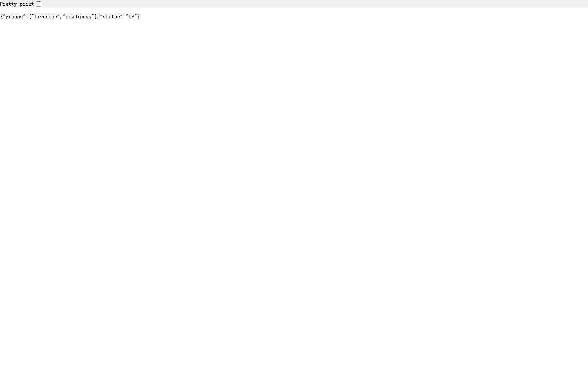

图6-1 Actuator健康检查

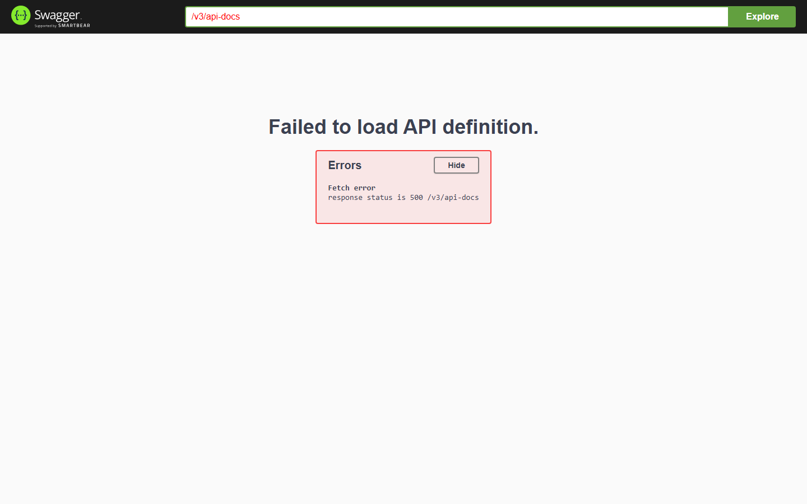

图6-2 Swagger UI接口文档

## 6.3功能测试

功能测试按照普通用户和管理员两条主线展开。普通用户测试覆盖认证、题库浏览、题目详情、在线做题、代码运行、正式提交、训练看板和个人中心；管理员测试覆盖管理概览、用户管理、密码重置审核、题目管理、测试用例维护、标签管理和判题环境检测。

表6-2功能测试用例表

| 用例编号 | 测试模块 | 测试目的 | 操作步骤 | 期望结果 | 实际结果 | 结论 |
| --- | --- | --- | --- | --- | --- | --- |
| TC-FUNC-001 | 认证与账号 | 验证正确账号登录 | 输入正确账号和密码并提交 | 登录成功，显示用户菜单 | 与期望一致 | 通过 |
| TC-FUNC-002 | 认证与账号 | 验证注册表单校验 | 输入新用户信息并提交 | 注册成功或显示明确校验提示 | 与期望一致 | 通过 |
| TC-FUNC-003 | 题库浏览 | 验证题库列表加载 | 打开题库页面 | 显示题号、标题、难度和标签 | 与期望一致 | 通过 |
| TC-FUNC-004 | 题库浏览 | 验证组合筛选 | 输入关键词并选择难度、标签和状态 | 列表按条件刷新 | 与期望一致 | 通过 |
| TC-FUNC-005 | 在线做题 | 验证题目详情加载 | 点击题目进入做题页 | 显示题面、限制、样例和代码编辑区 | 与期望一致 | 通过 |
| TC-FUNC-006 | 在线做题 | 验证代码草稿保存 | 编辑代码并保存草稿 | 再次进入页面可恢复草稿 | 与期望一致 | 通过 |
| TC-FUNC-007 | 代码运行 | 验证样例运行 | 使用正确代码点击运行 | 返回运行通过结果 | 与期望一致 | 通过 |
| TC-FUNC-008 | 提交判题 | 验证正式提交 | 使用正确代码点击提交 | 生成提交记录并返回AC结果 | 与期望一致 | 通过 |
| TC-FUNC-009 | 训练看板 | 验证训练数据展示 | 进入个人中心训练看板 | 显示题数、提交数、通过率和图表 | 与期望一致 | 通过 |
| TC-FUNC-010 | 后台管理 | 验证用户管理 | 管理员筛选和查看用户 | 用户列表和详情正常显示 | 与期望一致 | 通过 |
| TC-FUNC-011 | 后台管理 | 验证题目维护 | 新建或编辑题目 | 题目信息保存成功 | 与期望一致 | 通过 |
| TC-FUNC-012 | 后台管理 | 验证测试用例维护 | 新增、编辑或删除测试用例 | 测试用例数据保存成功 | 与期望一致 | 通过 |
| TC-FUNC-013 | 后台管理 | 验证标签管理 | 新增、编辑或删除标签 | 标签列表刷新正确 | 与期望一致 | 通过 |
| TC-FUNC-014 | 判题环境 | 验证环境检测 | 管理员打开判题环境检查 | 返回Docker和语言环境状态 | 与期望一致 | 通过 |

普通用户功能测试截图如图6-3至图6-7所示。登录弹窗能够正常提交账号信息，题库支持组合筛选，做题页能够展示题面和代码编辑区，训练看板能够显示用户训练统计。

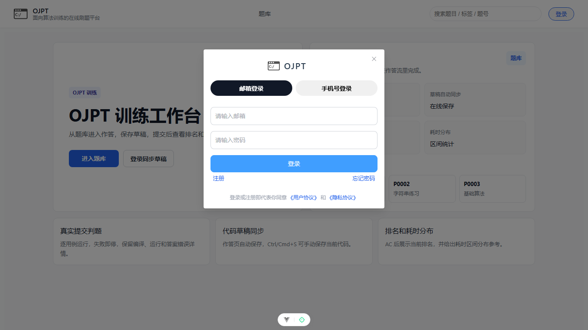

图6-3登录弹窗测试

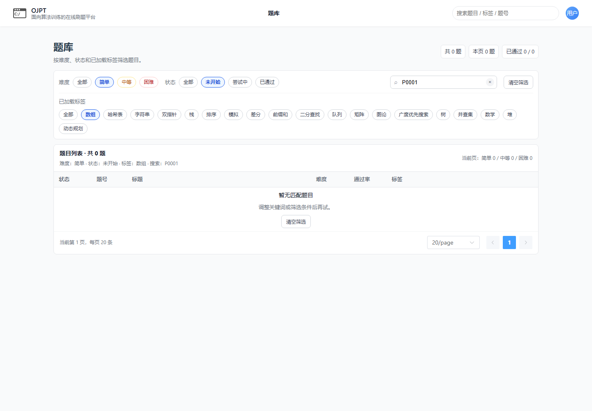

图6-4题库组合筛选测试

图6-5做题页代码编辑测试

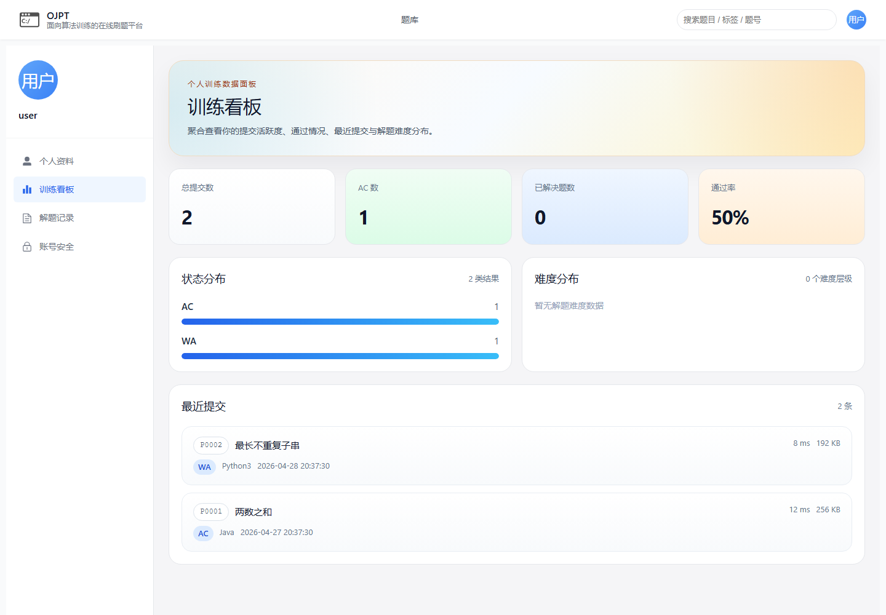

图6-6训练看板测试

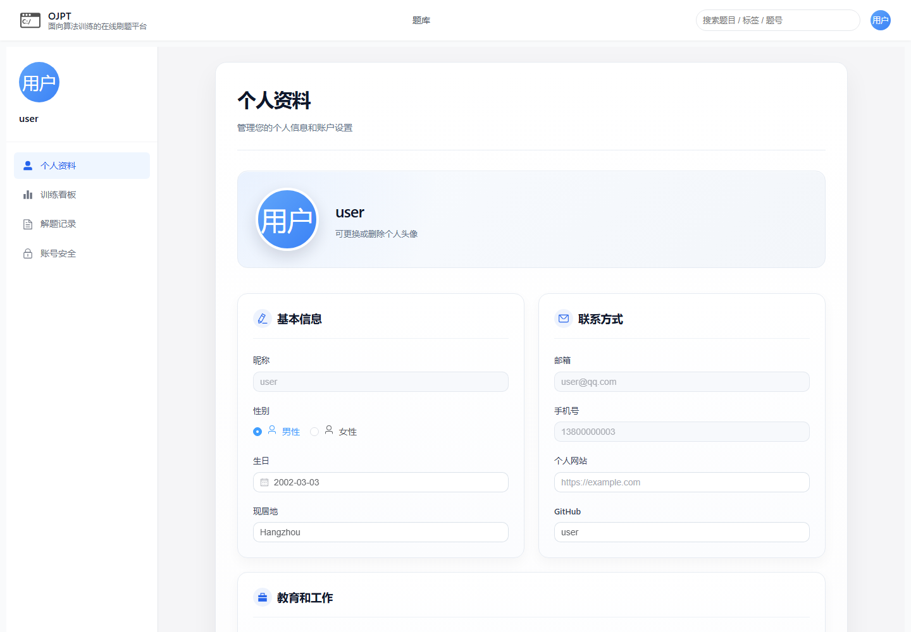

图6-7个人资料维护测试

管理员功能测试截图如图6-8至图6-12所示。管理员能够查看后台概览、维护用户、编辑题目、维护测试用例和管理标签。

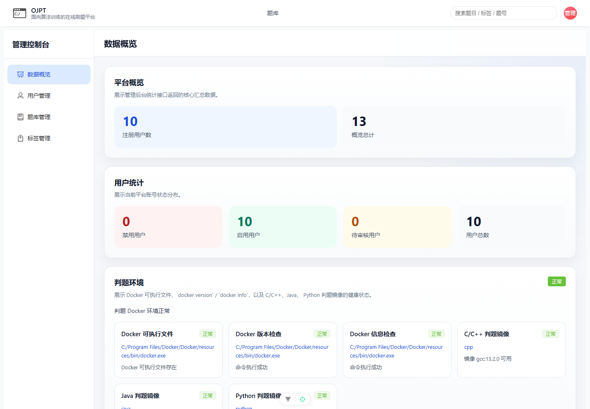

图6-8管理端概览测试

图6-9用户管理测试

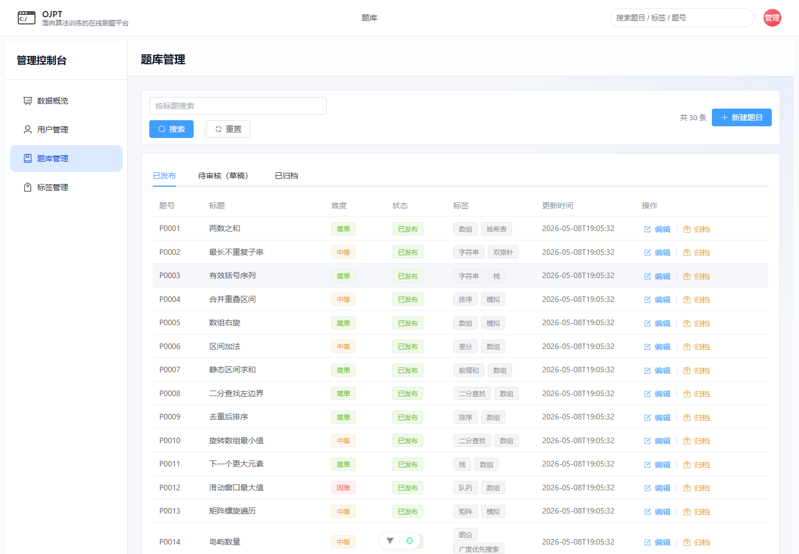

图6-10题目列表管理测试

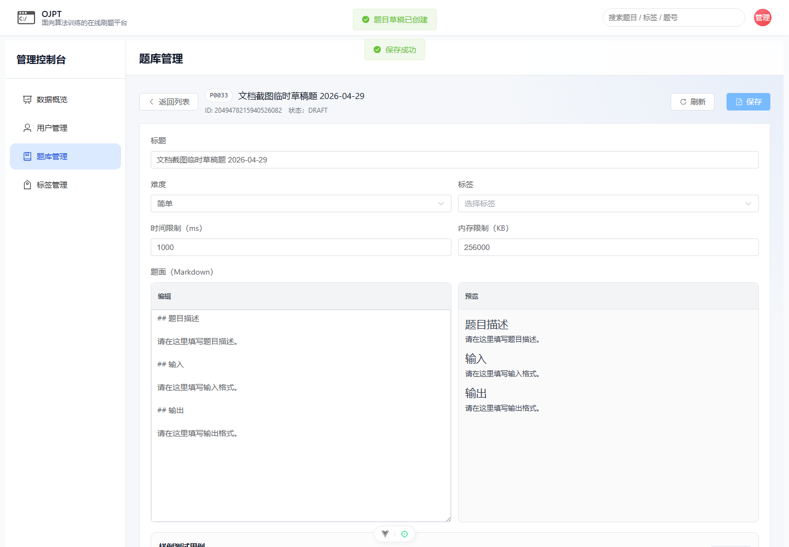

图6-11题目编辑测试

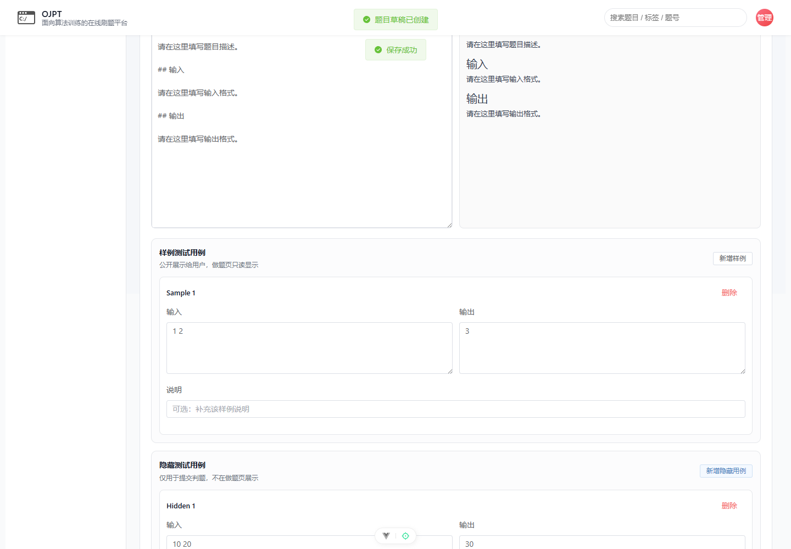

图6-12测试用例维护测试

## 6.4接口测试

接口测试主要验证后端API的请求方法、路径、权限和返回结构是否符合设计。接口响应采用统一结构，包含业务码、消息、数据和时间戳等字段。核心接口测试结果如表6-3所示。

表6-3接口测试结果表

| 接口 | 方法 | 测试点 | 期望结果 | 结论 |
| --- | --- | --- | --- | --- |
| `/api/auth/login` | POST | 正确账号登录 | 返回用户信息和Token | 通过 |
| `/api/auth/register` | POST | 注册新用户 | 返回注册结果 | 通过 |
| `/api/auth/me` | GET | 当前用户信息 | 返回当前用户身份 | 通过 |
| `/api/problems` | GET | 题库分页查询 | 返回题目列表和分页字段 | 通过 |
| `/api/problems/no/{problemNo}` | GET | 题目详情 | 返回题面、限制和标签 | 通过 |
| `/api/problems/run` | POST | 运行代码 | 返回运行状态和输出 | 通过 |
| `/api/problems/no/{problemNo}/submissions` | POST | 正式提交 | 返回提交ID和状态 | 通过 |
| `/api/problems/submissions/{submissionId}` | GET | 提交详情 | 返回提交和用例结果 | 通过 |
| `/api/users/me/training-dashboard` | GET | 训练看板 | 返回训练统计数据 | 通过 |
| `/api/admin/users` | GET | 管理端用户列表 | 管理员可访问并返回分页数据 | 通过 |
| `/api/admin/problems` | GET | 管理端题目列表 | 管理员可访问并返回分页数据 | 通过 |
| `/api/admin/judge-environment/health` | GET | 判题环境检查 | 返回Docker检查结果 | 通过 |

登录接口、题库接口、运行接口和提交接口响应截图如图6-13至图6-16所示。

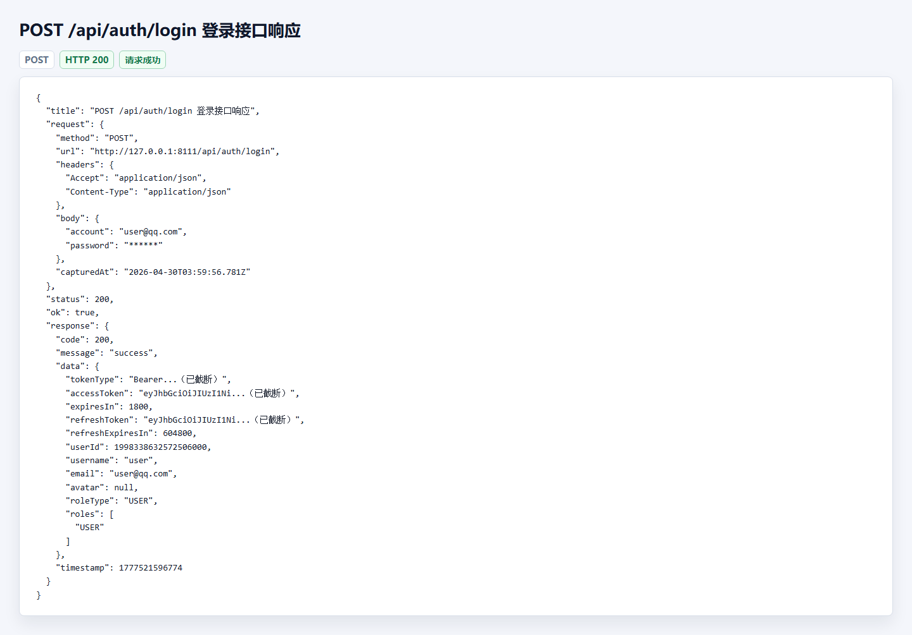

图6-13登录接口响应测试

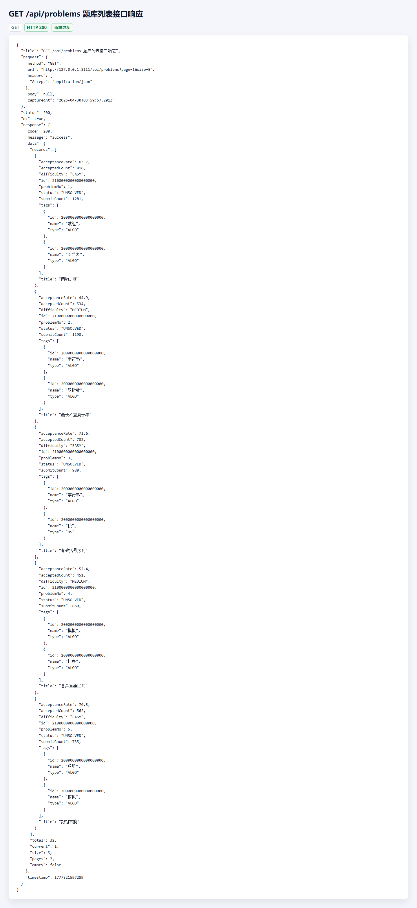

图6-14题库列表接口响应测试

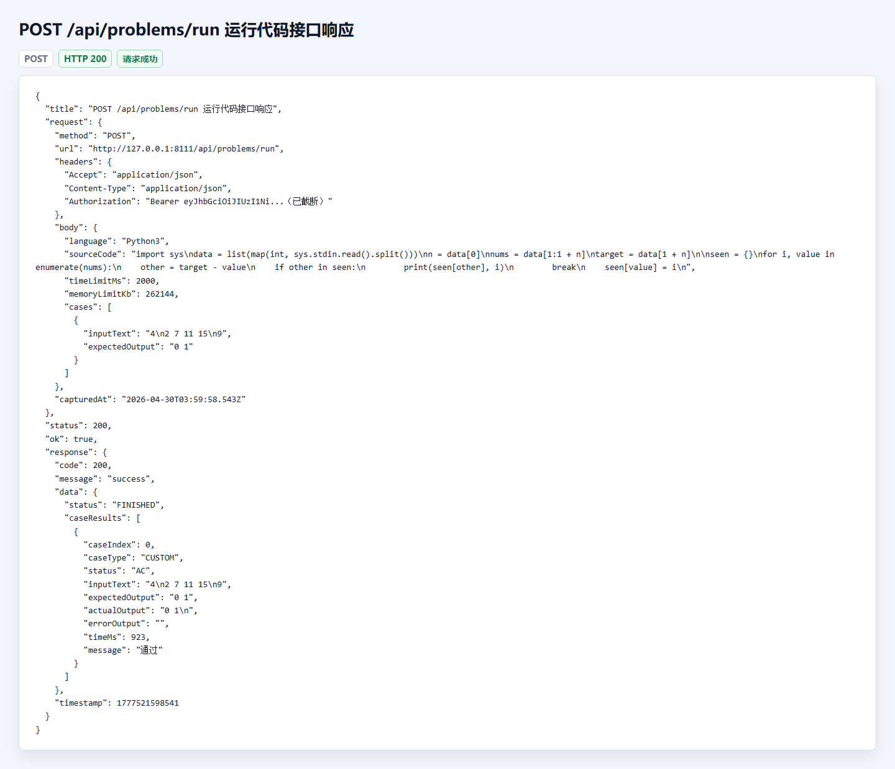

图6-15运行代码接口响应测试

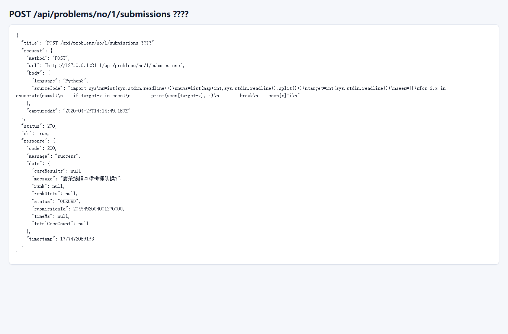

图6-16提交代码接口响应测试

## 6.5判题流程测试

判题流程测试重点验证代码运行、正式提交、逐用例结果保存和用户进度更新。测试覆盖正确答案、答案错误、编译错误、运行错误和隐藏用例展示控制等情况。判题流程测试结果如表6-4所示。

表6-4判题流程测试表

| 用例编号 | 场景 | 输入 | 期望结果 | 实际结果 | 结论 |
| --- | --- | --- | --- | --- | --- |
| TC-JUDGE-001 | 样例运行通过 | 正确代码和样例输入 | 返回AC | 与期望一致 | 通过 |
| TC-JUDGE-002 | 样例运行答案错误 | 输出错误的代码 | 返回WA和实际输出 | 与期望一致 | 通过 |
| TC-JUDGE-003 | 编译错误 | 语法错误代码 | 返回CE和编译信息 | 与期望一致 | 通过 |
| TC-JUDGE-004 | 运行错误 | 运行时异常代码 | 返回RE和错误输出 | 与期望一致 | 通过 |
| TC-JUDGE-005 | 正式提交通过 | 正确代码 | 提交状态为AC，进度为SOLVED | 与期望一致 | 通过 |
| TC-JUDGE-006 | 正式提交失败 | 错误代码 | 提交状态为WA，进度为ATTEMPTED | 与期望一致 | 通过 |
| TC-JUDGE-007 | 隐藏用例展示 | 失败隐藏用例 | 隐藏输入和期望输出 | 与期望一致 | 通过 |

判题结果截图如图6-17至图6-20所示。系统能够展示通过、编译错误、运行错误和答案错误等状态，便于用户判断代码问题。

图6-17提交AC详情测试

图6-18编译错误结果测试

图6-19运行错误结果测试

图6-20答案错误结果测试

## 6.6权限测试

权限测试用于验证匿名用户、普通用户和管理员在页面和接口访问上的边界。权限测试结果如表6-5所示。

表6-5权限测试表

| 用例编号 | 角色 | 操作 | 期望结果 | 实际结果 | 结论 |
| --- | --- | --- | --- | --- | --- |
| TC-AUTHZ-001 | 匿名用户 | 访问题库列表 | 允许访问 | 与期望一致 | 通过 |
| TC-AUTHZ-002 | 匿名用户 | 访问个人中心 | 跳转首页或要求登录 | 与期望一致 | 通过 |
| TC-AUTHZ-003 | 匿名用户 | 运行代码 | 拒绝访问 | 与期望一致 | 通过 |
| TC-AUTHZ-004 | 普通用户 | 访问管理员页面 | 拒绝访问 | 与期望一致 | 通过 |
| TC-AUTHZ-005 | 管理员 | 访问管理员页面 | 允许访问 | 与期望一致 | 通过 |
| TC-AUTHZ-006 | 管理员 | 发布题目 | 操作成功 | 与期望一致 | 通过 |

普通用户访问管理员页面被拒绝的截图如图6-21所示，管理员访问管理端成功的截图如图6-22所示。

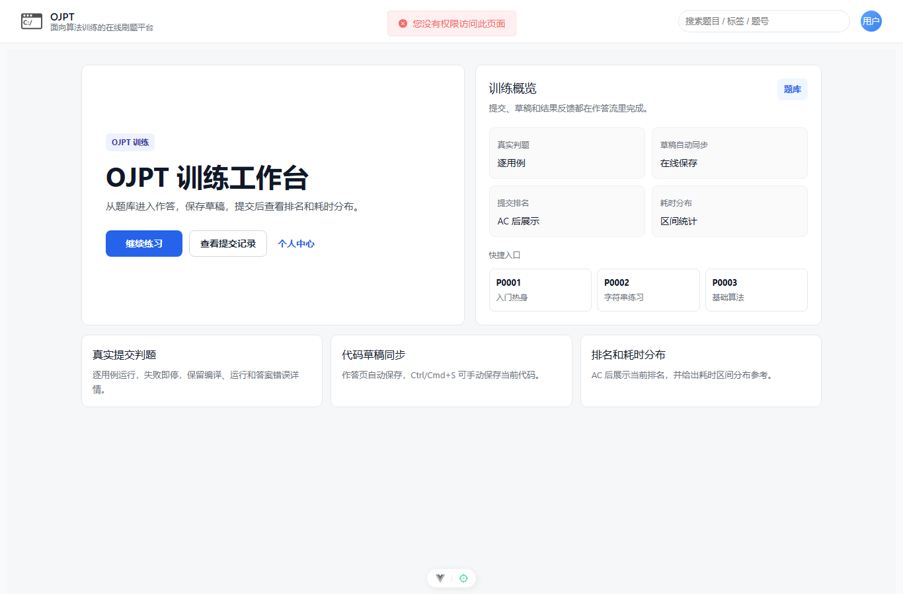

图6-21普通用户访问管理端被拒绝测试

图6-22管理员访问管理端成功测试

## 6.7判题环境检测测试

判题环境检测测试用于确认Docker服务、语言镜像和代码运行基础环境是否可用。管理员进入判题环境检查页面后，系统调用管理端健康检查接口，返回Docker状态、镜像状态和语言执行检查结果。当环境异常时，管理员可以根据检测结果判断是Docker未启动、镜像缺失还是语言运行命令异常。

判题环境检测截图如图6-23所示。

图6-23判题环境健康检查测试

## 6.8自动化测试与测试结果分析

项目中已经配置后端JUnit测试、前端Vitest测试和Playwright端到端测试。后端测试覆盖认证、用户注册、密码重置、题库服务、提交服务、代码运行、判题环境和权限控制；前端单元测试覆盖接口封装、认证状态、路由守卫、题库筛选、做题页交互、个人中心和管理端组件；端到端测试覆盖登录、题号路由、题库分页、管理员题目流程和管理看板。

表6-6自动化测试覆盖表

| 测试类型 | 代表内容 | 覆盖目标 |
| --- | --- | --- |
| 后端单元/集成测试 | `SubmissionServiceImplTest`、`ProblemServiceImplTest`、`AuthPasswordResetControllerTest` | 业务服务、提交判题、密码重置、权限控制 |
| 前端单元测试 | `problemset-filters.spec.ts`、`problem-solve-actions.spec.ts`、`auth-store.spec.ts` | 页面交互、接口封装、状态管理 |
| 管理端前端测试 | `admin-user-management.spec.ts`、`admin-problem-management.spec.ts`、`TagManagement.test.ts` | 管理端列表、题目维护、标签管理 |
| 端到端测试 | `login.spec.ts`、`problem-pagination.spec.ts`、`admin-problem-flow.spec.ts` | 用户可见核心链路 |
| 构建检查 | `npm run build`、`mvn test` | 类型、构建和测试回归 |

从功能测试结果看，普通用户和管理员两条主线均能完成预期流程。普通用户可以完成登录、题库筛选、题目详情查看、代码编辑、草稿保存、代码运行、正式提交、提交记录查看和训练数据查看；管理员可以完成用户管理、题目维护、测试用例维护、标签管理、统计查看和判题环境检查。

从接口测试结果看，认证接口、题库接口、做题与判题接口、用户接口和管理员接口均能够返回结构化响应。分页接口能够返回题目列表和分页指标，提交接口能够返回提交状态和提交详情，管理端接口能够根据管理员权限正常访问。

从判题流程测试结果看，系统能够区分正确答案、答案错误、编译错误和运行错误，并能够保存逐用例结果。正式提交后，系统能够根据结果更新提交状态和用户题目进度。隐藏用例结果展示策略能够避免直接泄露隐藏输入和期望输出。

从权限测试结果看，系统能够区分匿名用户、普通用户和管理员。公开题库允许匿名访问，个人中心和判题操作要求登录，管理端页面和接口要求管理员角色，符合系统安全设计。综上，系统测试结果表明OJPT主要功能能够按照设计要求运行，满足毕业设计演示和论文验证需要。
