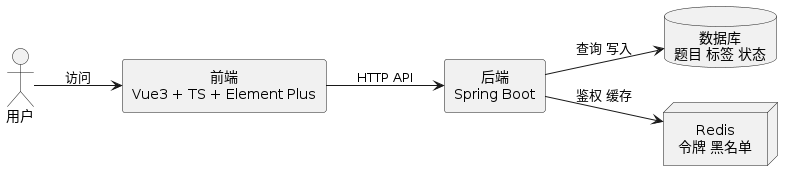
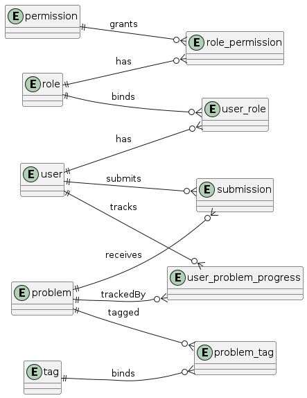
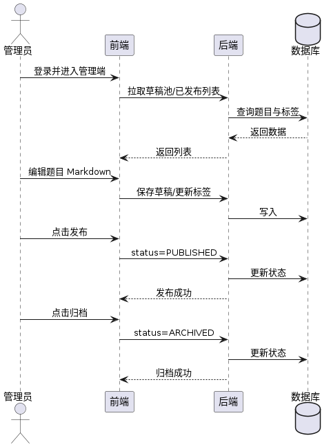

<!-- merged-by: scripts/thesis/merge_thesis.py -->
# 武汉工商学院本科毕业论文（设计）封面

（字体：小三；加粗；居中）

论文题目：在线判题平台设计与实现

（字体：小四；居中）

学号：__________
学生姓名：__________
学院：__________
专业：__________
年级：202__级
指导教师：__________（职称：__________）

（字体：四号；居中）

二〇二六年___月

---

# 原创性声明

（字体：宋体；字号：小二；加粗；段落格式：单倍行距；居中）

本人郑重声明：所呈交的论文是本人在指导教师的指导下独立完成研究工作所取得的成果。除文中特别加以标注引用的内容外，本论文不包含任何其他个人或集体已经发表或撰写的成果作品。本人的论文对相关数据、观点与研究过程具有真实性、完整性与可追溯性，本人完全意识到本声明的法律后果由本人承担。

（宋体；字号：四号；段落格式：单倍行距；首行缩进2字符）

作者签名：__________

年  月  日

---

# 目录

（页码占位：导出 Word 后按模板自动更新）

摘  要 ........................................................ 1

关键词 ............................................................ 2

Abstract ........................................................ 3

Key words ........................................................ 4

1 绪论 .............................................................. 5

1.1 研究背景与意义 ............................................. 5

1.2 国内外研究现状 ............................................. 6

1.3 研究内容与技术路线 ......................................... 7

1.4 论文结构安排 ................................................. 8

1.5 本章小结 ..................................................... 9

2 相关技术和理论概述 ............................................. 10

2.1 在线判题系统的基本架构与关键要素 ....................... 10

2.2 基于应用框架的分层服务设计 ................................. 11

2.3 安全框架鉴权与基于角色访问控制 ............................... 12

2.4 数据访问分页与一致性机制 ........................ 13

2.5 前端框架交互实现与工程化约定 ............................ 14

2.6 轻量标记语言安全渲染理论与实现 ............................... 15

2.7 基于统一入口文件约束的代码模板策略 ......................... 16

2.8 本章小结 ...................................................... 17

3 系统需求分析 ...................................................... 18

3.1 功能需求分析 .................................................. 18

3.2 用户角色与权限需求 .......................................... 19

3.3 业务流程需求 .................................................. 20

3.4 非功能需求分析 .............................................. 21

3.5 本章小结 ...................................................... 22

4 系统分析与设计 ...................................................... 23

4.1 总体架构设计 .................................................. 23

4.2 系统模块划分 .................................................. 24

4.3 关键数据模型设计 .......................................... 25

4.4 关键业务流程设计 .......................................... 26

4.5 统一入口文件约束设计 ...................................... 27

4.6 本章小结 ...................................................... 28

5 系统的开发设计与实现 ............................................. 29

5.1 后端服务实现 .................................................. 29

5.2 学员端实现 .................................................. 30

5.3 管理端实现 .................................................. 31

5.4 关键技术与实现细节 ........................................ 32

5.5 测试与结果分析 .............................................. 33

5.5.1 测试环境与工具 ........................................... 33

5.5.2 单元测试结果 ........................................... 34

5.5.3 端到端测试结果 ......................................... 35

5.5.4 结果分析与讨论 ......................................... 36

5.6 本章小结 ...................................................... 37

6 结论 .............................................................. 38

6.1 结论 .......................................................... 38

6.2 可进一步增强的方向 .......................................... 39

6.3 本章小结 ...................................................... 40

参考文献 .............................................................. 41

致谢 ................................................................. 42

---

# 摘要

随着程序设计竞赛与课程实践需求的增长，在线判题系统（Online Judge，OJ）在教学评测、作业管理与竞赛训练中的价值不断显现。为满足本科阶段“可演示、可验证”的交付目标，本文设计并实现了在线判题平台原型系统 OJPT（Online Judge Platform for Teaching）。系统以题库管理为主线，形成学员端题目浏览、题面展示、代码编辑与提交的闭环；同时在管理端提供草稿创建、审核发布与归档管理的最小可用流程。

系统采用前后端分离架构：后端基于 Spring Boot 4 实现题库相关接口、安全鉴权与分页机制；前端基于 Vue 3、TypeScript 与 Element Plus 实现题库列表与题目详情页，并对题面内容进行 Markdown 渲染与安全清洗。为满足后续沙盒执行约束，本文在代码编辑模块引入基于入口文件的结构化模板策略，统一规定沙盒执行以 `Main` 文件作为主要入口，并在学员端按语言生成对应的 `Main` 骨架代码。

在实现与验证方面，本文围绕关键交互与一致性问题组织测试：端到端用例用于覆盖管理端草稿到发布的可见性链路；封禁用户登录用例用于校验错误提示与剩余时间展示；分页回归用例用于验证题库列表的 `total/pages/size` 指标正确性；单元测试用于对 Markdown 渲染与 XSS 清洗逻辑进行稳定性校验。

实验结果表明，OJPT 能够支持题库从创建到展示的可演示流程，并在关键接口与前端交互上保持一致性与可用性，为后续接入更完善的评测沙盒体系奠定了接口与数据结构基础。

关键词：在线判题；题库管理；Markdown 渲染；代码提交；Main 文件约束

---

# Abstract

（字体：Times New Roman；字号：小二；加粗；段落格式：居中；单倍行距）

Title: Online Judge Platform for Teaching OJPT Design and Implementation

Abstract: With the continuous growth of programming competitions and course-based practice, online judge (OJ) systems play an increasingly important role in automated assessment, training feedback, and teaching management. This thesis designs and implements an online judge platform prototype OJPT (Online Judge Platform for Teaching) focused on a demonstrable workflow that integrates a problem bank, problem presentation, and code submission with consistent user experience. The platform separates the frontend and backend layers and provides both learner-side interfaces and administrator-side management flows. For question presentation, OJPT uses Markdown rendering with input sanitization to ensure security and readability. For submission, the system introduces a Main-file constraint combined with language templates to standardize the execution entry structure. In terms of verification, the system is validated through unit testing and end-to-end testing covering key interactive and regression scenarios, including pagination correctness, authentication and feedback consistency, and admin publication visibility.

Key words: online judge; problem bank management; Markdown rendering; code submission; Main-file constraint

---

# 1 绪论

## 1.1 研究背景与意义
随着计算机教学与竞赛训练的持续推进，程序设计类任务的布置与评测逐步从传统的人工批改转向自动化方式。在线判题系统（Online Judge，OJ）通过标准化输入输出接口与自动化评测能力，实现了作业提交、竞赛对抗与训练反馈的高效闭环。在教学场景中，学生不仅需要能够完成题目求解，还需要获得清晰一致的题面展示与结果反馈；在管理场景中，教师/管理员需要对题目进行维护，包括草稿管理、审核发布、归档回收与题面编辑。

题库管理是在线判题系统的核心能力之一。题库的可维护性、可追溯性与可扩展性，往往取决于管理策略是否清晰。进一步地，题面展示的可读性与代码提交体验会直接影响学习效率与反馈质量。基于本科阶段“可演示、可验证”的交付目标，本文以题库与题目管理为主线，构建可交互、可验证的在线判题平台原型系统 OJPT（Online Judge Platform for Teaching）。

## 1.2 国内外研究现状
在线判题系统在工业界与开源社区中已经形成较成熟的技术路线。通常而言，一个 OJ 系统包含题库管理、题目展示、代码编辑提交、编译运行沙盒、评测结果存储与排行榜等模块。研究与实践中，人们主要关注沙盒隔离安全性、评测任务调度效率以及用户体验的一致性。

从系统设计角度看，题库管理模块不仅是数据管理能力，也影响前端路由策略、展示编号体系以及权限边界；从工程化角度看，后端接口的分页正确性、错误提示一致性、Markdown 渲染安全性等细节决定了系统在真实教学环境中的可用性。针对本科生可交付成果，本研究强调在统一接口契约与交互体验的基础上实现可演示链路，为后续沙盒判题能力完善提供可复用的接口与数据模型。

## 1.3 研究内容与技术路线
本文围绕在线判题平台原型 OJPT 的题库与题目管理能力开展研究，主要内容包括：

1. 学员端题库列表与题目详情：实现基于题号（`problemNo`）的展示与详情路由，完成题面 Markdown 渲染与样式安全策略，并保障匿名可访问与提交鉴权一致性。
2. 管理端题库最小闭环：提供草稿创建、审核发布与归档管理的最小可用链路，支持题面编辑（Markdown 实时预览）与标签绑定操作，形成管理端到学员端的可见闭环。
3. Main 文件入口约束与语言模板：在代码编辑模块引入按语言生成的 `Main.*` 入口骨架策略，统一沙盒执行的入口文件约束，并为后续评测接口对接提供元信息组织方式。
4. 测试与验证：基于前端单元测试与端到端测试覆盖关键链路，验证接口分页指标正确性、封禁登录提示一致性与管理端发布可见性等现象。

技术路线方面，本文采用前后端分离架构：后端基于 Spring Boot 与 MyBatis-Plus 实现数据与接口，前端基于 Vue 3 与 TypeScript 实现交互与渲染，并以 JWT 与角色权限控制作为安全底座。

## 1.4 论文结构安排
本文共六章，安排如下：

- 第 1 章 绪论：介绍研究背景、意义、研究现状与本文主要研究内容。
- 第 2 章 相关技术和理论概述：介绍在线判题相关的技术基础与实现理论。
- 第 3 章 系统需求分析：分析学员端与管理端的功能需求、权限需求以及非功能需求。
- 第 4 章 系统分析与设计：给出系统总体架构、关键数据模型与关键流程设计，并阐述统一入口文件约束。
- 第 5 章 系统的开发设计与实现：重点描述后端接口实现、前端关键页面实现以及测试与结果分析。
- 第 6 章 结论：总结全文工作与结论，并提出进一步增强的方向。

## 1.5 本章小结
本章从研究背景与意义出发，梳理了在线判题系统的关键需求，明确了本文以题库与题目管理为主线的研究目标与技术路线。进一步地，围绕教学演示与工程可验证的约束，本文将“题面展示一致性、提交交互可用性、管理闭环可维护性”作为主线设计考量：一方面通过稳定的题目标识体系（`problemNo`）与路由映射保证题目定位的可直达性；另一方面通过 Markdown 安全渲染与统一错误处理增强题面阅读体验与提交交互的可靠性。

在研究方法上，本文采用需求分析—总体架构设计—关键模块实现—测试验证的技术路线。需求分析部分明确学员端与管理端的功能边界，并对鉴权策略、分页一致性、长内容滚动体验等非功能指标进行约束定义；总体架构设计部分给出前后端分离结构、数据模型抽象与主要业务流程；关键模块实现阶段围绕题面编辑、实时预览、语言模板生成与提交链路进行工程化落地；最后通过单元测试与端到端测试完成对关键交互的验证闭环。

本文的研究工作形成如下贡献：第一，为教学场景构建了可演示的题库管理闭环，包括草稿池、发布与归档的状态流转，以及默认“已发布”展示策略；第二，在编辑体验上引入左右分栏实时预览布局，并通过样式与滚动容器优化提升长内容可读性；第三，在代码提交与未来沙盒执行对接方面，基于 Main 文件入口约束与语言模板策略统一入口组织方式，从而降低语言切换与代码结构差异带来的不确定性；第四，通过分页一致性机制与 Markdown 安全清洗，提升系统在常见交互场景下的稳定性与安全性。

下文将围绕系统需求进行更细致的分析，明确关键数据结构、接口契约与实现约束，为后续章节的系统分析与设计提供依据。

### 1.6 本文的研究方法与验证思路
为确保设计能够落地并形成可验证的原型成果，本文采用“需求约束建模—架构与数据结构设计—前端交互实现—验证与回归”的方法链条。首先在需求侧明确学员端与管理端的差异化目标：学员端需要以匿名方式快速浏览已发布题目，并在做题页完成语言选择、代码编辑与提交链路；管理端需要以草稿池为入口完成题面维护，并具备发布与归档的闭环能力。其次在实现侧将关键字段与接口契约固化为统一的数据结构，包括题目标识 `problemNo`、题面 Markdown 字段以及状态枚举值，并在返回结构中同步提供分页指标，以支撑前端展示的稳定性。

在验证思路上，本文以用户可见效果与高风险回归点为中心组织测试：单元测试侧重渲染层面的安全性与确定性，验证 Markdown 解析结果在典型输入条件下能够稳定生成符合预期的页面结构；同时校验提交相关参数的组装逻辑，避免字段缺失或类型不一致导致接口调用失败。端到端测试则覆盖管理端草稿创建到发布可见的链路，重点验证状态流转后学员端列表与详情页能够读取到正确内容；此外还对封禁账号登录提示信息进行一致性校验，确保前后端错误结构在展示层面保持可读与可理解的呈现效果。

### 1.7 与系统落地的对齐策略
在线判题平台往往面临前后端契约松散、前端渲染差异、以及长页面可用性不足等工程化问题。为减少偏差，本文在设计阶段就将前端渲染需求纳入接口与数据结构考量，例如在题目列表中以 `problemNo` 作为稳定展示标识并用于详情路由定位；在题面内容上以 Markdown 作为统一表达形式并在渲染前执行输入清洗。与此同时，针对页面超出可视高度导致缺少滚动条的问题，本文将“全局主容器与管理端内容区滚动策略”纳入需求定义，通过 `overflow: auto` 与最小高度约束保障在不同分辨率下均能完成长内容浏览。

<!-- pagebreak -->

---

# 2 相关技术和理论概述

## 2.1 在线判题系统的基本架构与关键要素
在线判题系统通常围绕题库管理、题面展示、代码编辑与提交、编译运行沙盒与结果回传等关键要素展开。系统的可用性不仅体现在评测的正确性，也体现在接口契约一致性、错误提示友好性、以及前端渲染与交互体验的稳定性。

在 OJPT 的设计中，题库管理与题面展示是前置数据链路，沙盒执行则依赖稳定的输入组织与入口文件约束。围绕这一目标，本文在工程实现上构建了统一的题目标识体系（`problemNo`）、统一的数据传输结构，以及面向前端的分页与筛选接口，确保系统可演示、可验证。

## 2.2 基于应用框架的分层服务设计
OJPT 后端采用 Spring Boot 实现业务服务层与接口层的解耦。控制器负责参数接收与返回结构组织，服务层负责业务校验、状态变更与事务管理，数据访问层通过 MyBatis-Plus 执行查询与分页能力。

该分层方式有利于降低耦合度，使题库查询、管理端发布归档、提交接口与权限鉴权能够在同一套一致的结构下完成扩展与维护。

## 2.3 安全框架鉴权与基于角色访问控制
系统的安全需求要求对公开访问与敏感操作实施差异化策略。Spring Security 通过 JWT 认证与方法级授权（RBAC）实现登录态校验与角色权限控制。

在实践中，公开题目列表与详情接口对匿名请求开放；管理端发布/归档与题目编辑接口仅允许具备权限的用户访问。登录失败信息与封禁剩余时间等错误提示在前后端保持一致映射，从而提升用户可读性。

## 2.4 数据访问分页与一致性机制
为了让前端分页条显示与服务端数据保持一致，OJPT 使用 MyBatis-Plus 的分页拦截机制对 `total/pages/size` 指标进行正确计算。

在题库列表的接口实现中，该机制避免了分页返回字段为 0 的异常情况，并结合端到端回归用例对关键指标进行验证，确保接口契约在演示与迭代过程中稳定可用。

## 2.5 前端框架交互实现与工程化约定
前端采用 Vue 3、TypeScript 与 Element Plus 实现交互界面。学员端侧重题库列表与题目详情的可读展示；管理端侧重草稿池、发布归档以及题目编辑体验。

在工程化层面，前端对 API 请求进行封装，统一处理 token 注入与错误提示；路由层面采用基于 `problemNo` 的详情路径策略，保证可直达性与页面刷新兼容性。

## 2.6 轻量标记语言安全渲染理论与实现
题面使用 Markdown 表达需要在渲染时保证安全性。OJPT 在前端通过 Markdown 解析与 HTML 清洗实现对不可信输入内容的防护，并复用统一的最小样式集合以保持渲染效果一致。

管理端与学员端分别实现 Markdown 编辑与预览联动，使题面维护过程能够在界面层面直接可视化，从而降低维护成本并提升内容可检查性。

## 2.7 基于统一入口文件约束的代码模板策略
为与后续评测沙盒执行入口对齐，OJPT 在做题页引入按语言生成的 `Main.*` 入口模板策略。C/C++ 采用共用模板，Java、Python3 使用对应语言的入口骨架。

该策略将语言选择与入口文件命名规则绑定，使用户在编辑器中更明确地组织代码结构，同时为沙盒执行提供更确定的入口组织方式。

## 2.8 本章小结
本章从在线判题系统的关键要素出发，梳理了 OJPT 在后端分层服务、安全鉴权、分页一致性、前端交互实现、Markdown 安全渲染以及 Main 文件入口约束方面采用的技术基础与设计理论。为后续系统需求与工程落地提供了技术约束的解释框架。

在工程实现层面，这些技术并非孤立使用：后端分页一致性与统一返回结构共同决定了前端分页展示与列表刷新体验；鉴权策略与错误信息映射决定了匿名访问与敏感操作之间的用户可理解边界；Markdown 安全渲染与样式复用决定了题面在管理端预览与学员端展示之间的观感一致性；语言模板策略与 Main 文件入口约束则为代码提交与评测执行的入口组织提供了稳定的输入组织规则。

同时，测试策略的选择与验证粒度与以上技术选择相互耦合：单元测试更偏向于校验渲染安全性、字段组装与接口契约一致性；端到端测试更偏向于验证草稿发布链路、权限错误提示展示一致性以及分页指标回归。通过“关键链路—稳定性校验—用户可见验证”的组合方式，为原型系统的正确性提供可复用的证据链。

## 2.9 技术实现与可验证性的关联
从可验证性角度，OJPT 在关键环节对“输入—处理—输出”路径做了可观测化处理。例如在题面渲染路径中，题面 Markdown 从后端存储并通过接口传输到前端，在前端渲染前先执行输入清洗，再结合统一的最小样式集合完成显示。该流程使得测试可以从结构化校验角度验证渲染结果，而非仅以视觉观察为依据；同时，安全清洗与样式复用解耦，使得渲染策略在需求迭代时仍能保持一致性。

在提交与代码模板路径中，语言模板体系将用户选择与代码入口约束绑定，使得用户在不同语言下得到相同的入口文件命名规则，从而降低沙盒编译阶段的差异化处理成本。当前系统对 C/C++ 采用同一套入口模板策略，并为 Java 与 Python3 分别提供入口骨架，使入口一致性在前端层面就能够被用户直观感知。与此同时，前端在语言切换时采用确认交互策略，避免用户误切换导致代码内容丢失，从而提升提交体验的一致性。

在分页与列表展示路径中，后端通过分页拦截机制保证接口返回中的 `total/pages/size` 指标正确，前端据此渲染分页条组件并进行页码跳转。该设计使得分页体验能够被端到端测试覆盖，并在回归验证时作为高风险点进行重点观察。并且，系统在管理端默认展示“已发布”状态，使得演示与验证路径更集中于核心闭环，提高了原型交付的效率。

因此，相关技术在 OJPT 中的选择并不仅服务于实现，也服务于验证：通过把业务规则与渲染策略固化为明确的字段与可观察的输出，本文能够在原型迭代后保持关键交互的稳定性，并为后续评测沙盒接入奠定可靠接口基础。

<!-- pagebreak -->

---

# 3 系统需求分析

## 3.1 功能需求分析
根据应用场景，系统至少包含学员端、管理端与公共服务三部分。功能需求主要体现在题库展示、题目编辑维护、以及提交与结果回传的交互闭环。

（1）学员端题库浏览与搜索  
系统需要提供题库列表页：支持分页、关键字检索、难度筛选与标签筛选；列表中展示题号（以 `problemNo` 显示为 `P0001` 等形式）、标题与难度等信息。用户可进入题目详情页，查看题面元信息与题面内容。

（2）题面展示与 Markdown 渲染  
题面内容采用 Markdown 表达，系统在详情页实现安全渲染，并对样式进行适配，确保代码块、列表与段落显示一致。渲染策略借助前端工具对用户输入内容进行清洗，降低潜在脚本注入风险。

（3）题目求解与代码提交  
在做题页中，系统需要提供代码编辑器、语言选择、默认代码模板生成、以及提交入口。提交入口需要将题目标识与源代码与语言信息一并传输到后端接口，实现“提交成功/排队占位”的可视反馈。

（4）管理端草稿、发布与归档闭环  
管理端需要提供最小可用的题库管理链路：  
- 支持草稿池列表与状态切换（默认展示已发布）  
- 支持管理端对题目进行编辑（标题、难度、题面 Markdown、限时/内存、标签绑定）  
- 支持发布与归档动作，使发布内容可在学员端题库中立即可见。

## 3.2 用户角色与权限需求
系统采用基于角色的鉴权策略实现权限隔离，核心需求包括：

（1）匿名访问  
题库列表与已发布题目的详情需要支持匿名访问。通过后端安全配置对公开接口进行放行，保证学员无需登录即可浏览已发布题目。

（2）提交鉴权  
提交接口校验用户登录态。未登录时触发登录交互流程，登录错误信息通过前后端统一的结构映射保持一致且可读，包括用户名或密码错误提示，以及封禁剩余时间提示等展示策略。

（3）管理权限  
管理端发布与归档等敏感操作需要鉴权与角色校验，确保只有具备管理权限的用户才能对题目状态进行变更。

## 3.3 业务流程需求
面向演示与实际使用，系统关键业务流程可概括为：

（1）草稿创建与维护流程  
普通用户登录后可创建题目草稿，草稿状态为 `DRAFT`。用户可在编辑页维护题面内容与标签绑定。

（2）管理端审核与发布流程  
管理员在题库管理页切换至草稿池，选择题目进入编辑页并完成必要检查后执行发布动作，将题目状态设置为 `PUBLISHED`。发布后学员端可在题库列表与详情页直接访问。

（3）归档管理流程  
管理员可将不再使用的题目归档为 `ARCHIVED`。归档后对应题目不再出现在指定公开状态的列表中。

（4）代码提交与结果回传流程  
用户在做题页选择语言并编辑代码。提交时后端返回包含提交状态的结构化结果，前端根据状态展示“进入评测队列”等占位反馈。

## 3.4 非功能需求分析
非功能需求主要包括：

（1）可用性  
编辑体验需要支持 Markdown 实时预览与清晰的编辑/预览分区；做题页代码编辑应具备行号显示与滚动同步；管理端页面需要保证长内容区域具备可滚动体验。

（2）安全性  
题面 Markdown 渲染需要进行输入清洗；后端鉴权需要结合 JWT 与角色权限；对公开接口与敏感接口需要进行明确的安全策略拆分。

（3）可靠性与一致性  
分页相关接口需要保证 `total/pages/size` 等字段正确返回，避免前端分页条显示异常；登录错误提示与封禁信息需要在前后端间保持一致的数据结构映射。

（4）可维护性  
前后端分层与接口封装应保持清晰，便于后续接入评测沙盒与更多题型功能。

## 3.5 本章小结
本章围绕学员端与管理端的核心能力，完成了功能需求、权限需求、业务流程与非功能需求的系统化梳理。下章将基于需求结论给出系统分析与设计，并明确 Main 文件入口约束的实现路径。

为保证需求可落地、可验证，本文在需求侧同时明确了关键业务状态的语义约定：题目 `status` 在草稿阶段为 `DRAFT`，在审核通过并发布后进入 `PUBLISHED`，归档阶段进入 `ARCHIVED`。在前端表现层面，管理端草稿池与已发布/已归档列表通过状态筛选实现可见性隔离，并且默认展示策略将“已发布”作为主要入口以满足演示与验证的连续性。题库列表在公开展示状态下以 `problemNo` 升序排列，保证页面浏览顺序与题号标识一致。

在交互与渲染侧，需求也对长文本体验提出了明确要求：题目详情中的 Markdown 内容需要支持安全清洗后稳定渲染，管理端编辑页需要提供实时预览以提升编辑可检查性，同时长页面区域必须具备可滚动能力以保证在不同分辨率下均能完成内容浏览。上述要求共同构成后续章节中接口契约设计与前端布局方案的依据。

此外，为保证系统在真实教学环境中易用且可维护，本文对接口契约与错误信息表达提出了统一性要求。公开接口需要在匿名访问场景下返回可直接用于展示的关键字段，并对分页结果保持字段一致；敏感接口在鉴权失败时，需要返回可读错误结构，使前端能够在登录交互、错误提示、以及封禁剩余时间展示等环节保持一致表达。与此同时，前端在提交与语言切换过程中需要确保用户输入能够被保留并在交互确认后再进行状态变更，以减少因误操作带来的体验损失。

综上，需求分析阶段对功能、权限、交互体验与接口契约形成了相互约束的完整定义，为后续系统分析与设计章节的模块划分、数据模型与关键流程建模提供了依据。

在沙盒入口组织方面，需求也对代码提交的数据结构提出了明确约束。系统规定评测执行入口以 `Main` 文件为统一起点，并通过语言选择将用户输入映射到对应的入口文件命名与代码骨架形式。该约束使提交数据在后端接收与后续执行环节具有可预测的入口组织方式，从而降低多语言编译执行差异带来的不稳定因素。同时，题库与题面内容以 Markdown 形式承载，需求侧强调前端渲染必须完成输入清洗与样式控制，保证用户输入在展示层面保持可读与安全。

因此，本章提出的需求定义不仅覆盖“系统做什么”，也覆盖“系统如何做到可用、可验证与可扩展”，为后续章节中的接口契约、模块划分与关键实现策略提供了可直接落地的分析依据。

<!-- pagebreak -->

---

# 4 系统分析与设计

## 4.1 总体架构设计
OJPT 采用前后端分离的总体架构，系统由前端交互层、后端服务层与数据库/缓存层共同构成。整体架构如图所示：
后端服务层负责实现题库与题目管理接口、提交接口与安全鉴权策略；前端负责题面渲染、编辑交互与页面状态管理；数据库保存题目元信息与状态，Redis 用于支持刷新令牌与黑名单等安全需求。图4-1 进一步以工程组件视角对“用户—前端—后端—数据存储”的关系进行归纳：前端通过 HTTP API 调用后端服务；后端分别与数据库和 Redis 交互以完成题目数据读写与鉴权相关的缓存/黑名单能力，从而支持匿名浏览与登录后操作并存的访问场景。

（图4-1 系统总体架构图）

## 4.2 系统模块划分
系统模块划分围绕用户角色展开：  

（1）学员端模块：题库列表、题目详情、代码编辑与提交。  
（2）管理端模块：题库管理列表（草稿池）、题目编辑页（Markdown 编辑与预览、标签绑定）、发布与归档。  
（3）公共模块：Markdown 渲染与安全清洗、统一请求封装、错误处理与分页数据结构。

此外，为适配评测沙盒执行约束，前端在提交与代码编辑模块引入语言模板策略，通过入口文件名与代码骨架形成结构化输入。

## 4.3 关键数据模型设计
关键数据模型围绕题目实体展开，核心字段包括：

（1）`problemNo`：用于稳定展示与路由定位的题号编号，并在前端展示为 `P0001` 等格式。  
（2）题目状态 `status`：用于区分草稿（`DRAFT`）、已发布（`PUBLISHED`）与已归档（`ARCHIVED`）。  
（3）题面内容 `statementMd`：采用 Markdown 形式存储并在前端进行安全渲染。  
（4）标签关联：题目与标签通过中间表维护绑定关系，使管理端可进行标签增删并在列表中展示。

在接口返回层面，系统通过 VO/DTO 封装将关键字段以统一结构传输给前端，保证列表与详情页展示一致性。

### 4.3.1 数据库概念结构说明
根据系统业务范围，数据库概念结构可划分为“用户与权限域”和“题库与提交域”两组核心实体。其中，用户与权限域用于支持登录鉴权、角色授权与班级组织关系；题库与提交域用于支持题目维护、标签管理、代码提交与做题进度跟踪。核心实体及关系如下：

- 用户实体 `user` 与角色实体 `role` 为多对多关系，通过 `user_role` 维护；
- 角色实体 `role` 与权限实体 `permission` 为多对多关系，通过 `role_permission` 维护；
- 题目实体 `problem` 与标签实体 `tag` 为多对多关系，通过 `problem_tag` 维护；
- 提交实体 `submission` 以 `user_id` 与 `problem_id` 关联用户与题目；
- 进度实体 `user_problem_progress` 以 `user_id` 与 `problem_id` 唯一约束维护用户做题状态。

上述关系保证了系统在“权限控制—题目维护—提交记录—进度统计”上的数据闭环，满足管理端与学员端的联动需求。

数据库概念结构如图4-2所示。

图4-2 数据库概念结构图

### 4.3.2 关系模型与主外键设计
结合后端迁移脚本设计，系统采用 MySQL InnoDB 引擎，主键统一采用无符号长整型，关键关系通过唯一键与联合索引保障一致性。主要关系模型如下：

- `problem(id, problem_no, title, difficulty, statement_md, status, ...)`
- `tag(id, name, type, ...)`
- `problem_tag(id, problem_id, tag_id, ...)`
- `submission(id, user_id, problem_id, language, source_code, status, ...)`
- `user_problem_progress(id, user_id, problem_id, status, last_submission_id, ...)`

用户与组织权限相关关系模型如下：

- `user(id, username, password, role_type, status, ...)`
- `role(id, code, name, level, ...)`
- `permission(id, resource, action, ...)`
- `user_role(id, user_id, role_id, ...)`
- `role_permission(id, role_id, permission_id, ...)`

在约束设计上，`problem_tag` 通过唯一键 `(problem_id, tag_id)` 防止重复绑定；`user_problem_progress` 通过唯一键 `(user_id, problem_id)` 保证每个用户对每道题只有一条最新进度记录；`submission` 通过联合索引 `(user_id, problem_id, created_at)` 支撑用户历史提交按时间倒序查询。

### 4.3.3 关键数据表字段与索引策略
为保障查询性能与业务正确性，系统在关键表中采用如下字段与索引策略：

（1）题目主表 `problem`  
包含 `problem_no`（唯一展示题号）、`difficulty`（难度枚举）、`statement_md`（题面文本）、`status`（草稿/发布/归档）等核心字段。通过唯一索引 `uk_problem_no` 保证题号稳定唯一，通过联合索引 `(status, difficulty)` 支撑管理端筛选查询。

（2）提交表 `submission`  
包含 `user_id`、`problem_id`、`language`、`source_code`、`status`、`created_at` 等字段。通过 `(user_id, problem_id, created_at)` 索引提升“用户-题目维度历史提交”查询性能；通过 `(problem_id, created_at)` 索引支持题目维度统计与回放查询。

（3）题目标签关联表 `problem_tag`  
用于维护题目与标签多对多关系，采用唯一键 `(problem_id, tag_id)` 防止重复绑定，同时分别对 `problem_id`、`tag_id` 建立普通索引，保证双向检索效率。

（4）用户做题进度表 `user_problem_progress`  
维护 `UNSOLVED/ATTEMPTED/SOLVED` 三态进度，通过唯一键 `(user_id, problem_id)` 实现幂等更新，通过 `(user_id, status)` 支撑个人题单状态过滤。

综合上述设计，数据库结构能够支撑系统当前已实现功能，包括管理端题目维护与发布归档、学员端题面浏览与提交、以及后续评测统计与进度扩展。

## 4.4 关键业务流程设计
关键业务流程包括：

（1）题库展示流程  
学员端通过题库列表接口获取题目分页数据并展示题号、标题、难度与标签信息；点击题目后进入详情页，详情页通过按题号查询接口获取题面元信息并进行 Markdown 渲染。

（2）管理端发布流程  
管理员在管理端草稿池选择题目，进入编辑页完成必要字段维护与标签绑定；随后执行发布动作将题目状态切换为 `PUBLISHED`。发布后学员端题库列表与详情页可直接访问到已发布内容。

（3）归档流程  
管理员可将题目状态切换为 `ARCHIVED`，归档后对应内容从公开展示状态中不再出现。

（4）提交与反馈流程  
用户在做题页选择语言并编辑代码，提交时将题目标识、语言与源代码发送至提交接口；后端返回结构化提交结果，前端据此展示可读反馈信息。

图4-3 展示了管理端题库维护的核心闭环：管理员登录后进入草稿池或已发布列表，对题目进行编辑并通过实时预览完成内容校对，随后执行发布动作使内容对学员端可见；当题目不再适合公开展示时，可通过归档将其从公开列表中移除，从而形成可追溯的状态流转链路。

（图4-3 管理端题目发布归档业务流程图）

## 4.5 统一入口文件约束设计
OJPT 在代码编辑与语言模板层面引入 Main 文件约束。系统统一规定评测入口以 `Main` 文件形式组织代码：

（1）C/C++：入口文件采用 `Main.cpp` 的模板形式，前端语言选择中 C/C++ 共用同一套模板策略，保证入口形式一致。  
（2）Java：入口文件采用 `Main.java`，并以 `public class Main` 作为入口骨架。  
（3）Python3：入口文件采用 `main.py`，以 `if __name__ == "__main__":` 作为运行入口。

通过该约束，前端在语言切换与重置逻辑中能够稳定生成对应入口骨架，从而降低沙盒编译与运行环节的不确定性，并形成可复用的入口规则描述。

## 4.6 本章小结
本章从总体架构、模块划分、数据模型与关键流程入手，明确系统的设计边界与核心决策。通过 Main 文件入口约束，系统在后续工程落地中形成了一致的入口组织策略。下一节将结合实现细节描述关键接口与前端页面如何落地。

在系统分析阶段，为使实现与验证能够对齐，本文将接口契约与前端展示需求同步纳入设计过程。具体而言，题目列表接口需要同时支持状态过滤与多维检索条件，并在分页返回结果中给出可用于前端渲染的 `total/pages/size` 指标；题目详情接口需要以题目元信息与题面 Markdown 为核心返回字段，供前端进行统一安全清洗与渲染；提交接口则需要接收题目标识、语言选择与源代码文本，并返回可读且结构化的提交状态信息以支撑用户体验。

与此同时，针对管理端编辑体验，本文在设计层面约束了题面编辑与预览的交互方式。通过将编辑区域与预览区域作为并列分栏组织，并对容器设置可滚动策略，使得长题面在编辑与查看时保持连续阅读路径。对于语言模板策略，系统明确要求通过语言选择触发对应入口骨架生成，并在模板初始化与代码重置之间保持交互一致性，避免用户误操作导致的内容丢失风险。

在接口与数据结构设计层面，本文对关键字段做了明确的语义绑定。题目列表接口以分页形式返回题目集合与统计字段，列表行在展示时以 `problemNo` 作为稳定的编号依据；题目详情接口围绕题面元信息与题面内容提供统一返回结构，使前端能够在详情页中执行 Markdown 渲染，并在渲染结果上保持列表与详情之间的内容一致性。管理端在草稿池场景中需要支持对题面 Markdown 与标签绑定的编辑回写，并通过发布/归档动作完成状态切换；为降低前端实现的复杂度，后端在发布/归档接口返回中应提供清晰的操作结果字段，并保证状态切换后的可见性能够在学员端列表与详情页中同步体现。

此外，系统安全设计在总体层面也形成了输入约束与输出约束的闭环。公开接口与敏感接口通过鉴权策略进行划分：公开接口允许匿名访问以支持教学演示；敏感接口需要在登录态校验通过后才能执行，并在鉴权失败时返回可读错误结构。前端据此完成错误提示展示，并与封禁剩余时间信息保持一致，从而使用户在不同状态下都能获得可理解的系统反馈。该设计使安全策略与用户体验之间保持一致性，避免安全错误表现为不可解释的异常。

<!-- pagebreak -->

---

# 5 系统的开发设计与实现

## 5.1 后端服务实现
后端服务基于 Spring Boot 4 实现，采用分层架构组织控制器、服务与数据访问逻辑。系统实现了题库展示接口、管理端题库管理接口以及提交相关接口。

（1）题目公开查询接口  
通过按题号查询接口实现公开题目访问能力，使学员端可以在无需登录的情况下访问已发布题目详情。

（2）管理端题库管理接口  
管理端题库列表接口提供分页能力，并支持状态（`DRAFT/PUBLISHED/ARCHIVED`）过滤、关键字检索、标签过滤与默认排序策略。接口返回结构化分页结果，确保前端分页条能够正确显示 `total/pages/size` 指标。

（3）安全鉴权与权限控制  
系统采用 JWT 认证与角色权限机制，对公开接口进行放行、对管理端敏感接口进行鉴权。登录失败与封禁状态反馈在前端与后端之间保持一致的数据结构映射，从而提升错误提示的可读性。

（4）分页实现一致性  
在工程实现中，通过装配 MyBatis-Plus 分页拦截器解决分页 `total/pages` 返回为 0 的异常问题，保证列表分页结果稳定并可回归验证。

## 5.2 学员端实现
学员端基于 Vue 3、TypeScript 与 Element Plus 构建，主要实现以下功能：

（1）题库列表页与题号路由策略  
列表展示通过 `problemNo` 进行题号呈现与详情路由定位。页面以 `P0001` 等格式显示题号，点击进入题目详情页完成内容展示。

图5-1 以用户操作顺序串联了核心交互：从题库列表进入题目详情后，前端完成题面渲染与安全清洗；用户选择语言后系统应用对应的 Main 入口模板并进入代码编辑；提交后返回结构化状态提示，使用户获得“已进入评测队列”等可读反馈。该链路的稳定性直接决定了学员端的可用体验。

（图5-1 学员端做题与提交链路流程图）

（2）题面 Markdown 渲染与安全清洗  
题面内容使用 Markdown 解析并在前端进行安全清洗，避免潜在脚本注入。渲染样式通过作用域深度选择器对内容进行统一调整，使标题、段落、列表与代码块显示符合教学展示的阅读体验。

（3）代码编辑器与滚动同步  
在做题页中实现代码编辑器行号展示，并通过滚动同步保证行号与代码区域一致，从而提升编程交互体验。

（4）按语言生成的 Main 文件模板  
系统在做题页提供语言选择与模板初始化机制。当前语言集合中 C/C++ 采用共用模板，Java 与 Python3 分别提供入口骨架。模板的入口文件名分别为 `Main.cpp`、`Main.java`、`main.py`，并以此形成沙盒执行入口组织策略。

（5）提交链路与反馈  
提交按钮在登录态校验通过后，将题目标识、语言与源代码发送至后端提交接口。后端返回结构化提交状态信息，前端据此展示可读反馈，例如进入评测队列的占位提示。

## 5.3 管理端实现
管理端实现了题库管理的最小闭环链路，满足草稿池到发布上架的演示需求。

（1）管理端题库管理列表页  
页面通过 Tab 分区管理草稿池、已发布内容与已归档内容，并将默认展示定位为已发布状态。列表支持标题搜索与按状态分页浏览。

（2）题目编辑页  
编辑页提供标题、难度、时间限制、内存限制以及题面 Markdown 的编辑能力。为便于对照效果，题面编辑采用左右分栏布局：左侧为 Markdown 编辑区，右侧为实时预览区，实现了“输入即视图更新”的交互体验。

（3）标签绑定与同步  
编辑页提供标签的选择与绑定/解绑操作。系统对标签绑定执行增删差异同步，使题目标签在发布后可以在列表展示中保持一致。

（4）发布与归档操作  
通过后端发布/归档接口完成题目状态切换，发布后学员端题库与详情页可立即可见。

## 5.4 关键技术与实现细节
为保证系统在演示与验证阶段具备稳定性，本文在关键环节使用了以下工程实现手段：

（1）全局接口返回结构统一  
前后端基于统一返回结构进行字段解析与错误处理，减少前端对后端返回形态的耦合。

（2）Markdown 渲染样式复用与内容清洗  
对渲染内容进行安全清洗并复用学员端的最小样式集合，确保管理端预览与学员端展示的一致性。

图5-2 说明了题面内容从 Markdown 文本到最终页面渲染的处理顺序：先通过解析器将 Markdown 转换为 HTML 结构，再通过清洗器移除潜在风险标签与属性，最后在统一样式约束下渲染到页面。该流程使题面展示在“可读性”与“安全性”之间达到平衡，并为测试提供可断言的处理链路。

（图5-2 Markdown 渲染与安全清洗处理流程图）

（3）页面滚动体验修复  
对主容器与管理端内容区采用 `overflow: auto` 的策略，解决长页面内容超出可视区域时缺乏滚动条的问题，使长题面编辑与列表页面可以顺畅浏览到底部。

## 5.5 测试与结果分析

OJPT 的测试策略以“关键链路正确 + 高影响回归防护”为目标，覆盖单元层面的稳定性校验以及端到端层面的可见性验证。

### 5.5.1 测试环境与工具
测试体系采用前端 TypeScript 为主的单元测试与端到端测试策略：

（1）单元测试  
使用 Vitest 对关键工具与 API 封装进行校验，包括 Markdown 渲染与安全清洗逻辑、题目信息字段组织一致性以及提交相关参数组装行为。

（2）端到端测试  
使用 Playwright 对用户可见链路进行验证，包括管理端草稿创建到发布可见的全流程、封禁账号登录提示信息展示一致性、以及题库列表分页指标回归验证等场景。

（3）运行环境与访问方式  
端到端测试在本地服务环境中完成：后端通过本地 Spring Boot 启动，前端通过本地 Vite 启动，依赖统一的接口封装与路由策略完成端到端调用链路。

### 5.5.2 单元测试结果
单元测试主要覆盖以下方面：

（1）Markdown 渲染稳定性  
对 Markdown 渲染输入进行结构化校验，确保段落、列表与代码块等结构能稳定生成对应 HTML。

（2）安全清洗校验  
对典型脚本注入风险输入进行清洗断言，降低潜在 XSS 风险对页面渲染层面的影响。

（3）题号接口字段一致性  
对基于题号 `problemNo` 的详情查询返回结构进行断言，保证路由策略与详情页面展示字段一致。

（4）提交接口请求参数一致性  
对提交 API 请求 payload 的字段组装进行校验，降低字段缺失导致的接口调用偏差。

图5-3 以“准备—操作—断言”的思路归纳端到端测试的关键回归点：其一为管理端草稿发布后学员端可见性验证，确保状态流转与数据刷新一致；其二为封禁用户登录提示一致性验证，确保错误结构与剩余时间信息的展示符合预期；其三为分页指标回归验证，确保 `total/pages/size` 的返回与前端分页条表现一致。通过聚焦高影响路径，端到端测试为迭代提供稳定的回归基线。

（图5-3 端到端测试关键回归点覆盖图）

### 5.5.3 端到端测试结果
端到端测试围绕“用户可见效果”和“关键回归点”展开，确保系统在迭代过程中仍保持一致体验。

（1）管理端发布到学员端可见链路  
通过测试模拟草稿创建、管理端登录审核发布，并验证学员端题库列表与题目详情页能够读取到新发布题目。

（2）封禁登录体验一致性  
对封禁用户登录错误提示进行断言，确保错误信息中包含与剩余时间相关的展示内容，并保持前端与后端错误结构一致。

（3）题库分页指标回归  
对题库列表接口分页返回结构进行断言，重点验证在记录非空时 `total/pages/size` 指标不会异常为 0，确保分页条显示正确。

### 5.5.4 结果分析与讨论
综合单元测试与端到端测试，本文在一致性与回归防护方面得到如下结论：

（1）一致性与可用性  
关键页面的数据结构与展示策略保持一致，题库发布闭环能够形成用户可见的反馈闭环。

（2）安全与稳健性  
Markdown 渲染清洗策略降低了渲染层面的安全风险；接口封装与统一错误处理机制提升了使用过程中的可读性。

（3）回归防护能力  
针对分页指标异常与封禁提示缺失等历史高影响点，端到端用例提供了稳定的验证基线，便于维护迭代。

## 5.6 本章小结
本章从后端接口实现、前端关键交互实现、以及测试与结果分析三个维度阐述了系统的工程落地过程。通过接口契约一致性与关键回归用例，OJPT 在演示与验证阶段保持了较好的正确性与稳定性。

在开发实现细节方面，本文重点关注了“长内容可用性”“编辑体验可检查性”与“沙盒入口一致性”三个环节。首先，在页面滚动体验层面，系统对主容器与管理端内容区引入 `overflow: auto` 策略，并在根级视图中启用全局可滚动能力，确保在不同分辨率下内容均可浏览到底部。其次，在 Markdown 编辑体验层面，管理端采用左右分栏卡片布局：左侧为编辑区，右侧为实时预览区，并通过自适应宽度与容器高度策略保证两侧卡片在父级空间内稳定排布；预览内容同时复用安全清洗策略，确保用户输入内容在展示层面可控。再次，在代码提交一致性层面，前端引入语言模板体系，并对 C/C++ 采用共用入口模板的规则；当用户切换语言时，通过确认交互避免误切换导致的代码结构丢失，且重置时保持入口文件命名与 Main 文件约束一致，从而为后续评测执行入口组织提供可预测的输入形式。

从验证结果看，测试体系覆盖了分页字段正确性、Markdown 渲染与安全清洗稳定性、封禁用户登录提示展示一致性，以及管理端草稿到发布的可见性闭环等关键场景。通过单元测试与端到端测试的组合，系统能够在功能迭代后仍维持关键链路的稳定性，并为后续评测沙盒更复杂题型的接入提供可复用的接口基础与验证基线。

在前端实现层面，OJPT 重点保证了管理端“题目维护—实时校对—状态发布”的可操作性。管理端题目列表通过状态分区组织，默认将“已发布”作为首要展示，以便在演示时快速定位到可见题目；列表同时按 `problemNo` 升序排列，确保同一题号在不同轮次的浏览体验一致。题目编辑页的 Markdown 编辑区域采用左右分栏布局：左侧为可输入的编辑区，右侧为实时预览区，并以卡片式容器组织，提升视觉层次与可读性。为保证编辑与预览区在不同屏幕宽度下保持良好排版，相关容器均按父级宽度自适应，并通过最小高度约束避免内容过短导致的布局塌陷。

在题面滚动体验上，本文对全局与管理主区域采用 `overflow: auto` 策略，保证当内容超过视口高度时能够自然出现滚动条，从而解决长题面编辑与长列表浏览无法到底部的问题。与之配套，Markdown 渲染容器通过样式作用域控制标题、段落与代码块展示，确保预览与详情页展示风格一致，降低“编辑看见的与发布后看到的不同步”问题。

在语言模板策略层面，学员端提供了按语言选择的代码骨架生成机制。当前系统以 C/C++、Java、Python3 三类语言为主要入口，其中 C/C++ 共用同一套 Main 入口模板，并将入口文件命名统一为 `Main.cpp`、`Main.java` 与 `main.py` 以保证沙盒执行入口的稳定性。为减少误操作风险，前端在语言切换时会弹出确认交互，在确认后对代码编辑器进行对应语言模板的初始化与更新。模板内容保持为最小可执行骨架，避免过多注释降低代码可读性，并使用户能够在提交前快速完成对入口函数的调整。

综合上述实现细节，OJPT 原型系统在“交互可用性、渲染一致性、入口组织一致性与可验证性”方面形成了较为完整的闭环，为后续扩展评测沙盒执行与题型丰富提供了稳定的工程基础。

<!-- pagebreak -->

---

# 6 结论

## 6.1 结论
本文围绕在线判题平台原型系统 OJPT 展开设计与实现，重点完成了题库与题目管理、题面展示与提交交互链路的可演示闭环。系统在学员端实现了题库列表与题目详情页的稳定展示，通过 `problemNo` 路由策略与 Markdown 安全渲染实现内容一致性；在管理端提供了草稿池与发布/归档最小闭环，并通过 Markdown 左右分栏实时预览与标签绑定操作提高题目维护效率。

在提交与评测相关设计上，系统引入 Main 文件入口约束与语言模板策略，为沙盒执行入口组织提供了统一的结构化骨架输入。为保证系统在迭代过程中的稳定性，本文采用了前端单元测试与端到端测试相结合的验证方式，覆盖关键链路与高影响回归点。

## 6.2 可进一步增强的方向
基于当前系统实现的基础，后续可进一步增强以下能力：

（1）评测执行模块的细化  
在现有 Main 文件入口约束基础上，进一步完善评测沙盒对输入组织、运行参数与输出回传的适配机制，使更多题型具备更高的执行稳定性。

（2）题库管理体验的扩展  
在草稿池与编辑页基础上，增强批量操作、检索与历史版本对比能力，提高教师/管理员的维护效率与可追溯性。

（3）测试体系的完善  
进一步扩展端到端测试覆盖面，提升对关键回归点的防护能力，并在测试结果分析中引入更细粒度的性能与交互评估指标。

## 6.3 本章小结
通过以上工作，本文实现了面向教学与演示场景的在线判题原型系统，并在功能闭环、安全渲染、分页一致性与关键链路验证方面形成了可复用的工程实践。本文的设计思路与实现方法为后续评测沙盒能力完善提供了接口与数据结构基础。

综合来看，OJPT 原型系统能够为课程教学中的题目展示、题库维护与代码提交提供一致、可验证的交互体验。基于“题目标识稳定展示—题面安全渲染—编辑与预览可检查—发布状态可追溯—测试验证可回归”的实现路径，本文的工作具备一定的工程复用价值，也为后续更细粒度的评测能力扩展提供了清晰的结构化入口。

<!-- pagebreak -->

---

# 参考文献

[1] Spring. Spring Boot Reference Documentation[EB/OL]. (2025-01-01)[2026-02-26]. https://docs.spring.io/spring-boot/reference/．
[2] Spring. Spring Security Reference[EB/OL]. (2025-01-01)[2026-02-26]. https://docs.spring.io/spring-security/reference/．
[3] MyBatis-Plus Team. MyBatis-Plus Documentation[EB/OL]. (2025-01-01)[2026-02-26]. https://baomidou.com/．
[4] Vue.js Team. Vue.js Documentation[EB/OL]. (2025-01-01)[2026-02-26]. https://vuejs.org/guide/．
[5] Vite Team. Vite Guide[EB/OL]. (2025-01-01)[2026-02-26]. https://vite.dev/guide/．
[6] Element Plus Team. Element Plus Documentation[EB/OL]. (2025-01-01)[2026-02-26]. https://element-plus.org/．
[7] TypeScript Team. TypeScript Handbook[EB/OL]. (2025-01-01)[2026-02-26]. https://www.typescriptlang.org/docs/．
[8] Microsoft. Playwright Documentation[EB/OL]. (2025-01-01)[2026-02-26]. https://playwright.dev/docs/intro．
[9] Vitest Team. Vitest Guide[EB/OL]. (2025-01-01)[2026-02-26]. https://vitest.dev/guide/．
[10] Marked Contributors. Marked Documentation[EB/OL]. (2025-01-01)[2026-02-26]. https://marked.js.org/．
[11] Cure53. DOMPurify Project Documentation[EB/OL]. (2025-01-01)[2026-02-26]. https://github.com/cure53/DOMPurify．
[12] OWASP Foundation. OWASP API Security Top 10 2023[EB/OL]. (2023-07-01)[2026-02-26]. https://owasp.org/API-Security/editions/2023/en/0x11-t10/．
[13] OWASP Foundation. OWASP Application Security Verification Standard 5.0[EB/OL]. (2023-12-01)[2026-02-26]. https://owasp.org/www-project-application-security-verification-standard/．
[14] OWASP Foundation. Authentication Cheat Sheet[EB/OL]. (2024-01-10)[2026-02-26]. https://cheatsheetseries.owasp.org/cheatsheets/Authentication_Cheat_Sheet.html．
[15] OWASP Foundation. Session Management Cheat Sheet[EB/OL]. (2024-03-01)[2026-02-26]. https://cheatsheetseries.owasp.org/cheatsheets/Session_Management_Cheat_Sheet.html．
[16] OWASP Foundation. Content Security Policy Cheat Sheet[EB/OL]. (2024-01-15)[2026-02-26]. https://cheatsheetseries.owasp.org/cheatsheets/Content_Security_Policy_Cheat_Sheet.html．
[17] OWASP Foundation. Server Side Request Forgery Prevention Cheat Sheet[EB/OL]. (2024-06-01)[2026-02-26]. https://cheatsheetseries.owasp.org/cheatsheets/Server_Side_Request_Forgery_Prevention_Cheat_Sheet.html．
[18] IETF. RFC 9457 Problem Details for HTTP APIs[EB/OL]. (2023-07-01)[2026-02-26]. https://www.rfc-editor.org/rfc/rfc9457．
[19] OpenSSF. Secure Software Development Fundamentals[EB/OL]. (2024-10-01)[2026-02-26]. https://openssf.org/．
[20] GitHub. Security Hardening for GitHub Actions[EB/OL]. (2024-12-01)[2026-02-26]. https://docs.github.com/en/actions/security-guides/security-hardening-for-github-actions．

---

# 致谢

在论文撰写与系统实现的过程中，感谢指导教师在选题思路、技术路线与论文结构等方面给予的悉心指导。感谢同学在需求讨论、界面评估与测试验证环节提供的建议与帮助。感谢学校实验平台与相关资源支持，使得本研究能够顺利完成并形成可演示的原型成果。

---
