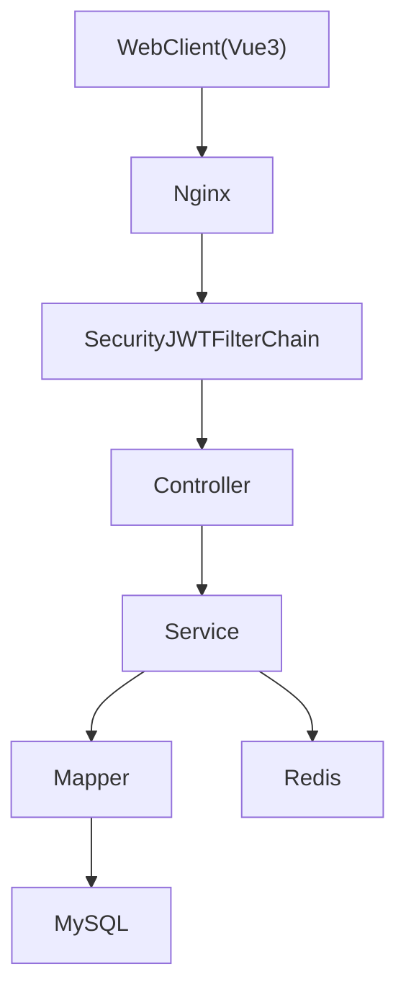

OJPT / OJPS (Online Judge Platform for Training)

中文释义：面向算法训练的在线刷题平台。

亮点：“OJ”是行业通用词，专业认可度高。“T”强调训练，与竞赛准备的目标高度契合

## 📘 项目规划（Spring Boot）

### 🎯 一、总体愿景
| 目标 | 说明 |
| --- | --- |
| 🌍 平台定位 | 面向高校、训练营的在线判题与训练平台，支持日常练习与模拟竞赛 |
| 🧱 技术架构 | 以 Spring Boot 为核心，逐步演进为微服务/云原生架构 |
| 📈 成功标准 | 日均活跃提交量 ≥ 10k，评测平均响应 ≤ 5s ，系统可用性 ≥ 99.5% |

### 👥 二、角色画像与关键场景
| 角色 | 核心诉求 | 关键功能 |
| --- | --- | --- |
| 👤 学员（User） | 高质量题库、即时评测反馈、个性化训练路径 | 题库练习、错题本、训练计划、排名 PK、数据画像 |
| 👩‍🏫 教师（Teacher） | 备课与布题、跟踪班级表现、针对性辅导 | 题单/作业发布、班级管理、提交批注、学员对比分析 |
| 🏫 校方（School） | 横向对比、赛事组织、学籍/教务对接、安全合规 | 多校账号体系、数据看板、认证管理、赛事审批 |
| 🛠 管理员（Admin） | 系统运维、资源调度、策略配置、账号治理 | 角色/权限、评测资源监控、策略灰度、公告与运维工具 |

### 🧩 三、核心能力拆解
| 能力 | 功能要点 | 关键指标 |
| --- | --- | --- |
| #题库管理 | CRUD、标签、难度、导入导出、题解/讨论 | 支持 Markdown/LaTeX、批量导入、版本管理 |
| #评测系统 | 多语言提交、沙箱运行、结果判定、实时反馈 | 支持 C/C++/Java/Python/Go，评测队列可水平扩展 |
| #训练与竞赛 | 训练计划、限时竞赛、榜单、教练点评 | 支持私有/公开赛、封榜策略、作弊检测 |
| #多角色用户中心 | 学员/教师/校方/管理员的权限隔离、SSO、身份审核 | RBAC + ABAC 策略、OAuth2、学校/班级/组织多维绑定 |
| #学习分析 | 提交记录、通过率、薄弱点分析、图表报告 | 自动生成能力画像、邮件/站内推送报告 |
| #运维支撑 | 系统配置、公告、日志监控、告警、自检 | Prometheus + Grafana、运维一键脚本 |

### 🛠️ 四、技术选型与基础设施
- **应用框架**：Spring Boot 4.0.0
- **数据层**：MySQL 8.0.44、Redis（缓存、排行榜、JWT）
- **消息与调度**：RabbitMQ（评测队列）、Kafka（日志流）、Quartz/Spring Scheduler（定时任务）
- **评测沙箱**：Docker 隔离、多语言镜像、资源配额
- **网页页面**：Vue 3 + Vite（Web）
- **静态资源与网关**：Nginx 负责静态资源分发、前后端反向代理、TLS 终端

### 🧱 五、模块规划（按角色映射）
| 模块 | 面向角色 | 说明 |
| --- | --- | --- |
| `user-service` | 学员/教师/校方/管理员 | 账号、认证、RBAC/ABAC、审计追踪 |
| `organization-service` | 校方/管理员 | 学校、院系、班级、赛事组织、资质审核 |
| `problem-service` | 教师/学员 | 题库、标签、题解、讨论、题库版本 |
| `submission-service` | 学员/教师 | 提交接入、评测状态、重判、可视化状态机 |
| `judge-service` | 管理员 | 判题调度、沙箱池、资源监控、故障恢复 |
| `training-service` | 教师/学员 | 训练、作业、竞赛、排行榜、通知 |
| `analytics-service` | 校方/教师 | 数据仓库、班级画像、学习报告、导出 |
| `ops-service` | 管理员 | 配置、公告、日志、告警、运维脚本 |

### 🗓️ 六、里程碑（示例 12 周）
| 周期 | 里程碑 | 关键交付 | 角色收益 |
| --- | --- | --- | --- |
| 1-2 | 架构与组织模型 | 角色矩阵、ER 图、基础脚手架 | 全体：清晰权限边界 |
| 3-4 | 用户/组织 & 题库 | 用户中心、校方管理、题库 CRUD | 教师/校方：可建班布题 |
| 5-6 | 评测链路打通 | 提交→评测→回写闭环、监控仪表 | 学员：即时反馈；管理员：资源可视 |
| 7-8 | 训练/竞赛 | 作业/竞赛、排行榜、通知、封榜 | 学员：训练体验；教师：班级管理 |
| 9-10 | 数据分析 & 运维 | 画像报表、告警、灰度策略、Nginx 优化 | 校方：看板；管理员：运维工具 |
| 11-12 | 压测 & 试运行 | 性能压测、联调、上线手册、试点学校 | 全体：稳定上线 |

### ⚠️ 七、风险雷达 & 应对
- 🧨 判题安全/性能：Docker seccomp、资源限额、评测集群弹性扩缩、压测基线
- 🔄 多语言环境维护：镜像分层、统一基础镜像、自动化构建/扫描流水线
- 📊 数据一致性/报表延迟：消息队列+事务消息、离线补偿任务、监控滞后指标
- 👥 多角色协同：需求评审引入教师/校方代表、维护权限蓝图、定期 UX 回访
- 🧯 运维与合规：SLA & 演练手册、Nginx/WAF 策略、敏感数据脱敏、日志留存策略

> 注：以上为 **整体产品/系统规划**，当前后端代码实现阶段主要聚焦在「多角色用户中心 + 组织管理」能力，判题与题库等能力将按里程碑逐步落地。

---

## 🧩 当前后端项目结构总览（Spring Boot 单体应用）

### 📁 1. 顶层目录结构

```text
OJPT/
├── pom.xml
└── src
    ├── main
    │   ├── java
    │   │   └── com
    │   │       └── example
    │   │           └── ojpt          # 后端主代码
    │   └── resources
    │       ├── application.properties
    │       └── db
    │           └── migration         # Flyway 数据库迁移脚本
    └── test                          # 单元测试 / 集成测试
```

### 🧱 2. 分层架构与主要包

后端当前为 **Spring Boot 单体应用 + 典型分层架构**：

- `controller`：对外暴露 REST API，进行参数校验、结果包装
- `service` / `service.impl`：业务逻辑层，聚合多表操作与领域规则
- `mapper`：MyBatis-Plus Mapper 接口，负责数据库 CRUD
- `entity`：领域实体（与数据表映射）
- `dto`：请求/命令对象（Create/Update/Query 等）
- `vo`：对外返回的视图对象
- `config`：框架与中间件配置（Security、MyBatis、Redis、OpenAPI 等）
- `security`：认证授权相关组件（JWT 过滤器、UserDetailsService 等）
- `exception`：统一异常与错误码体系
- `common`：通用封装（统一返回结构、分页封装等）
- `converter`：DTO/VO 与实体之间的转换器

示例包结构（局部）：

```text
com.example.ojpt
├── controller
├── service
│   └── impl
├── mapper
├── entity
├── dto
├── vo
├── config
├── security
├── exception
├── common
└── converter
```

### 🚀 3. 启动类

- 启动入口：`com.example.ojpt.OjptApplication`
- 标准 Spring Boot 启动方式：

```bash
mvn spring-boot:run
```

> 运行前需确保 MySQL、Redis 等基础设施已准备就绪，并已执行/自动执行 Flyway 迁移。

---

## 👥 核心后端模块说明（当前实现）

> 本节描述 **当前代码中已实现的后端能力**，主要聚焦于多角色用户中心与组织管理，后续会在此基础上叠加题库、评测、训练等 OJ 核心模块。

### 1️⃣ 用户与认证模块

- **主要能力**
  - 用户注册、登录、登出
  - JWT 认证（Access Token + Refresh Token）
  - Token 黑名单与刷新 Token 管理
  - 用户个人信息与安全信息维护
- **典型类/包**
  - `controller.AuthController`：登录 / 刷新 Token 等认证接口
  - `controller.UserController`：用户信息相关接口
  - `security.JwtAuthenticationFilter`：请求级别 JWT 校验
  - `security.JwtService`：Token 生成与解析
  - `security.CustomUserDetailsService`：Spring Security 用户详情加载
  - `security.TokenBlacklistService`、`security.RefreshTokenStore`：Token 黑名单 & 刷新 Token 存储

### 2️⃣ 组织架构模块

- **主要能力**
  - 学校（School）管理：学校信息、认证状态
  - 院系/部门（Department）管理
  - 班级（Clazz）管理：班级基本信息、所属学校/院系
  - 学生与班级关联、教师与班级关联
- **典型类/包**
  - `controller.SchoolController`：学校 / 部门 / 教师等管理接口
  - `controller.StudentController`、`controller.TeacherController`：学生、教师相关接口
  - `entity.School`、`entity.Department`、`entity.Clazz`、`entity.ClassUser`、`entity.ClassTeacher`
  - `mapper.SchoolMapper`、`mapper.DepartmentMapper`、`mapper.ClazzMapper`、`mapper.ClassUserMapper` 等

### 3️⃣ 角色与权限模块（RBAC）

- **主要能力**
  - 角色（Role）管理：新增 / 修改 / 启用禁用
  - 权限（Permission）管理：资源 + 操作维度的权限点
  - 用户-角色、角色-权限关联关系维护
  - 支持多种系统角色：学生、教师、学校管理员、系统管理员等
- **典型类/包**
  - `controller.AdminController`、`controller.AdminUserController`
  - `entity.Role`、`entity.Permission`、`entity.RolePermission`、`entity.UserRole`
  - `mapper.RoleMapper`、`mapper.PermissionMapper`、`mapper.RolePermissionMapper`、`mapper.UserRoleMapper`
  - `service.AdminService`、`service.AdminUserService` 及其 `impl` 实现

### 4️⃣ 统计分析模块（当前范围）

- **主要能力（示例，视当前实现为准）**
  - 用户数量、角色分布、状态分布统计
  - 学校数量、认证状态统计
  - 可用于后台看板的基础统计数据
- **典型类/包**
  - 相关接口集中在 `controller.AdminController`、`controller.SchoolController` 中
  - 数据计算逻辑在对应的 `service` 层实现

---

## 🛠️ 技术栈与基础设施（后端实现）

### 🌱 核心框架

- **语言与运行环境**
  - Java 17
  - Spring Boot 4.0.x（基于 Spring Framework 6）
- **构建工具**
  - Maven（单模块项目）

### 💽 数据访问层

- **MyBatis-Plus**
  - 提供基础 CRUD、分页、逻辑删除、自动填充等能力
  - 通过 `mapper` 包下各接口与数据库表对应
- **MySQL**
  - 使用官方驱动 `mysql-connector-j`，默认通过 HikariCP 连接池管理连接
- **数据库版本管理**
  - 使用 **Flyway** 管理建表与数据迁移脚本
  - 脚本位置：`src/main/resources/db/migration`

### 🔐 安全与认证

- **Spring Security 6**
  - 全局过滤链接入 JWT 认证
  - 支持方法级权限控制（如 `@PreAuthorize`）
- **JWT**
  - 使用 `jjwt` 0.11.x 作为 Token 生成与解析库
  - Access Token + Refresh Token 双 Token 模式
- **密码安全**
  - 采用 BCrypt 进行密码哈希存储

### 🧠 缓存与会话

- **Redis**
  - 使用 Spring Data Redis（Lettuce 客户端）
  - 典型用途：
    - Token 黑名单
    - 刷新 Token 存储
    - 其他需要快速失效控制的场景

### 📚 接口文档与运维

- **SpringDoc OpenAPI**
  - 提供 Swagger UI 与 OpenAPI JSON
  - 常见访问路径（部署后示例）：
    - 文档页面：`/swagger-ui.html` 或 `/swagger-ui/index.html`
    - OpenAPI 文档：`/v3/api-docs`
- **Spring Boot Actuator**
  - 暴露健康检查等基础运维端点（如 `/actuator/health`）

---

## 🗄️ 数据模型与数据库设计概览

### 👤 用户域

- 核心表（命名以实际表为准）：
  - `user`：用户主表（登录账号、密码、状态等）
  - `user_profile`：用户扩展信息（姓名、联系方式、头像等）
  - `user_role`：用户与角色的关联关系

### 🔐 权限域

- 核心表：
  - `role`：系统角色（如 STUDENT、TEACHER、SCHOOL_ADMIN、ADMIN 等）
  - `permission`：权限点（资源 + 操作）
  - `role_permission`：角色与权限的多对多关联

### 🏫 组织域

- 核心表：
  - `school`：学校信息
  - `department`：院系/部门信息
  - `class` / `clazz`：班级信息
  - `class_user`：班级与学生关联
  - `class_teacher`：班级与教师关联

### 📏 通用设计约定

- 大部分业务表采用：
  - 逻辑删除字段（如 `is_deleted`）
  - 审计字段（如 `created_at`、`updated_at`、`created_by`、`updated_by`）
- 所有结构变更通过 **Flyway 脚本**进行版本化管理，便于多环境同步与回溯。

---

## 🌐 API 路由约定与权限模型

### 🚪 主要路由前缀

- `/api/auth/**`：认证相关接口（登录、刷新 Token 等），部分为匿名访问
- `/api/user/**`：通用用户能力，需登录
- `/api/admin/**`：平台级管理员接口，要求 ADMIN 等高权限角色
- `/api/student/**`：学生角色能力相关接口
- `/api/teacher/**`：教师角色能力相关接口
- `/api/school/**`：学校管理员相关接口

> 具体路由与入参/出参，可通过 OpenAPI/Swagger 文档查看。

### 🔑 权限控制方式

- 基于 **Spring Security + JWT**：
  - 通过过滤器在请求进入业务前完成认证与用户身份解析
  - 在 Controller 或 Service 层使用 `@PreAuthorize("hasRole('ADMIN')")` 等注解声明权限
- 典型 RBAC 模型：
  - 用户（User）⇔ 用户角色（UserRole）⇔ 角色（Role）⇔ 角色权限（RolePermission）⇔ 权限（Permission）

---

## 🔗 与前端工程的衔接

- 当前 Web 前端基于 **Vue 3 + Vite**，单独维护在 `OJPT_frontend` 仓库中（详见该仓库的 `README.md`）。
- 后端提供统一的 RESTful API 与 OpenAPI 文档，供前端与后续判题/评测服务统一接入。

---

## 🗺️（可选）整体架构示意（当前阶段）



> 后续引入判题服务、题库服务等微服务时，可在此图基础上继续扩展。
